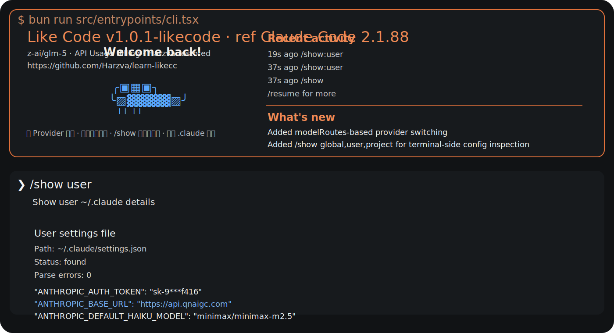
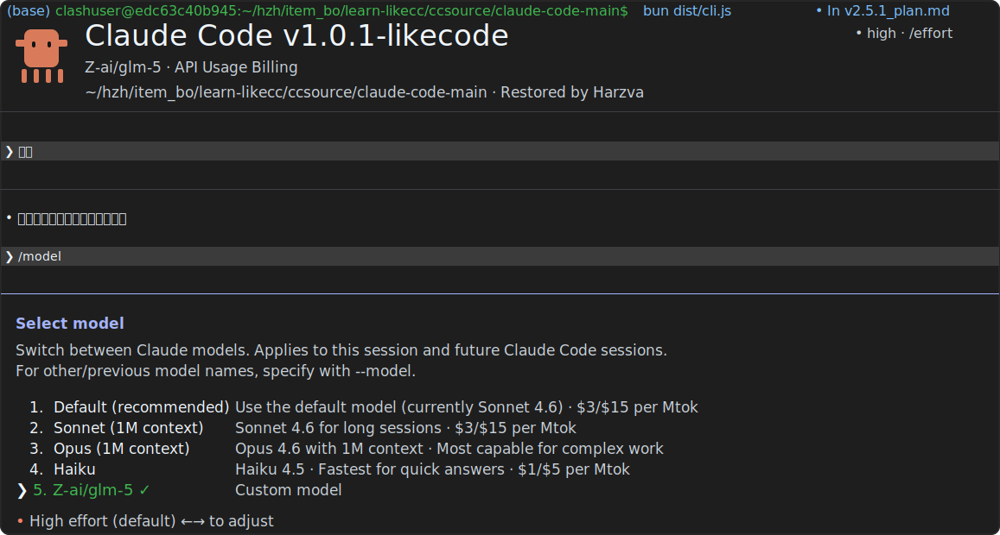
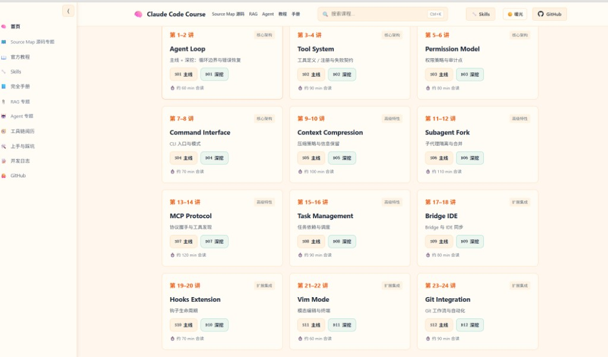

# Learn LikeCode

> 从 Claude Code 学起，但不止于 Claude Code。一个面向「源码学习 + 可运行复刻 + 自由换模型」的 likecode 工程。

[](https://harzva.github.io/learn-likecc/)
[](https://github.com/Harzva/learn-likecc)
[](LICENSE)

---

<p align="center">
  
</p>

## 顶部重点：我们现在最重要的事

这不是单纯“把 Claude Code 跑起来”的仓库了。  
我们正在基于 **Claude Code 2.1.88 恢复工程**，持续做一批**来自真实使用需求**的定制化增强。

### 已经落地的关键定制

- ✅ **多 Provider 自由切换**
  - 通过项目本地 `modelRoutes`，按模型自动切换 `baseURL / authToken / headers`
- ✅ **模型切换不再卡死在固定列表**
  - `/model` 菜单会自动展示本地已经配置好的外部模型
- ✅ **配置自动重载**
  - 修改 `.claude/settings.json` / `.claude/settings.local.json` 里的 API 与关键配置后，不需要退出 agent-cli 再重新开
- ✅ **终端内可直接查看详细配置**
  - 支持 `/show`、`/show:global`、`/show:user`、`/show:project`、`/show:slash`
- ✅ **启动界面配置可见性**
  - 启动头直接显示 Global / Project / Local 三层 `.claude` 摘要、当前命中的 `claude` 路径、当前工程仓库地址
- ✅ **启动界面开始给出 Web 工作台入口**
  - 启动头现在会直接显示本地 `localhost` 工作台入口，方便用户不离开初始界面就能跳到 Web 侧观察台
- ✅ **启动 logo 已收成 Like Code 语义**
  - 启动头图已进一步收成蓝色爱心，`Like` 单独放在爱心正上方，右侧标题改为更克制的 `code · Harzva restored · v2.1.88`
- ✅ **第三方兼容网关稳定性修复**
  - 兼容非标准 `headers` 返回结构，避免切 provider 后直接崩掉

### 下一批最重要的真实需求

- [ ] **多对话窗口 / 会话页签**
  - 参考 zellij 的交互逻辑，为同一个 session 提供多个任务窗口与快捷键切换能力
- [ ] **同 session 内并行做不同任务**
  - 让用户不用反复新开进程，也不用把不相关任务硬塞进同一个对话窗口
- [ ] **subagent 工作视图**
  - 后续在多窗口模式下，把不同 subagent 的忙碌状态、所在仓库、当前任务分别展示出来
- [ ] **会话级任务分屏**
  - 一个窗口主线程写码，另一个窗口做 review，第三个窗口跟踪搜索 / 摘要 / provider fallback
- [ ] **panel / 分屏优先级提升**
  - 当前 tab 已经证明方向可行，但真正拉开体验差异的是 panel、分屏和 subagent 状态视图

### 这条需求的第一版设计已经定下来了

- ✅ **第一阶段先做 `tab`，不先做 `pane`**
  - 目标是先把“一个 session 下多个任务窗口”做稳，再考虑真分屏
- ✅ **快捷键方案已经形成第一稿**
  - 参考 zellij 的前缀心智，优先采用 `Ctrl+g` 进入窗口管理，再做新建 / 切换 / 重命名 / 关闭
- ✅ **数据结构已经拆成两层**
  - `SessionState` 负责当前焦点与窗口顺序，`TabState` 负责 transcript、任务类型、模型、provider、subagent 归属
- ✅ **UI 信息层已经明确**
  - 顶部 tab 行看“我在哪个窗口”，次级状态栏看“这个窗口在干什么”，可折叠 subagent 面板看“谁在忙什么”
- ✅ **已经产出独立设计稿**
  - 见 `.claude/plans/multi-window-subagent-design-v1.md`
- ✅ **已经拆成开发任务清单**
  - 状态层、Tab UI、Tab 行为、状态绑定、快捷键、Subagent 面板、验证与发布都已分 phase
- ✅ **已经映射到具体版本计划**
  - 当前先落到 `v1.0.2-likecode`，目标是交付 tab 模式起步版
- ✅ **状态层骨架已经接进代码**
  - 已新增 `sessionTabs`、`SessionTabState`、`SessionTabsMetadata`，并开始把 tab 状态映射进 session metadata
- ✅ **顶部 tab UI 已经可见**
  - 主 REPL 顶部已经能显示 tab 行、当前激活 tab、模型/provider/状态，以及 `+ /tab new` 提示
- ✅ **tab 管理命令已经可用**
  - 已支持 `/tab list`、`/tab new`、`/tab next`、`/tab prev`、`/tab switch`、`/tab rename`、`/tab close`、`/tab panel`
- ✅ **第一批窗口快捷键已经可用**
  - 已支持 `Ctrl+g` 前缀后接 `c / n / p / x / s / 1-9`
- ✅ **panel / 分屏第一版已经开始落地**
  - `/tab panel` 不再只是开关占位文案，主 REPL 里已经会出现一个真实的 session workspace 面板
- ✅ **底部开始出现多个可见对话框区域**
  - pane 模式下底部不再只剩一个视觉对话框，而是会为不同 tab 渲染多个可见的对话框 dock
- ✅ **左右 pane 的 transcript 已开始拆开显示**
  - 每个 pane 现在会保存并展示自己那条对话的独立 transcript 预览，不再继续共用同一段可见内容
- ✅ **非 active pane 已升级成“准可操作态”**
  - inactive pane 现在会显示自己的 transcript 摘要、todo 摘要、draft 提示和更明确的激活文案，不再只是空预览壳
- ✅ **pane 聚焦入口更贴近分屏心智**
  - 现在除了点击 pane，还支持 `/tab focus left|right|1|2` 和 `Ctrl+g h / l` 快速把左右 pane 提升为 active
- ✅ **每个 pane 的 task lane 也开始直接可见**
  - inactive pane 现在除了 transcript / todo / draft，还会直接显示当前任务摘要，不用只靠右侧 workspace 面板判断
- ✅ **每个 tab 开始固定自己的逻辑 todo lane 标识**
  - pane 现在不再只挂在同一个默认 lane 文案上，而是开始为各自 tab 保留稳定的逻辑 lane id，方便继续推进真正隔离
- ✅ **第一版 localhost 读取接口已经起步**
  - 现在已经有 `session / pane / transcript / events` 四层本地只读接口，可以作为后续 Web UI 的数据底座
- ✅ **切换 tab 时主消息区开始切到各自 transcript**
  - tab 不再只切标题和预览，主消息区现在会跟着切到该 tab 保存下来的消息流
- ✅ **todo lane 开始按 tab 记住和恢复**
  - 当前 active tab 会保存自己的 todo/task 快照，切换 tab 时会恢复到该 tab 自己那份待办摘要
- ✅ **tab 开始绑定自己的模型 / provider / transcript / todo lane**
  - 切换 tab 后会带出当前 tab 的模型与 provider，tab 也会记住自己当前绑定的 transcript 与 todo lane
- ✅ **subagent 状态面板已经不是纯占位**
  - 面板里已经能看到当前聚焦 transcript、运行中的 subagent、任务状态和 legacy todo 摘要
- ✅ **tab 与 branch 的边界已经判断清楚**
  - `tab` 是同一个 session 内的任务视图管理，`branch` 是会话历史分叉与恢复，两者不重复

### 我们现在强调的不是“炫”，而是这些真实需求

- 用户想在同一套 Agent CLI 里自由切换 `glm`、`minimax`、Claude 等模型
- 用户不想每换一个模型就手改整套 API 配置
- 用户不想改完 JSON 之后还必须退出整个 agent-cli 才能生效
- 用户在没有编辑器的终端里，也应该能看清 `.claude` 到底加载了什么
- 用户要能一眼分清这次 session 到底受哪几层配置覆盖
- 用户希望一个 session 不只一个对话窗口，而是能像 zellij 那样按窗口并行处理不同任务
- 用户希望日后引入 subagent 后，能从不同窗口看出不同 subagent 分别在忙什么、在哪个仓库工作
- 用户虽然需要 tab，但真正最有价值的还是 panel / 分屏，因为那才会让并行任务与 subagent 可见性变得直观

### 这类需求如何长期跟踪

- 新需求：必须写进 `.claude/plans/*.md`
- 未完成：必须持续保留在 `README.md` 的 todo / roadmap
- 已完成：必须在 README 和 plan 里同步打钩
- 影响用户可见功能时：默认同步检查 git、GitHub Pages、Release、CHANGELOG、版本号

这套约定已经被固化进仓库内：

- skill: `.claude/skills/repo-release-governance/SKILL.md`
- rule: `.claude/rules/release-workflow.md`

**对外更专业的叫法**建议用：**配置自动重载** 或 **配置热重载**。  
如果表达“Claude 会记住并自动感知你刚改过的配置”这个感觉，也可以在介绍里辅助解释为“自动重载配置记忆”，但正式能力名建议还是前两者。

---

## Why LikeCode

Claude Code 很强，但真实使用里一直有一个明显痛点：

- 官方登录态下，常用模型选择并不自由
- 部分能力默认绑定 Anthropic 自家 API 语义
- 想切到别家模型，往往不是「换个参数」就行，而是整条链路都要重来
- 同一次 session 里想无感切模型，通常还要担心上下文、工具调用、compact、兼容格式

**learn-likecc / likecode** 想解决的，不只是「把 Claude Code 跑起来」，而是把这套 Agent CLI 的关键能力拆开、学透、再推进到一个更自由的方向：

- 既能学习 Claude Code 的核心设计
- 也能探索一个更开放的 likecode：**模型可换、API 可换、供应商可换、同 session 的策略可换**

---

## 已经做出来的东西

- ✅ 基于 Source Map 还原出可阅读、可搜索、可运行的 TypeScript 工程
- ✅ CLI 主链路已经跑通，支持 `likecode` 命令直接启动
- ✅ 课程站点已经上线，12 章源码课程可在线阅读
- ✅ 工具系统、权限系统、compact、session、MCP 等关键模块都已有课程与源码锚点
- ✅ 仓库已经不只是“资料堆”，而是一个可继续演进的实验底座
- ✅ 启动界面已经开始产品化：支持 `Like Code` 品牌头图、彩色信息层和配置摘要
- ✅ 已经能在启动界面看出本次 session 受哪些 `.claude` 层级覆盖
- ✅ 已经能在启动界面直接看到当前命中的 `claude` 命令路径，帮助判断本地 / 全局安装

---

## 新方向：自由换模型

### 我们想解决什么

我们希望 likecode 最终可以做到：

- 在同一套 CLI / Agent 工作流里接不同模型提供商
- 不被「只能选固定几个模型」卡住
- 按任务实时切换模型，而不是每次重新开局
- 在**同一次 session** 中，尽量做到**不 compact 也能切模型 / 调其他模型**

### 可行性判断

基于当前仓库内恢复出的实现，结论不是空想，而是：

- ✅ **同 session 切模型，本身是可行的**
  - 代码里已经存在 `set_model` 控制消息、`mainLoopModelOverride`、session metadata 同步与 model-switch breadcrumb 注入逻辑
- ✅ **同一家协议族内的模型切换，难度相对低**
  - 比如 Anthropic 体系内不同 Claude 模型，或兼容其消息 / tool-use 语义的代理层
- 🟡 **跨不同 API 提供商切模型，可行但不能只靠改 env**
  - 需要一层 provider adapter，把请求/响应、工具调用、流式事件、usage 统计、错误恢复统一起来
- 🟡 **“无需 compact 就切模型”在部分场景可做，但不是绝对成立**
  - 前提是目标模型能吃下当前上下文，且兼容当前消息格式、工具状态、附件与 tool-use/tool-result 配对
- 🔴 **真正难的不是切模型按钮，而是会话连续性**
  - 包括上下文窗口差异、tool schema 差异、`tool_reference`/beta 能力、缓存 token 统计、compact 边界、resume 恢复一致性

### 一句话判断

**结论：值得做，而且有现实可行路径；但它本质上是“多 provider 会话编排层”问题，不是简单的模型下拉框问题。**

### 关于多窗口 / subagent 视图的判断

这条需求同样值得做，而且比“重新造一个终端”更像是在现有 Agent CLI 上补一层 **会话窗口管理**：

- ✅ **需求是成立的**
  - 一个 session 里做多个任务，确实不应该永远只有一个对话窗口
- ✅ **对未来 subagent 很关键**
  - 一旦引入更强的 subagent 模式，用户一定会需要一个视图去区分“谁在忙什么”
- 🟡 **实现上更像 zellij 的 pane/tab 思路，而不是简单加历史列表**
  - 需要窗口状态、焦点切换、各窗口 transcript、任务归属、subagent 归属
- 🟡 **第一阶段不必追求完整平铺分屏**
  - 更稳的路径是先做“会话页签 + 快捷键切换”，再演进到 pane 和 subagent live view

### 多窗口设计的当前结论

- ✅ **优先级**
  - 先做 `tab`，再做 `pane`，最后再做 `subagent live view`
- ✅ **与 branch 不重复**
  - `branch` 是把对话分叉成另一条可恢复会话；`tab` / `panel` 是在同一个 session 内管理多个任务视图
- ✅ **与 subagent 也不重复**
  - `panel` 是界面层 / 工作区层，解决“怎么看、怎么切、怎么组织任务”；`subagent` 是执行层 / 代理层，解决“谁去干活”
  - 一个 `panel` 可以先没有 `subagent`，只作为同一 session 下的多任务工位；当系统真的拉起 `subagent` 时，这个 pane 才进一步变成 subagent 的可视化工作位
- 🟡 **当前这版 tab 还偏轻**
  - 现在更像“会话窗口管理壳层”，真正高价值的差异化能力还是 panel、分屏和 subagent 状态面板
- ✅ **快捷键**
  - 第一版推荐 `Ctrl+g` 作为窗口管理前缀，再映射新建、切换、关闭、重命名
  - pane 聚焦已额外支持 `Ctrl+g h / l`
- ✅ **状态模型**
  - session 主状态和 tab 子状态必须分开，不要把所有窗口信息继续硬塞进一条主 transcript
- ✅ **UI 层级**
  - 顶部 tab 行、次级状态栏、可折叠 subagent 面板三层足够支撑 V1
- ✅ **设计稿入口**
  - `.claude/plans/multi-window-subagent-design-v1.md`
- ✅ **版本计划入口**
  - `.claude/plans/v1.0.2_plan.md`

### 为什么不是直接多开终端

- ✅ **多开终端解决的是“多进程并行”，不是“同 session 内协同”**
  - 多个终端天然是多个独立 Claude 进程；内部 panel 则是同一个 session 里的多个工作窗格
- ✅ **内部 panel 的价值是共享一层会话编排**
  - 可以共享同一份 session 背景、模型切换历史、provider 路由、规则层、todo / transcript 状态，而不是让用户自己在几个终端之间搬运上下文
- ✅ **更适合 future subagent**
  - 多开终端时，用户要自己记“哪个窗口是谁、谁在跑什么”；内部 panel 可以天然展示 pane、task、subagent、provider、worktree 之间的对应关系
- ✅ **不是替代多终端，而是补足多终端做不到的会话内组织能力**
  - 更准确的说法是：多开终端是“我自己管理多个 Claude”，内部 panel 是“Claude 帮我管理同一个 session 下的多个任务”

---

## 产品 Todo

下面这些不是拍脑袋写的 wishlist，而是从真实使用场景里长出来的需求。

### 已完成的基线能力

- ✅ 可运行 CLI 基线
- ✅ `likecode` 全局命令入口
- ✅ Source Map 分析与课程化整理
- ✅ 在线文档站点
- ✅ Claude Code 关键模块拆解
- ✅ 工程化修补与可重复构建
- ✅ `markdownlint` 仓库内工具链
- ✅ 启动头图与品牌化展示
- ✅ `.claude` 多层配置摘要展示
- ✅ pane 非激活态的 transcript / todo / draft 摘要展示
- ✅ 当前 `claude` 命令路径展示

### 正在推进的核心 Todo

- [ ] 做一个统一的 **provider adapter** 层，而不是把实现写死在 Anthropic SDK
- [ ] 支持更多模型来源：兼容 Anthropic 风格代理、OpenAI 风格、Gemini 风格、国产模型网关
- [ ] 支持 **同一 session 内切模型**
- [ ] 支持 **同一 session 内多对话窗口 / 会话页签**
- [ ] 支持参考 zellij 的快捷键逻辑去新建、切换、关闭窗口
- [x] 完成“多窗口 / subagent 视图”第一版设计稿
- [x] 完成“多窗口 / subagent 视图”第一版开发任务拆分
- [x] 将 tab 模式映射到 `v1.0.2-likecode` 版本计划
- [x] 为 tab 模式接入第一层状态骨架
- [x] 接入顶部 tab UI
- [x] 接入 `/tab` 管理命令
- [x] 接入第一批 `Ctrl+g` 窗口快捷键
- [x] 接入 `/show:slash`，可在终端直接查看所有 slash command 与用法
- [x] 启动 logo 改为红色爱心
- [x] 接入第一版 `panel / 分屏` 工作区侧栏
- [x] 让 pane 模式下底部出现多个可见对话框区域，而不只是一个共享输入框
- [x] 让左右 pane 开始显示各自的 transcript 预览
- [x] 让切 tab 时主消息区开始切到各自 transcript
- [x] 让 todo lane 开始按 tab 保存和恢复
- [x] 将当前 tab 的 `model / provider / transcript / todo lane` 开始同步到真实状态
- [x] 将 subagent 面板从纯占位升级为第一版真实状态面板
- [ ] 支持 **subagent 工作视图**：按窗口看不同 subagent 在忙什么
- [ ] 并行设计一个 **localhost Web UI 工作台**
- [ ] 在 Web UI 第一版里展示 `session / pane` 列表、结构化 transcript、tool/subagent 时间线、model/provider 切换记录、思考过程卡片流
- [x] 完成 `localhost Web UI` 第一版设计稿
- [x] 完成 `localhost Web UI` 第一版读取协议草案
- [x] 起好 `localhost Web UI` 第一版只读接口骨架
- [ ] 支持 **按任务自动路由模型**：写代码 / 总结 / 搜索 / 便宜优先 / 最强优先
- [ ] 尽量做到 **不 compact 也能切到别的模型继续干活**
- [ ] 在上下文过长时，优先尝试「局部转译 / 局部摘要 / 局部降配」而不是直接整段 compact
- [ ] 给 session 标记“当前模型、历史模型、切换原因、切换成本”
- [ ] 做出真正可解释的失败提示：是 token 爆了、协议不兼容、工具不兼容，还是 provider 不支持

### 真实场景驱动的私人订制 Todo List

- [ ] 白天主力写码用强模型，晚上批量跑任务自动切到便宜模型
- [ ] 代码改动阶段用高质量模型，写周报/总结阶段自动切快模型
- [ ] 同一 session 卡住时，直接拉另一个模型接手，不强制开新会话
- [ ] 同一个 session 开多个窗口：一个写代码，一个 review，一个跟踪搜索/摘要
- [ ] 把 tab 模式先做出来，再评估哪些场景真的需要 pane 分屏
- [x] 把 panel / 分屏放到 tab 之后的最高优先级，而不是继续只做轻量 tab 装饰
- [x] 把 tab 需求映射到具体版本计划与发版节奏
- [x] 让不同 tab 开始绑定各自 transcript、todo、model/provider，而不是先只做窗口层
- [x] 把 subagent 面板从占位升级成真实状态视图
- [ ] 继续把“多个可见对话框”升级成真正的多活跃输入与多 transcript 并行，而不只是先做 active pane 输入
- [ ] 继续把 transcript / todo 做到真正隔离，而不只是先完成 UI 层消息区与快照恢复
- [ ] 为 localhost Web UI 设计一版“观察台”而不是先做“控制台”，优先承接结构化展示与流程图
- [ ] 为 localhost Web UI 落地 `session / pane / transcript / events` 读取接口
- [ ] 继续扩展 localhost 接口里的结构化 transcript、tool/subagent 时间线和切模型记录
- [ ] 团队里每个人可配置自己的默认 provider / 默认模型 / 默认预算策略
- [ ] 项目级规则决定“这个仓库优先稳定模型，那个仓库优先低成本模型”
- [ ] 一个命令完成“继续当前 session，但换模型再试一次”
- [ ] 失败重试时优先保住现有上下文、待办列表、工具执行轨迹，而不是重新问一遍
- [ ] 给重度用户做真正的“私人定制工作台”：模型偏好、预算上限、危险操作策略、项目级记忆
- [ ] 引入 subagent 后，按不同仓库 / 不同窗口看各个 subagent 的忙碌状态

---

## 构建成功展示

<p align="center">
  
</p>

<p align="center"><strong>验证命令：</strong><code>cd ccsource/claude-code-main && npm run build && bun dist/cli.js</code></p>

---

## 在线课程站点预览

以下为 [GitHub Pages 在线站点](https://harzva.github.io/learn-likecc/) 界面截图：侧栏导航、顶栏搜索与 **12 章源码课程**卡片（主线 / 深挖入口、预估阅读时长等）。实际布局与文案以线上版本为准。



---

## 🔥 Source Map 事件

### 什么是 Source Map？

Source Map 是一张**对照表**，告诉调试器压缩代码与源码的对应关系。当它被打入正式发布包后，就变成了**源码导航图**。

### 事件规模

| 项目 | 数量 |
|------|------|
| TypeScript 源文件 | **1900+** |
| 代码行数 | **51万+** |
| cli.js.map 大小 | **57 MB** |

### 分析内容

- **工具调用框架** - Tool 定义与调用机制
- **权限控制系统** - 多层权限验证
- **上下文管理** - 消息压缩与优化
- **记忆管理机制** - 长期记忆落地
- **IDE 通信桥接** - Bridge 协议
- **未公开功能** - Buddy, Kairos, Ultraplan 等

---

## 📊 项目状态

### 当前版本: v2.0.7

| 指标 | 状态 |
|------|------|
| 编译错误 | ~2180 (不影响运行) |
| Stub 模块 | 40+ 已创建 |
| 运行状态 | ✅ **可运行** |
| 课程章节 | 12 章完成 |
| likecode 方向 | ✅ 已进入产品化探索 |

### 🎉 重大进展

```bash
$ bun run dev --version
1.0.1-likecode (Claude Code)

$ bun run dev --help
Usage: claude [options] [command] [prompt]
...
```

### 编译错误趋势

| 版本 | 错误数 | 变化 |
|------|--------|------|
| v2.0.0 | 6099 | 原始状态 |
| v2.0.1 | 2271 | -63% |
| v2.0.3 | 2137 | 可运行 ✅ |
| v2.0.7 | 2180 | CLI 正常 ✅ |

---

## 📁 项目结构

```text
learn-likecc/
├── bin/
│   └── likecode              # 全局 PATH 后可执行：启动 ccsource CLI
├── ccsource/
│   ├── claude-code-main/     # 恢复的源码 (可运行)
│   └── CC/cli.js.map         # 原始 Source Map (57MB)
│
├── course/
│   ├── docs/zh/              # 12 章节课程 (S01-S12)
│   └── examples/             # TypeScript 示例代码
│
├── site/                     # 课程网站（含专栏页 column-agent-journey 等）
│   ├── index.html
│   ├── md/                   # 与 HTML 成对的 Markdown 镜像
│   ├── css/style.css
│   └── js/app.js
│
├── docs/readme-assets/        # README 用截图等（如 course-site-preview.jpg）
│
├── wemedia/zhihu/articles/   # 知乎等平台待发 / 已发稿 Markdown
├── wemedia/wechat/           # 微信公众号：md2wechat + Claude Code 接入备忘
├── EXPERIENCE.md             # 工程经验总结
├── CHANGELOG.md              # LikeCode 发布记录
└── .claude/plans/            # 版本计划与路线图
```

---

## 📚 课程内容

### Part 1: 核心架构

- **S01**: Agent Loop - 主循环与状态管理
- **S02**: Tool System - 工具定义与调用
- **S03**: Permission Model - 权限控制与用户交互
- **S04**: Command Interface - CLI 命令处理

### Part 2: 高级特性

- **S05**: Context Compression - 消息压缩与优化
- **S06**: Subagent Fork - 子代理创建与分支
- **S07**: MCP Protocol - Model Context Protocol
- **S08**: Task Management - 任务队列与调度

### Part 3: 扩展与集成

- **S09**: Bridge IDE - IDE 集成与通信
- **S10**: Hooks Extension - 钩子系统
- **S11**: Vim Mode - Vim 键绑定
- **S12**: Git Integration - Git 工作流集成

---

## 🚀 快速开始

```bash
# 克隆仓库
git clone https://github.com/Harzva/learn-likecc.git
cd learn-likecc/ccsource/claude-code-main

# 安装依赖 (需要 Bun)
bun install

# 配置 API Key
cp .env.example .env
# 编辑 .env 文件，填入 ANTHROPIC_API_KEY

# 测试运行
bun run dev --version
bun run dev --help

# 管道模式测试
echo "list files" | ANTHROPIC_API_KEY=your-key bun run dev -p
```

### 终端全局命令 `likecode`

仓库根目录提供启动脚本 **`bin/likecode`**：在任意目录输入 `likecode` 即等同于在 `ccsource/claude-code-main` 下执行 `bun run src/entrypoints/cli.tsx`。

```bash
# 1) 赋予执行权限（克隆后执行一次）
chmod +x /path/to/learn-likecc/bin/likecode

# 2) 加入 PATH：二选一
#    A) 把 bin 目录放进 PATH（示例：写入 ~/.bashrc 或 ~/.zshrc）
export PATH="/path/to/learn-likecc/bin:$PATH"

#    B) 或建符号链接到已有 PATH 目录（如 ~/.local/bin）
mkdir -p ~/.local/bin
ln -sf /path/to/learn-likecc/bin/likecode ~/.local/bin/likecode
# 确保 ~/.local/bin 已在 PATH 中
```

使用示例（与直接 `bun run dev` 相同，参数传给 CLI）：

```bash
likecode --version
likecode -- --help          # 部分环境下建议加 -- 再跟 CLI 参数
likecode -- -p "当前目录有哪些文件？"
```

**`bun install` 与 workspaces**：此前若出现 `Workspace name "@ant/..." already exists`，是因为 `packages/*` 与 `src/_external/shims/` 里注册了**同名**工作区包。当前根目录 `ccsource/claude-code-main/package.json` 已去掉重复项（`@ant/*` 与 napi 等仅以 `packages/` 为准；`@anthropic-ai/*` 中仅保留 shim 里独有的四个包 + `packages` 里的 `sandbox-runtime`）。拉取最新代码后再执行 `bun install` 即可。

---

## 🗓️ 长期计划（里程碑状态）

以下为**本仓库学习向工程**的阶段性目标；与 Anthropic 官方发行包 **1:1 全量对齐**仍见 [long-term-roadmap.md](.claude/plans/long-term-roadmap.md) 中的逆向路线。

### Phase 1: 编译修复 ✅

- ✅ 放宽 tsconfig 配置
- ✅ 创建 40+ stub 模块
- ✅ 程序可运行（CLI / `likecode`）

### Phase 2: 运行测试 ✅

- ✅ 基本命令测试
- ✅ API 调用测试（配置有效密钥与网络前提下）
- ✅ 工具调用测试（主路径已跑通；边界与全工具矩阵仍随上游迭代）

### Phase 3: 功能恢复 ✅（教学基线）

- ✅ 核心工具链可加载与执行（部分模块为 **stub**，保证可编译可跑）
- ✅ 权限系统主路径可用
- ✅ MCP 协议相关接入与课程/文档覆盖（与上游完整度仍可能有差距）

### Phase 4: 产品化 ✅（本仓库交付形态）

- ✅ 完整功能测试（以「可重复构建 + CLI 主流程」为验收口径）
- ✅ 文档网站：[GitHub Pages 在线课程](https://harzva.github.io/learn-likecc/)（`site/` 静态站 + 多专栏）
- ✅ **Release**：以 **Git 仓库版本 + Pages** 为发布单元；不设独立 npm 发行包

### Phase 5: LikeCode 自由模型路线 🚧

- [x] 在 README / 首页 / 站点入口明确 Learn LikeCode 叙事
- [x] 形成 LikeCode 长远路线图与阶段任务清单
- [x] 为“已完成能力 / 私人订制 Todo”建立打钩展示区
- [x] 为项目本地 `.claude/settings.local.json` 增加 `modelRoutes` 配置能力
- [x] 增加按模型自动切换 `baseURL / authToken / headers` 的本地路由层
- [x] `/model` 菜单开始展示本地配置过的外部模型项
- [x] 启动界面展示 `.claude` 分层覆盖摘要、命令路径与仓库入口信息
- [x] 修复自定义网关 headers 兼容问题，保住非标准 headers 返回结构
- [ ] 抽象 provider adapter，降低 Anthropic SDK 绑定度
- [ ] 评估不同 provider 的 messages / tools / streaming 兼容层
- [ ] 支持同 session 内 `set_model` 式模型切换的外部化产品能力
- [ ] 为跨模型切换补上 context carry-over、tool state carry-over、resume 一致性策略
- [ ] 探索「无需 compact 切模型」的安全边界与回退机制
- [ ] 把自由模型路线拆分进后续版本计划并持续打钩

### Phase 5 执行清单（本仓库打钩传统）

- [x] 论证“同 session 切模型”具备源码基础
- [x] 首页文案升级为 Learn LikeCode
- [x] 站点首页加入路线图与绿钩展示
- [x] 新建专项计划：[likecode-model-freedom-roadmap.md](.claude/plans/likecode-model-freedom-roadmap.md)
- [x] 安装 Markdown lint 工具链（仓库内）
- [x] 跑通关键 Markdown lint
- [x] 为 API client 增加按模型切换 API 配置的增量能力
- [x] 支持 `modelRoutes` 这种更易维护的本地配置格式
- [x] 让 `/model` 菜单自动出现已配置的外部模型
- [x] 修复 `error.headers?.get` / `headers.forEach` 兼容性问题
- [x] 启动界面加入品牌化视觉、配置层级摘要与命令路径可见性
- [x] 启动界面支持把当前工程显示成仓库地址，降低用户路径理解成本
- [x] 增加 `/show`、`/show:global`、`/show:user`、`/show:project` 配置查看命令
- [ ] 进入 provider adapter 设计阶段

### 本轮新功能与真实需求对应

- [x] 需求：切换 `minimax` / `glm` 时不想手改整套配置
  交付：支持按模型自动切换 `baseURL / authToken / headers`
- [x] 需求：项目本地实验不要污染用户全局配置
  交付：支持项目内 `.claude/settings.local.json` 的 `modelRoutes`
- [x] 需求：`/model` 里不该只看到当前一个外部模型
  交付：菜单自动枚举本地已配置的外部模型
- [x] 需求：第三方兼容网关返回的 `headers` 结构不标准时不要崩
  交付：补齐 `Headers` / 普通对象两种兼容路径
- [x] 需求：用户分不清这次 session 吃了哪几层 `.claude`
  交付：启动头展示 Global / Project / Local 三层摘要
- [x] 需求：用户分不清当前跑的是本地 claude 还是全局 claude
  交付：启动头展示当前命中的 `claude` 命令路径
- [x] 需求：默认路径太长、太像临时工程，不利于理解仓库归属
  交付：当前工程启动头改显示仓库地址 `https://github.com/Harzva/learn-likecc`
- [x] 需求：界面过于朴素，不够像一个持续演进的产品工程
  交付：启动头加入 `Like Code` 品牌、颜色层次和更清晰的状态信息
- [x] 需求：没有编辑器时，用户很难看清 `.claude` 里到底配了什么
  交付：增加 `/show` 系列命令，直接在终端展开 global / user / project 配置细节

**说明**：TypeScript 严格检查下仍有约 **~2180** 类编译告警/错误位点，与 stub、类型放宽策略并存；**不影响**当前文档所述的运行与教学主线。

详见: [long-term-roadmap.md](.claude/plans/long-term-roadmap.md) · [likecode-model-freedom-roadmap.md](.claude/plans/likecode-model-freedom-roadmap.md)

---

## 🔗 资源链接

- [Claude Code 官方](https://claude.ai/code)
- [Anthropic SDK](https://github.com/anthropics/anthropic-sdk-typescript)
- [MCP Protocol](https://modelcontextprotocol.io)
- [Source Map 分析](ccsource/CC/cli.js.map.README.md)
- [工程经验](EXPERIENCE.md)
- [发布记录](CHANGELOG.md)

---

## ⭐ Star History

[](https://star-history.com/#Harzva/learn-likecc&Date)

---

## 📝 免责声明

本项目仅供学习研究使用，与 Anthropic 官方无关。

- Claude Code 是 Anthropic, PBC 的产品
- 本项目基于公开的 Source Map 文件进行学习分析
- 请勿将本项目用于商业用途

---

最后更新：2026-04-07
