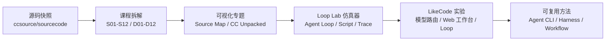
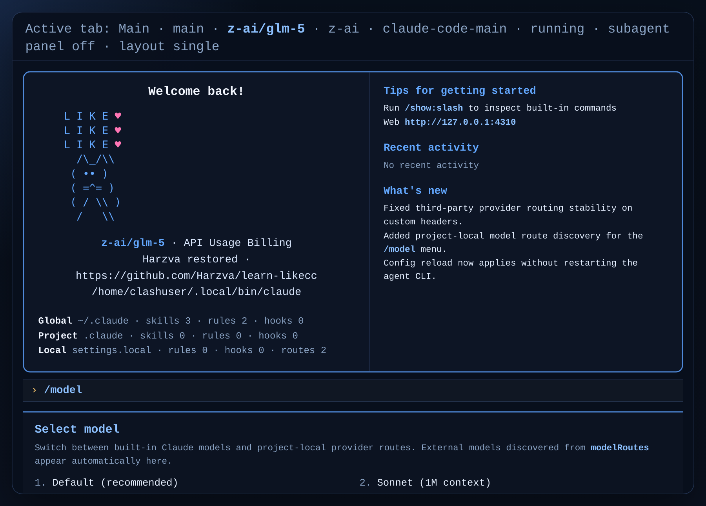

<div align="center">
  <h1>Learn LikeCode</h1>
  <p><strong>从 Claude Code 源码学习、可运行复刻、仿真教程，到自由换模型实验的一站式工程。</strong></p>
  <p>
    <a href="https://harzva.github.io/learn-likecc/">GitHub Pages</a>
    · <a href="https://harzva.github.io/learn-likecc/topic-cc-loop-lab.html">Loop Lab 仿真专题</a>
    · <a href="https://github.com/Harzva/learn-likecc/tree/main/course/docs/zh">源码课程</a>
    · <a href="https://github.com/Harzva/learn-likecc/blob/main/docs/commit-ledger.md">Commit Ledger</a>
  </p>
  <p>
    
    
    
    
  </p>
</div>

<p align="center">
  
</p>

## 这是什么

`learn-likecc` 不是一个单纯的“Claude Code 使用笔记”仓库。它把四条线放在同一个可发布工程里：

| 方向 | 你会得到什么 | 入口 |
| --- | --- | --- |
| 源码学习 | 以真实 TypeScript 源码结构理解 Agent Harness、工具系统、权限、MCP、Hooks、Subagent、上下文压缩 | [`course/docs/zh`](course/docs/zh) |
| 可运行复刻 | 基于 `ccsource/claude-code-rebuild` 的学习版 CLI，用于研究运行链路，不作为生产替代品 | [`ccsource/claude-code-rebuild`](ccsource/claude-code-rebuild) |
| 在线教程站 | GitHub Pages 上的教程、专题、图谱、仿真器和工作流页面 | [`site/`](site) |
| LikeCode 实验 | 多 provider 路由、模型切换、localhost 工作台、Loop 任务与长期迭代记录 | [`docs/`](docs) / [`.claude/plans`](.claude/plans) |

> 这个仓库的定位是学习、研究、复刻和产品化实验。涉及 Claude Code 的源码快照与分析均以教育研究为目的，原始产品与相关源码权利归原权利方所有。

## 推荐先打开

| 你想做什么 | 推荐入口 |
| --- | --- |
| 直接看在线课程 | <https://harzva.github.io/learn-likecc/> |
| 从源码结构学 Agent Loop | <https://harzva.github.io/learn-likecc/topic-sourcemap.html> |
| 体验仿真器专题 | <https://harzva.github.io/learn-likecc/topic-cc-loop-lab.html> |
| 看 Claude Code 解构总览 | <https://harzva.github.io/learn-likecc/topic-cc-unpacked-zh.html> |
| 跟踪本仓库自己的迭代 | [`CHANGELOG.md`](CHANGELOG.md) / [`docs/commit-ledger.md`](docs/commit-ledger.md) |

## 学习地图



## Loop Lab 仿真专题

仿真专题是这个仓库最适合“边看边理解”的入口：它把抽象的 Agent 运行链路拆成可以点击、回放和对照的页面。

| 仿真器 | 解决的问题 | 在线入口 |
| --- | --- | --- |
| Agent Loop 动态模拟器 | 一次 Agent 循环到底怎么跑 | [`site/agent-loop-simulator/`](site/agent-loop-simulator) |
| 脚本启示仿真器 | 命令、配置、练习如何组织成训练路径 | [`site/agent-script-insight/`](site/agent-script-insight) |
| Trace Prompt 仿真器 | Claude Code 请求如何由 system、tools、runtime reminder 和 user message 组装 | [`site/agent-trace-simulator/`](site/agent-trace-simulator) |
| Loop Lab 总入口 | 三条仿真路径、机制页、本地 SSE 联调统一入口 | [`site/topic-cc-loop-lab.html`](site/topic-cc-loop-lab.html) |

<p align="center">
  
  
  
  
  
</p>

## 本地快速开始

如果你之前是从 GitHub 页面点 `Download ZIP`，解压目录没有 `.git`，无法提交和推送。建议正式开发时 clone 仓库：

```bash
git clone https://github.com/Harzva/learn-likecc.git
cd learn-likecc
```

安装根目录校验工具：

```bash
npm ci
npm run lint:md
python tools/check_site_md_parity.py
python tools/check_cc_loop_steps.py
python tools/gen_cc_overview.py --check
python tools/gen_cc_arch_treemap.py --verify-in-sync
```

本地预览站点：

```bash
cd site
python -m http.server 8080
```

然后打开：

```text
http://127.0.0.1:8080/
http://127.0.0.1:8080/topic-cc-loop-lab.html
```

## 运行复刻 CLI

当前正式 clone 中可用的学习版 CLI 基线在 `ccsource/claude-code-rebuild`。

```bash
cd ccsource/claude-code-rebuild
bun install
bun run src/entrypoints/cli.tsx
```

根目录脚本 [`bin/likecode`](bin/likecode) 会优先寻找 `ccsource/like-code-main`，如果该本地主开发线不存在，则回退到 `ccsource/claude-code-rebuild`。

```bash
chmod +x bin/likecode
./bin/likecode --help
```

> 这是学习版复刻环境，不建议把它当作生产 CLI 使用。真实项目中请优先使用官方 Claude Code 或你明确审计过的分支。

## 自由换模型实验

LikeCode 当前最重要的产品化实验，是把“模型选择”从固定列表变成可配置路由。

```json
{
  "env": {
    "ANTHROPIC_BASE_URL": "https://api.provider.example",
    "ANTHROPIC_DEFAULT_SONNET_MODEL": "claude-sonnet-4-5-20250929"
  },
  "modelRoutes": {
    "minimax/minimax-m2.5": {
      "baseURL": "https://api.provider.example",
      "authToken": "sk-provider-route-example",
      "headers": {
        "x-provider": "minimax"
      }
    }
  },
  "model": "minimax/minimax-m2.5"
}
```

已经验证过的关键点：

- SiliconFlow MiniMax 路由可跑通 `Pro/MiniMaxAI/MiniMax-M2.5[1m]`。
- `baseURL` 应写到 provider 根地址，例如 `https://api.siliconflow.cn`，不要直接写到 `/v1/messages`。
- 非官方兼容网关需要对 `thinking`、headers 和 provider 语义做兼容处理。

<p align="center">
  
</p>

## 课程内容

| Part | 主题 | 章节 |
| --- | --- | --- |
| Part 1 | 核心架构 | S01 Agent Loop、S02 Tool System、S03 Permission、S04 Command |
| Part 2 | 高级机制 | S05 Context Compression、S06 Subagent、S07 MCP、S08 Task Management |
| Part 3 | 扩展集成 | S09 IDE Bridge、S10 Hooks、S11 Vim Mode、S12 Git Integration |

课程正文在 [`course/docs/zh`](course/docs/zh)，站点镜像在 [`site/s01.html`](site/s01.html) 到 [`site/s12.html`](site/s12.html)。

## 仓库结构

```text
learn-likecc/
├─ site/                         # GitHub Pages 静态站点与仿真器入口
│  ├─ agent-loop-simulator/       # Agent Loop 动态模拟器
│  ├─ agent-script-insight/       # 脚本启示仿真器
│  ├─ agent-trace-simulator/      # Trace Prompt 仿真器
│  ├─ images/claude-pets/         # Claude Pet SVG 墙素材
│  └─ md/                         # HTML 对应 Markdown 镜像
├─ course/                        # 源码学习课程
├─ ccsource/
│  ├─ claude-code-rebuild/        # 可运行重建基线
│  └─ sourcecode/claude-code-main # 源码学习快照
├─ tools/                         # 站点校验、生成、抓取与联调脚本
├─ docs/                          # 设计说明、运行记录、提交台账
└─ .github/workflows/             # Pages 部署与站点校验
```

## 维护命令

| 命令 | 用途 |
| --- | --- |
| `npm run lint:md` | README 与关键 Markdown lint |
| `python tools/check_site_md_parity.py` | 校验 `site/*.html` 与 `site/md/*.md` 镜像关系 |
| `python tools/check_site_git_tracking.py` | 校验 topic 页面是否被 Git 跟踪 |
| `python tools/gen_cc_overview.py --check` | 校验 CC overview 数据 |
| `python tools/gen_cc_arch_treemap.py --verify-in-sync` | 校验架构 treemap 数据 |
| `python tools/check_cc_loop_steps.py` | 校验 Loop steps JSON schema |

## 当前路线图

- [x] 源码课程主线：S01-S12 基础完成
- [x] GitHub Pages 站点与专题导航
- [x] Loop Lab 三类仿真器入口
- [x] 模型路由实验记录与 MiniMax/SiliconFlow 验证
- [ ] README、站点与仿真器继续做产品级信息架构
- [ ] 多窗口 / tab / subagent 工作视图继续推进
- [ ] localhost Web 工作台继续补 transcript、tool chain、workflow replay

## 资源链接

- GitHub Pages: <https://harzva.github.io/learn-likecc/>
- Repository: <https://github.com/Harzva/learn-likecc>
- Codex Loop Skill: <https://github.com/Harzva/codex-loop-skill>
- Claude Code 官方文档: <https://docs.anthropic.com/en/docs/claude-code>
- Anthropic Claude Code: <https://github.com/anthropics/claude-code>

## 使用边界

本仓库仅供学习、研究、教学和复刻实验。请不要把未审计的复刻代码、私有 token、真实业务凭据或第三方源码权利不明的内容用于生产环境或公开分发。
