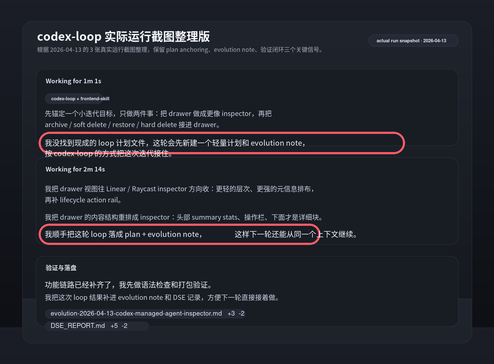

# codex-loop 运行实况截图（2026-04-13）

这张图用来归档一次真实的 `codex-loop` 运行状态，内容来自本次对话里提供的 3 张实际截图。

这次归档想保留的不是“界面长什么样”，而是这条运行链路已经真实出现过的三个信号：

- 没有现成 plan 时，agent 会先补一个轻量计划和 `evolution note`，把 bounded pass 接住。
- 代码实现之外，还会把这轮 loop 同步落成可续跑的记录，而不是只留下聊天输出。
- 收尾阶段会做语法 / 打包验证，并把结果补回演化记录与 DSE 记录，形成闭环。

如果后续拿到了这 3 张截图的原始导出文件，可以直接替换成原图版本；当前仓库里同时保留了可预览的 PNG 和便于后续微调的 SVG。
