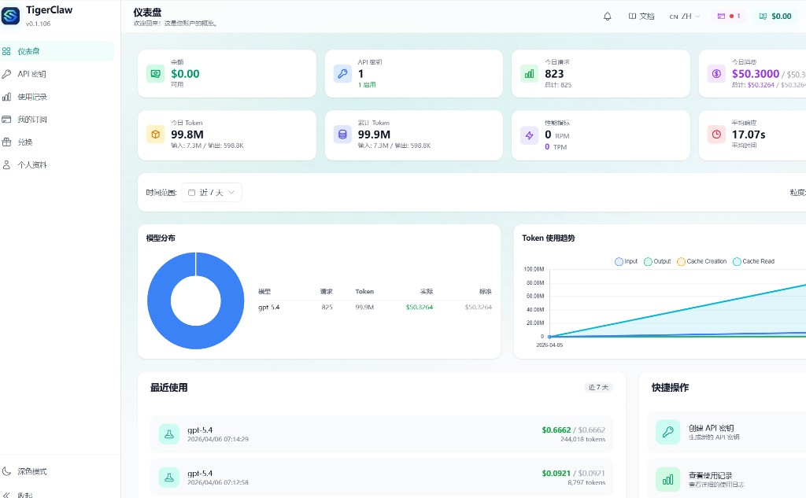
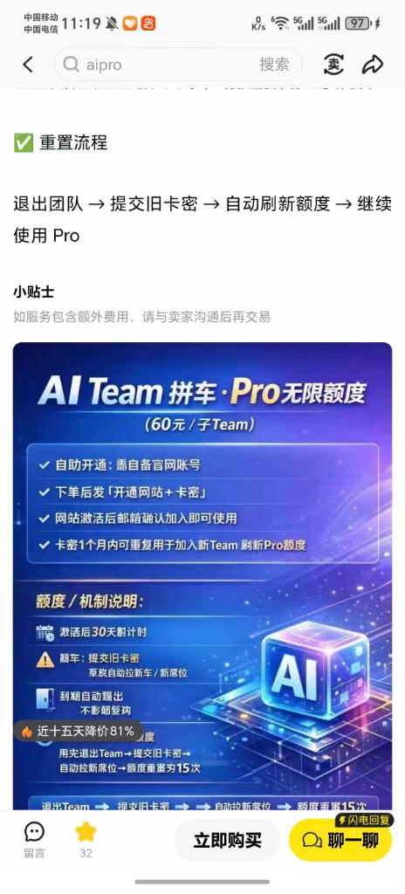
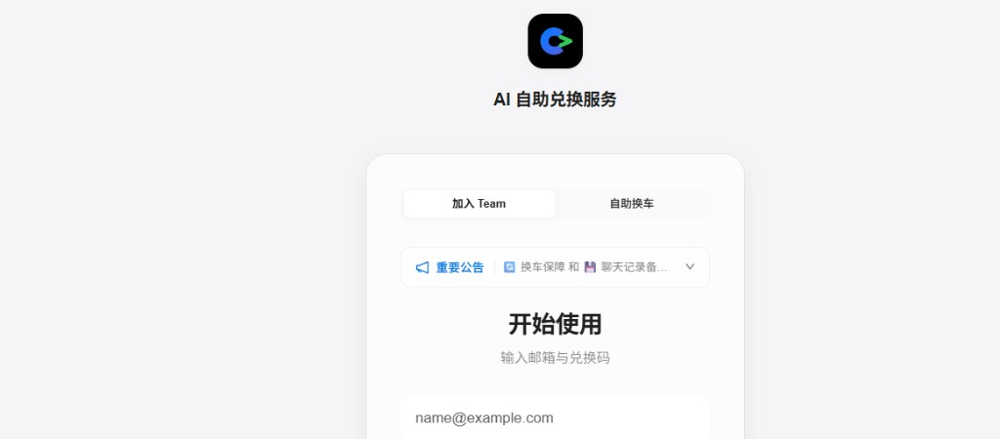

# 渠道评测：GPT Pro / API 中转（个人笔记）

> 本站专栏（带主题与侧栏）：[column-channel-review.html](../column-channel-review.html)  
> GitHub Pages：<https://harzva.github.io/learn-likecc/column-channel-review.html>

个人主观记录，**非购买建议**；第三方渠道存在条款与账号风险，请自担。

## 一类：中转 API（日限额约 50 美元档）

- 模型能力主观正常；仪表盘可印证当日消费贴近日顶。
- **续买常只延长天数，不叠加当日额度**；当日顶满后更现实的选项是新号或等重置。

## 二类：GPT Pro Team 拼车

- 账号被拉入 Business Team；网页 Pro 可用。
- **换车**（换 Team）繁琐，且有**每日次数上限**（例如约 15 次），大用量工作流不友好。

## 小结

| 维度 | 中转 API | Team 拼车 |
|------|----------|-----------|
| 续命方式 | 日桶；续费多加长 | 换车；有日次数上限 |
| 适合 | API 工具链 | 能接受折腾的低价需求 |
