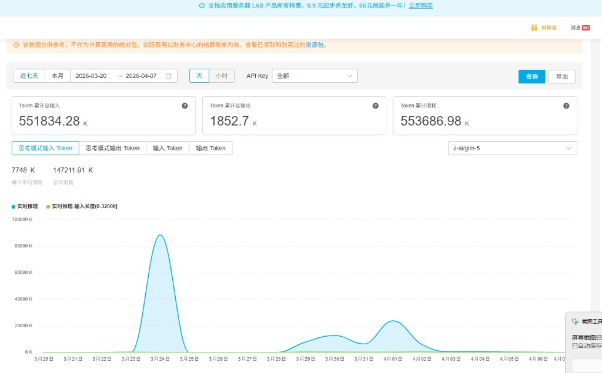

# Show me your usage：Cursor 订阅与用量自证

> 本站专栏页（带主题与侧栏）：[column-show-your-usage.html](../column-show-your-usage.html)  
> GitHub Pages 直达：<https://harzva.github.io/learn-likecc/column-show-your-usage.html>

本专栏用于公开维护者在 **Cursor** 上的 **Pro 订阅**与 **Usage 用量**截图，并补充 **七牛云** 等渠道上的 **模型推理 Token 用量**截图，说明编写课程与站点时在编辑侧与 API 侧均有可对账的消耗痕迹。**Cursor 为 Cursor, Inc. 产品；七牛云为独立云服务商**（官网 <https://www.qiniu.com/>），均与 Anthropic / Claude Code 官方无隶属关系；截图不构成广告或代言。

## 订阅与套餐内用量概览

## 用量明细（历史请求）

## 七牛云：模型推理 Token 用量

以下为 **七牛云** 控制台中的 AI 模型 Token 用量统计节选（累计输入/输出、按日曲线等；具体模型与时间范围以界面为准）。数据仅供参考，实际费用以七牛财务结算为准。

七牛云官网：<https://www.qiniu.com/>

## 说明

- 图片存放于仓库 `site/images/show-your-usage/`。
- 界面语言、数字比例会随 Cursor 后台与时间变化；以你本地登录后为准。
