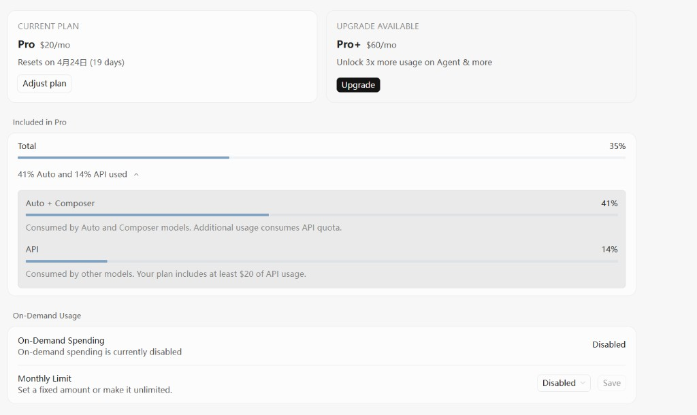
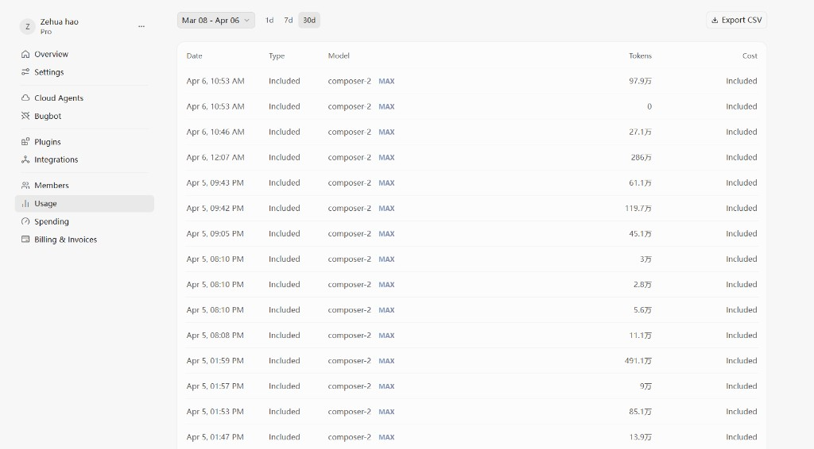

# Show me your usage：Cursor 订阅与用量自证

> 本站专栏页（带主题与侧栏）：[column-show-your-usage.html](../column-show-your-usage.html)  
> GitHub Pages 直达：<https://harzva.github.io/learn-likecc/column-show-your-usage.html>

本专栏用于公开维护者在 **Cursor** 上的 **Pro 订阅**与 **Usage 用量**截图，说明编写 Claude Code 相关课程与站点时，在编辑侧有真实付费与消耗。**Cursor 为 Cursor, Inc. 产品，与 Anthropic / Claude Code 官方无关**；截图不构成广告或代言。

## 订阅与套餐内用量概览

## 用量明细（历史请求）

## 说明

- 图片存放于仓库 `site/images/show-your-usage/`。
- 界面语言、数字比例会随 Cursor 后台与时间变化；以你本地登录后为准。
