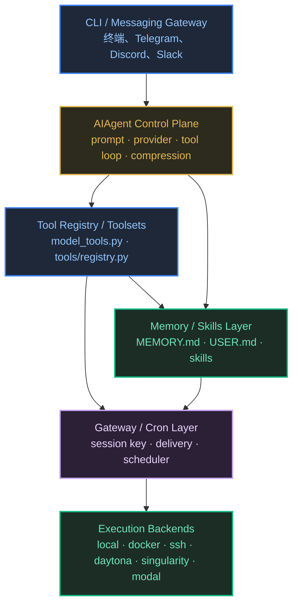

# Hermes Agent 解构

> **在线页面**: https://harzva.github.io/learn-likecc/topic-hermes-unpacked.html  
> **本文件**: `site/md/topic-hermes-unpacked.md`  
> **更新时间**: 2026-04-10

本页归入 **庖丁解牛专题**，目标不是介绍 Hermes Agent 有多“全能”，而是拆它如何把 `agent loop + tools registry + memory/skills + gateway + cron + environments` 拼成一个长期运行的 agent 控制层。

## 目录（对照 HTML）

### 参考来源与版本锚定

官方来源优先：

- `https://hermes-agent.ai/`
- `https://github.com/NousResearch/hermes-agent`
- `https://hermes-agent.nousresearch.com/docs/developer-guide/architecture`
- `https://hermes-agent.nousresearch.com/docs/user-guide/features/memory`

本地锚点：

- `reference/reference_agent/hermes-agent/README.md`
- `reference/reference_agent/hermes-agent/run_agent.py`
- `reference/reference_agent/hermes-agent/tools/registry.py`
- `reference/reference_agent/hermes-agent/tools/memory_tool.py`
- `reference/reference_agent/hermes-agent/tools/skills_tool.py`
- `reference/reference_agent/hermes-agent/tools/delegate_tool.py`
- `reference/reference_agent/hermes-agent/gateway/run.py`
- `reference/reference_agent/hermes-agent/gateway/session.py`
- `reference/reference_agent/hermes-agent/cron/scheduler.py`

### 01 · 为什么 Hermes 值得放进庖丁解牛专题

Hermes 值得拆，不是因为它“功能很多”，而是因为它把长期运行 agent 的关键控制点都做成了正式层：

- CLI / gateway 双入口
- `AIAgent` 主循环
- tools registry 与 toolsets
- memory / user profile / skills
- gateway session 与平台 delivery
- cron scheduler 与环境后端

### 02 · 先拆成六层：Hermes 到底在拼什么

- 入口壳：`hermes_cli/` 与 README 的 CLI / gateway 双入口
- 控制面：`run_agent.py` 中的 `AIAgent`
- 工具执行面：`model_tools.py` + `tools/registry.py`
- 长期记忆层：`tools/memory_tool.py` + `agent/memory_manager.py`
- 技能层：`tools/skills_tool.py`、`tools/skill_manager_tool.py`
- 平台与时间轴：`gateway/`、`cron/`、`environments/`

结论：Hermes 更像一个长期在线的 `agent operations layer`，不是一个单纯终端助手。

### [插图提示词]

用途：画 Hermes 六层总图，让读者先建立入口壳、控制面、工具面、记忆/技能、gateway/cron、环境后端的分层心智。  
形式：分层结构图。  
提示词：画一个 Hermes Agent 六层架构图，顶部是 CLI 与 Messaging Gateway 双入口，中间是 AIAgent 控制面与 Tool Registry，左侧是 Memory / User Profile，右侧是 Skills / Skill Manager，底部是 Gateway adapters、Cron scheduler、Environment backends，箭头标出消息进入、工具调用、记忆写回、定时触发、平台回送。  
Mermaid 更适合：是。

### 03 · 控制面到底在哪：不是 gateway，而是 AIAgent

从官方 Architecture 页与 `run_agent.py` 看，真正像控制面的还是 `AIAgent`：

- 负责 provider 选择
- 负责 prompt assembly
- 负责 tool-calling loop
- 负责 compression / retries / persistence
- 负责 memory / skill nudges

所以 gateway 更像 ingress layer，不是主脑。这一点和我们读 Claude Code / Like Code 时得到的判断一致：不要把壳误认成脑。

### 04 · Hermes 的关键差异：它把记忆和技能放进了主循环

Hermes 的 README 把它描述成 built-in learning loop，本地代码也确实能看到对应结构：

- `AIAgent` 维护 `_turns_since_memory`、`_iters_since_skill`
- 初始化时加载 memory store / memory provider / skills config
- 后台 review 会审查当前对话是否值得写入 memory 或 skill

这说明 Hermes 不把记忆和技能当外挂，而是当 loop 内结构。

边界可以再拆得更细：

- `tools/memory_tool.py` 的 `MemoryStore` 负责 `MEMORY.md` / `USER.md` 的文件落盘与冻结快照
- `agent/memory_manager.py` 负责协调内建 memory 与外部 memory provider
- `tools/skills_tool.py` 负责 `skills_list` / `skill_view` 这样的渐进披露
- `tools/skill_manager_tool.py` 的 `skill_manage` 才是真正的 skill 写入面
- `run_agent.py` 里的 `_turns_since_memory`、`_iters_since_skill` 与 background review 负责“什么时候值得沉淀”

### [插图提示词]

用途：说明 Hermes 的 closed learning loop。  
形式：闭环流程图。  
提示词：画一个 Hermes Agent learning loop 闭环：user message 进入 AIAgent，模型调用工具完成任务，conversation 结束后触发 background review，判断是否写入 memory、user profile 或 skill，随后这些内容回到下一轮 system prompt，形成持续学习闭环。  
Mermaid 更适合：是。

### 05 · Gateway、Cron、Environment：它怎么从“会聊天”走到“长期在线”

官方 Architecture 页给出的三条数据流很关键：

- CLI session
- Gateway message
- Cron job

这说明 Hermes 把“从哪里进来”“何时触发”“结果送到哪里”都纳入了正式系统设计。

再叠加 README 里列出的 local / Docker / SSH / Daytona / Modal 等环境后端，可以把它理解成：Hermes 不是只会在当前终端回答一句话，而是在尝试做一个跨平台、跨时间轴、跨执行环境的长期 agent runtime。

这里还值得再拆一层：`gateway/session.py` 不只是“存聊天记录”，而是在定义 Hermes 的 session seam：

- `build_session_key()` 决定 DM、group、thread、per-user isolation 怎么折叠成同一条会话
- `SessionStore.get_or_create_session()` 与 `_should_reset()` 决定 idle / daily reset policy
- `build_session_context_prompt()` 把来源平台、home channel、delivery options 注入系统提示
- `gateway/run.py` 用 `session_key` 复用 `_agent_cache` 里的 `AIAgent`
- `run_agent.py` 明确写了 plugin user context 是 ephemeral 的，不会持久写回 session DB

所以 gateway 真正做的是：把平台消息收束为稳定的 session identity、prompt context、history persistence 和 delivery path，而不是自己成为第二个控制面。

### [插图提示词]

用途：画 Hermes 的 gateway / session boundary 图。  
形式：结构流图。  
提示词：画一个 Hermes gateway session boundary 图。左侧是 Telegram / Discord / Slack adapter 输入消息，中间是 build_session_key 与 SessionStore，标出 reset policy、session context prompt、history load/save，右侧是 cached AIAgent kernel，底部是 transcript persistence 与 delivery router。强调 gateway 负责 ingress、session identity、history、delivery，而不是替代 AIAgent 控制面。  
Mermaid 更适合：是。

再往下一层，Hermes 还把“执行边界”做成了正式抽象：

- `tools/terminal_tool.py` 用 `TERMINAL_ENV` + `create_environment()` 在 local、docker、ssh、daytona、singularity、modal 之间切换
- `terminal_tool.py` 顶部和 `run_agent.py` 的 `_cleanup_task_resources()` 明确区分 persistent filesystem 与 live sandbox：文件可保留，不等于进程永存
- `environments/README.md` 说明同一个 `task_id` 会复用同一终端 / 浏览器状态，所以 verifier 检查的是模型刚操作过的那份环境
- 这套 backend 抽象又被 `HermesAgentBaseEnv` / Atropos 训练环境直接复用，说明 execution layer 不是 UI 附件，而是可训练、可评测的运行层

这也是 Hermes 和普通“终端聊天壳”差别很大的地方：它不是只会调一个 shell，而是把 backend selection、生命周期、状态复用都纳入控制面设计。

### [插图提示词]

用途：解释 Hermes 的 execution boundary。  
形式：执行路径图。  
提示词：画一个 Hermes execution boundary 图。顶部是 AIAgent 与 terminal tool，中间是 TERMINAL_ENV backend selector，下面分成 local、docker、ssh、daytona、singularity、modal 六个执行后端。旁边标出 task_id 复用、persistent filesystem、idle reaper、lifetime_seconds、ToolContext verifier，强调“统一工具接口，多种执行面，状态按 task/session 管理”。  
Mermaid 更适合：是。

### 06 · 三条运行链路复盘：CLI、Gateway、Cron 到底怎么汇进同一套脑子

官方 Architecture 页把三条链路写得很清楚：

- CLI Session：`hermes_cli/main.py` → `AIAgent.run_conversation()` → prompt builder → provider runtime → tool loop
- Gateway Message：`gateway/run.py` → adapter `on_message()` → resolve session key → fresh `AIAgent` + history → adapter delivery
- Cron Job：`cron/scheduler.py` → jobs.json → fresh `AIAgent` → attached skills context → target delivery

这三条链路共同说明：Hermes 的关键不是入口多，而是所有入口都被收敛回同一个 agent kernel。

### 07 · 对 Claude Code / Like Code / codex-loop 值得学什么

- 把控制面和入口壳分开：主脑在 loop，不在 UI 或平台 adapter。
- 把记忆和技能当成 loop 内结构，而不是外挂资料夹。
- 把时间轴与回送通道当成正式能力。
- 学 Hermes 的“长期运行控制层”，不要照搬它的整套产品壳。

### 08 · 放回我们自己的栈：Hermes 和 Claude Code / Like Code / codex-loop 到底哪里相像，哪里不同

更有价值的读法，不是把 Hermes 当成“另一个竞品 agent”，而是把它当作长期运行控制层样本，再对照我们自己的栈：

- Hermes：`AIAgent` 内建 provider、prompt、tool loop、memory/skills、gateway、cron
- 我们：Claude Code / Like Code 负责交互式主脑，`codex-loop` 负责 plan-driven 调度，repo 内 skills / plans / docs 承担外置长期记忆

可以把差异粗略整理成五层：

- 主脑：Hermes 更偏一体化内核；我们更偏强主脑 + 外置流程纪律
- 入口：Hermes 统一 CLI 和消息平台；我们更偏工程工作台与内容工作台
- 持续推进：Hermes 用 cron 直接拉起 fresh agent；我们用 plan + evolution note 明确推进链路
- 记忆 / 技能：Hermes 内建沉淀；我们把沉淀放进 repo，可版本化、可复查
- 执行面：Hermes 有正式 backend abstraction；我们目前更偏本地工程环境加定向自动化

所以最值得学的不是“照搬产品壳”，而是学它那条清楚的控制面主线：主脑、入口、调度、记忆、执行面要怎么拆，拆完之后又怎么重新接起来。

### 参考与原始链接

- https://hermes-agent.ai/
- https://github.com/NousResearch/hermes-agent
- https://hermes-agent.nousresearch.com/docs/developer-guide/architecture
- https://hermes-agent.nousresearch.com/docs/user-guide/features/memory
- `reference/reference_agent/hermes-agent/run_agent.py`
- `reference/reference_agent/hermes-agent/tools/registry.py`
- `reference/reference_agent/hermes-agent/gateway/run.py`
- `reference/reference_agent/hermes-agent/cron/scheduler.py`
