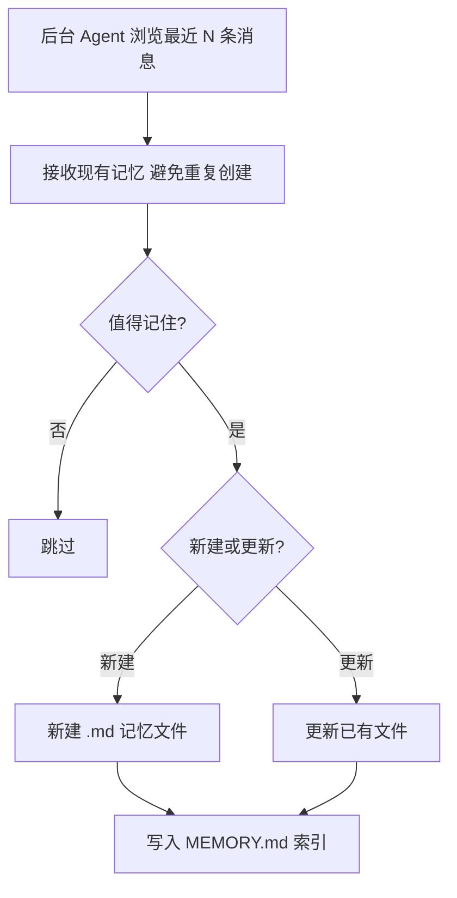
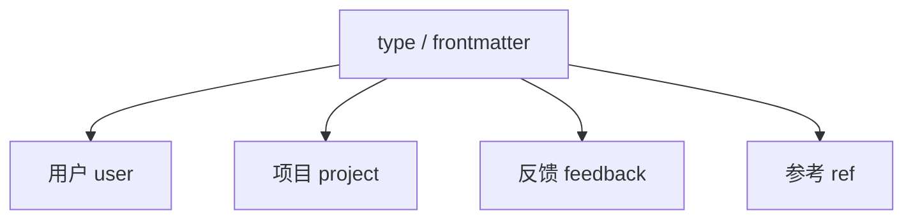
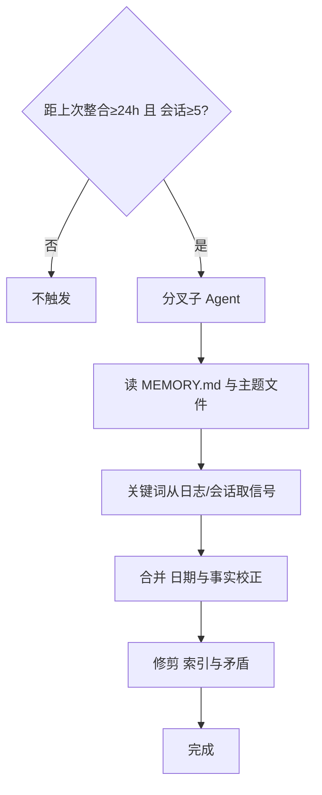
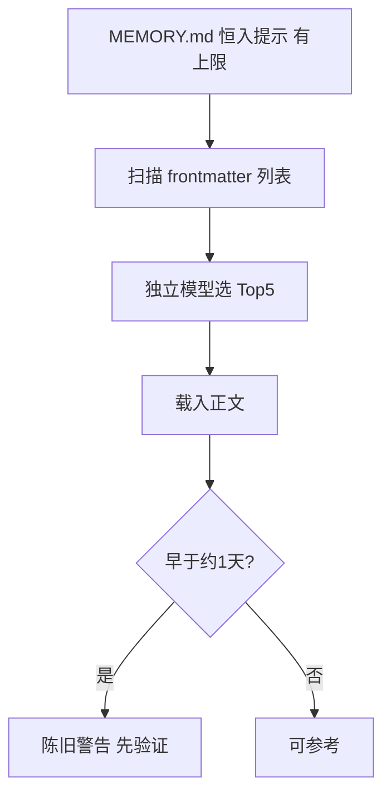

# Memory 长期记忆：写入、整合、检索与安全
> **更新时间**: 2026-04-12

> **在线页面**: https://harzva.github.io/learn-likecc/topic-memory-harness.html  
> **本文件**: `site/md/topic-memory-harness.md`  
> **仓库完整稿（与专题同源）**: `wemedia/zhihu/articles/13-Memory长期记忆-写入检索与安全.md`

## 概要

梳理 Claude Code 类 **Harness** 如何把长期记忆落成 **Markdown + 索引 + YAML 元数据**：分阶段写入、定期整合、用独立模型筛选待读文件、沙箱约束写路径。下图与正文为**教学示意**，细节以官方文档与当前产品为准。

## 目录（对照 HTML）

- **导语**：定位与免责声明
- **1. 写入（阶段一）** + Mermaid
- **四种 type** + Mermaid
- **MEMORY.md 与单文件示例**
- **2. 阶段二：定期整合** + Mermaid
- **3. 删除哲学**
- **4. 检索** + Mermaid
- **5. 安全三层** + Mermaid
- **6. Harness 四条纪律**

---

## 1. 阶段一：逐轮写入（Mermaid）

## 四种记忆类型

## 阶段二：整合

## 检索与陈旧提示

## 安全三层

## MEMORY.md 与 frontmatter 示例

见网页版代码块；知乎稿与本文同源。

## 各节摘要（对照 HTML）

### 写入

逐轮判定「值不值得记」→ 新建/更新文件 → 维护 `MEMORY.md` 单行索引。

### 整合

子 Agent 合并、去矛盾、修剪；用锁避免并发写乱。

### 删除

无简单按天过期；删除发生在整合时的显式判断。

### 检索

索引常载；正文由便宜模型筛 Top5；`description` 质量决定召回；旧记忆带验证提示。

### 安全

路径全局配置 + 校验 + 白名单，防借记忆越权写。

### 总结

写入格式锁死、检索独立、删除不静默、过时靠警告与验证——Harness 不信任无监督自管记忆。
