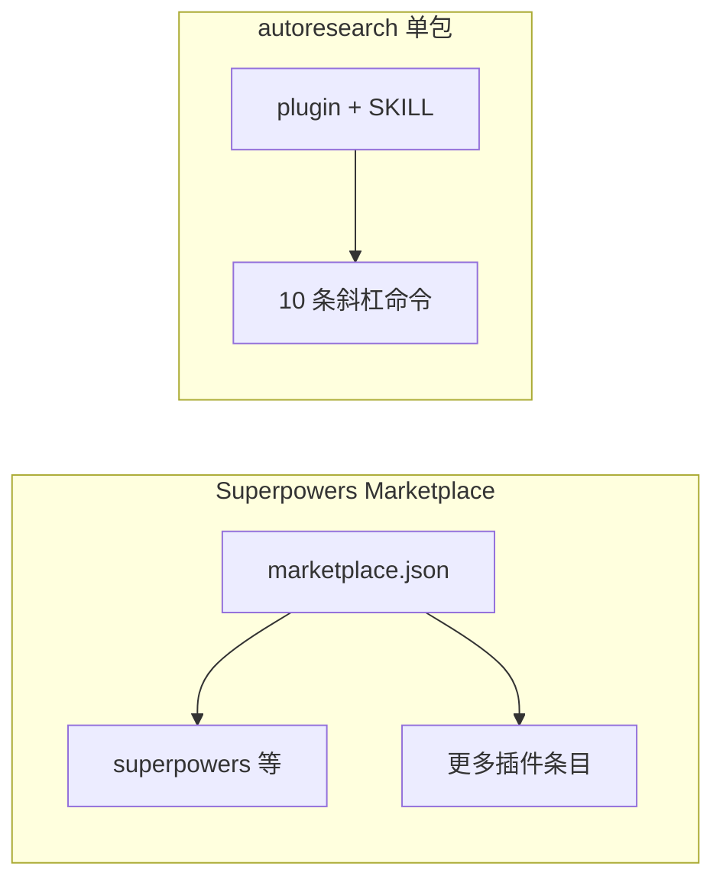
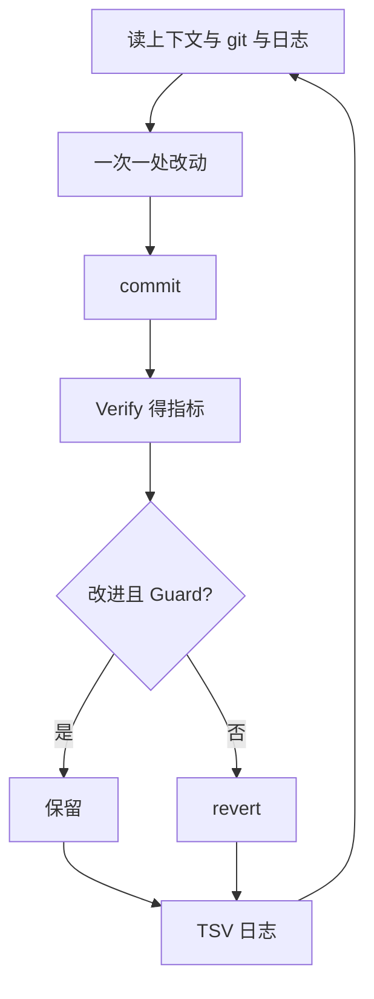

# Superpowers 市场 vs Autoresearch（本站镜像）

> **在线页面**: https://harzva.github.io/learn-likecc/topic-superpowers-autoresearch.html  
> **本文件**: `site/md/topic-superpowers-autoresearch.md`  
> **知乎长文**: `wemedia/zhihu/articles/21-Superpowers市场与Autoresearch-Claude插件对比.md`

## 概要

基于本仓库 `reference/reference_agent/` 内 **vend 快照**（`superpowers-marketplace`、`autoresearch`）做结构对照：**市场目录多插件** vs **单一自主改进插件包**，避免把「Superpowers」与「Autoresearch」当成同类可替代产品。

## 证据路径（本仓库）

- `reference/reference_agent/superpowers-marketplace/.claude-plugin/marketplace.json`
- `reference/reference_agent/autoresearch/claude-plugin/.claude-plugin/plugin.json`
- `reference/reference_agent/autoresearch/claude-plugin/skills/autoresearch/SKILL.md`

## Mermaid（与网页同源 key）

### 货架 vs 单包

### Autoresearch 验证循环（简化）

## 上游

- https://github.com/obra/superpowers-marketplace  
- https://github.com/uditgoenka/autoresearch  
