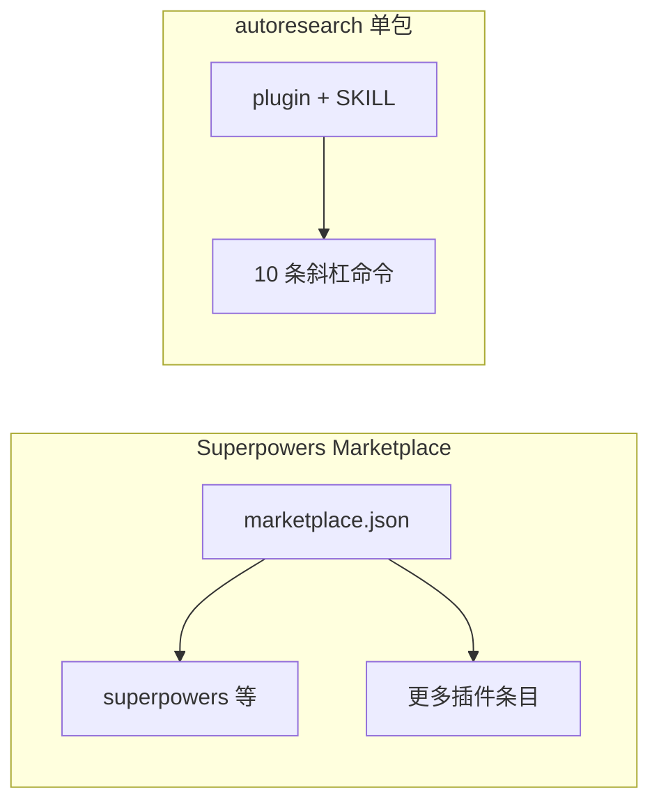
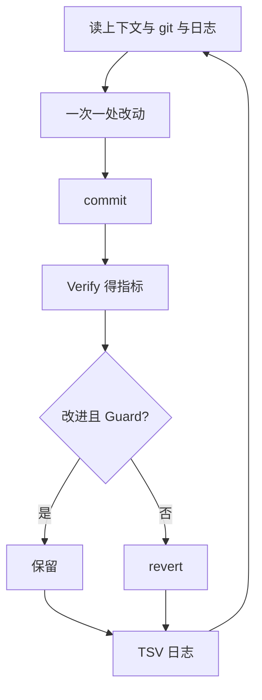

# Superpowers 市场 vs Autoresearch（本站镜像）
> **更新时间**: 2026-04-04

> **在线页面**: https://harzva.github.io/learn-likecc/topic-superpowers-autoresearch.html  
> **本文件**: `site/md/topic-superpowers-autoresearch.md`  
> **知乎长文**: `wemedia/zhihu/articles/21-Superpowers市场与Autoresearch-Claude插件对比.md`

## 概要

基于本仓库 `reference/reference_agent/` 内 **vend 快照**（`superpowers-marketplace`、`autoresearch`）做结构对照：**市场目录多插件** vs **单一自主改进插件包**，避免把「Superpowers」与「Autoresearch」当成同类可替代产品。

## 证据路径（本仓库）

- `reference/reference_agent/superpowers-marketplace/.claude-plugin/marketplace.json`
- `reference/reference_agent/autoresearch/claude-plugin/.claude-plugin/plugin.json`
- `reference/reference_agent/autoresearch/claude-plugin/skills/autoresearch/SKILL.md`

## Mermaid（与网页同源 key）

### 货架 vs 单包

### Autoresearch 验证循环（简化）

## 上游

- https://github.com/obra/superpowers-marketplace  
- https://github.com/uditgoenka/autoresearch  

## 几种循环 / 定时方式

这类 Agent 长循环常见有四种驱动口径：

| 方式 | 谁驱动循环 | 最大优势 | 典型短板 | 适合什么 |
| --- | --- | --- | --- | --- |
| 原生 Loop | 产品自身 runtime | 体验最顺，用户不用自己搭调度层 | 强依赖平台原生支持 | 产品已经内建 loop / 定时唤醒能力时 |
| Hook 内循环 | 会话生命周期 hook | 上下文连续性最好，循环发生在当前 session 里 | 没有 hook 的平台难复刻 | Ralph loop 这类 Stop hook 自循环 |
| Daemon 循环 | 后台常驻进程 | 最工程化，可写状态、日志、锁文件 | 要自己维护后台进程 | `codex-loop` 这种复用 thread 的长期推进 |
| Cron 调度 | 操作系统定时器 | 最稳定，适合开机拉起、巡检 | 不是 thread-aware loop 本体 | 守护 daemon、开机恢复、定时健康检查 |

一句话记忆：

- Hook 最像“会话内自循环”
- daemon 最像“工程化长期运行”
- cron 更像“外层守护与调度”

所以 cron 往往不是 loop 本体，而是用来守护 daemon。
