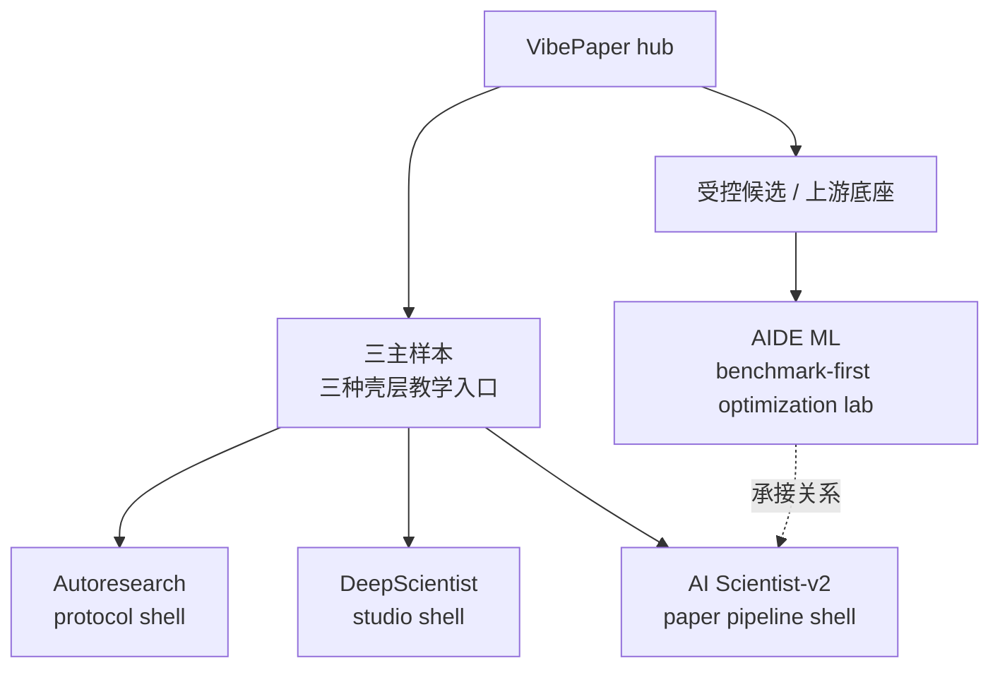
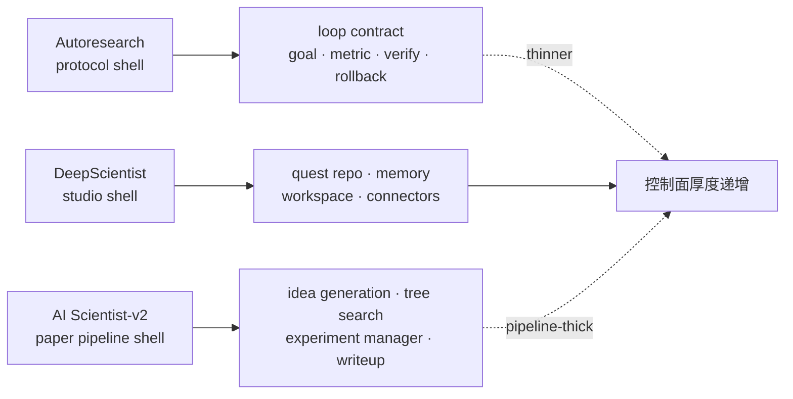

# VibePaper 专题 - Claude Code Course

> **在线页面**: https://harzva.github.io/learn-likecc/topic-vibepaper.html  
> **本文件**: `site/md/topic-vibepaper.md`  
> **更新时间**: 2026-04-11

## 概要

VibePaper 专题目前先收 **Autoresearch**、**DeepScientist** 与 **AI Scientist-v2** 三条样本线，关注的不是“论文工具很多”，而是：一个系统如何把论文阅读、baseline 复现、实验迭代、图表整理、成稿输出和长期记忆串成持续运行的研究工作流。

## 目录（对照 HTML）

- 为什么单列一个 VibePaper 专题
- 当前先收三条样本项目
- 先用四个问题把当前锚点放到一张表里
- 新进候选：AI Scientist-v2 先放 hub，不急着拆独立页
- 再做一个受控 intake：AIDE ML 先作为优化实验室候选
- 再往前走一步：三条线的 control-plane thickness 到底差在哪
- 建议怎么读这条线
- 这个专题会怎么持续长出来
- 参考与本地路径

## 各节摘要

### 为什么单列一个 VibePaper 专题

这条线不只是在讲 paper，而是在拆“自动科研 / 自动论文系统”的结构：谁更像插件式自主循环，谁更像研究工作台，谁适合成为后续教程与可视化的核心样本。

### 当前先收三条样本项目

- `Autoresearch`
  - 本地路径：`reference/reference_agent/autoresearch/`
  - 更像单插件 / 单循环协议，适合看 verify loop、命令面与机械验证。
- `DeepScientist`
  - 本地路径：`reference/reference_agent/DeepScientist/`
  - 更像本地优先的自动科研 studio，适合看 quest repo、baseline/experiment/paper 一体化与可见研究进度。
- `AI Scientist-v2`
  - 本地路径：`reference/reference_agent/AI-Scientist-v2/`
  - 更像 paper factory / agentic tree search system，适合看 idea 生成、树搜索实验管理、PDF 成稿链路。

当前站内状态可以先这样理解：

- `Autoresearch` 和 `DeepScientist` 已经各自展开成独立解构页
- `AI Scientist-v2` 先留在 hub 里承担第三条主样本线
- `AIDE ML` 继续留在候选底座 lane，用来解释 AI Scientist-v2 背后的上游实验搜索结构

### [插图提示词]

用途：画 VibePaper 当前入口结构，让读者先分清三主样本和候选底座不是同一层。  
形式：三主样本加一条候选旁路的结构图。  
提示词：上方主线放三张主样本卡：Autoresearch，突出 plugin、command surface、verify loop、mechanical checklist；DeepScientist，突出 quest repo、baseline、experiment rounds、paper outputs、visible workspace、human takeover；AI Scientist-v2，突出 idea generation、tree search、experiment manager、writeup pipeline。旁路再放 AIDE ML，标注 benchmark-first optimization lab 与 AI Scientist-v2 的上游承接关系。图中央注明三主样本负责教学入口，候选底座先留在 comparison lane。  
Mermaid 更适合：是。

### 先用四个问题把当前锚点放到一张表里

Task 6 后续加新系统时，不应该先写宣传语，而应该先回答四个结构问题：它更像哪种系统形态，它的 control plane 在哪，它保留什么 durable state，它最适合长成哪类教程内容。先把当前三条样本放进同一张表，后面加新项目时才能保持口径一致。

| 系统 | 更像哪种形态 | control plane 在哪 | durable state 保留什么 | 值得长成什么教程 |
| --- | --- | --- | --- | --- |
| `Autoresearch` | 插件式研究循环协议 | `goal + metric + scope + verify + rollback + git memory` 这套 loop contract，而不是某个厚 UI | git 历史、实验提交、verify 结果、比较日志、guide / comparison 文档 | 最适合长成“研究循环协议”“验证链路”“单循环 debug / fix / ship 方法论” |
| `DeepScientist` | 本地优先研究工作台 | `quest + baseline/experiment/write stage workflow + quest repo`，而不是单个聊天框 | quest repo、findings memory、artifacts、paper outputs、visible workspace 状态 | 最适合长成“quest repo 操作系统”“durable research loop”“自动科研工作台分层” |
| `AI Scientist-v2` | paper factory / agentic tree search system | `launch_scientist_bfts.py`、`bfts_config.yaml` 与 experiment manager agent 组成的树搜索调度面 | idea JSON、`experiments/` 日志、`unified_tree_viz.html`、writeup 中间产物与最终 PDF | 最适合长成“idea → tree search → experiment → paper draft”流水线教程，以及 search manager 对照课 |

这张表有两个用处：

- 它把 Autoresearch、DeepScientist 和 AI Scientist-v2 的差异压缩成站内统一口径，避免以后专题页越长越散
- 它给后续新增项目提供一个最低准入模板：如果这四个问题答不清楚，就先不要急着把它抬成独立子专题

### [插图提示词]

用途：画 VibePaper 四问评估框架，把“系统形态 / 控制面 / 持久状态 / 教程价值”变成可复用评估卡。  
形式：四栏结构卡。  
提示词：画一个 VibePaper evaluation framework 图，横向四列分别是 system shape、control plane、durable state、tutorial value，纵向放三行案例：Autoresearch、DeepScientist 和 AI Scientist-v2。Autoresearch 行突出 plugin protocol、loop contract、git memory、verify tutorial；DeepScientist 行突出 research studio、quest workflow、findings memory 和 paper outputs、workspace tutorial；AI Scientist-v2 行突出 agentic tree search、experiment manager、experiment logs 和 PDF writeup。  
Mermaid 更适合：否，更适合 HTML 卡片图。

### 新进候选：AI Scientist-v2 先放 hub，不急着拆独立页

这一轮先把一个新候选系统接进 VibePaper：`AI Scientist-v2`。选择它的原因很直接：它有明确的官方 repo、官方 paper，而且“从 idea 到 experiment 再到 PDF”这条链比一般 research agent 更完整，适合放进 VibePaper 的比较坐标里。

先按四问框架给出当前判断：

- 更像哪种形态：不是插件式协议，也不是厚重 studio，更像 **paper factory / agentic tree search system**
- control plane 在哪：`launch_scientist_bfts.py`、`bfts_config.yaml` 和 README 里提到的 experiment manager agent，说明它的主脑更靠近树搜索调度和阶段编排
- durable state 保留什么：idea JSON、`experiments/` 下的 timestamped logs、`unified_tree_viz.html`、最终 PDF 与 writeup 中间产物
- 值得长成什么教程：最适合长成“idea → tree search → experiment → paper draft”的流水线教程，以及“研究控制面为什么从 loop contract 变成 search manager”的对照课

当前站内决策：它先作为 **short hub card / comparison sample** 保留在 VibePaper 总页里，还不急着升成独立 unpacked 页面。等后面把 `AI Scientist-v1 / v2` 差异和它引用的 AIDE 底座再看清，再决定是否单独拆页。

### 再做一个受控 intake：AIDE ML 先作为优化实验室候选

这一轮新接入的不是第四个正式样本，而是一个受控候选：`AIDE ML`。它的价值不在“会不会直接写论文”，而在于它把 **code-space tree search + benchmark optimization** 做得非常清楚，而且是 `AI Scientist-v2` 背后直接承接的参考算法之一。

先按四问框架给出当前判断：

- 更像哪种形态：不是 plugin 协议，也不是 workspace studio，更像 **benchmark-first optimization lab**
- control plane 在哪：`aide` CLI、`aide/agent.py`、`aide/run.py` 和 journal / report 流程，核心是围绕代码树搜索与评测反馈展开
- durable state 保留什么：`logs/<id>/best_solution.py`、`tree_plot.html`、journal / report 产物、sample results 与工作目录
- 值得长成什么教程：最适合长成“benchmark-first 优化 loop”“代码树搜索怎样比线性代理更强”“AIDE 与 AI Scientist-v2 的承接关系”

当前站内决策：它先作为 **comparison-section candidate** 保留在 VibePaper hub，而不是直接加入三主样本表。原因很简单：它和 `AI Scientist-v2` 关系太近，先作为“上游实验搜索底座”来介绍，比直接把页面扩成四主样本更清楚。

| 系统 | 当前站内角色 | 为什么先放在这个层级 |
| --- | --- | --- |
| `Autoresearch` | 主样本 | 它把研究动作压成 loop contract，足够独立，适合单独承担“协议壳”教学入口。 |
| `DeepScientist` | 主样本 | 它已经形成完整的本地研究工作台，适合单独承担“studio shell”教学入口。 |
| `AI Scientist-v2` | 主样本 | 它直接覆盖 idea 到 writeup 的成稿流水线，足够代表“paper pipeline shell”。 |
| `AIDE ML` | 候选底座 | 它更像 AI Scientist-v2 的上游优化实验底座，当前拿来讲承接关系比抬成第四主样本更清楚。 |

这个小表的作用不是给项目排座次，而是把站内层级固定下来：三主样本负责承担三种壳层的教学入口，`AIDE ML` 这种上游底座先放在 comparison section，等它能贡献一个真正不同的壳层，再考虑抬升。

### 再往前走一步：三条线的 control-plane thickness 到底差在哪

如果只看名字，三条线都像“自动科研系统”。但真正值得教学的是它们的控制面厚度差异：

- `Autoresearch` 最薄：主脑几乎全压在 loop contract 里，重点是 goal / metric / verify / rollback 这些协议面
- `DeepScientist` 最厚：quest repo、stage workflow、memory、workspace、connectors 共同构成一个本地研究工作台
- `AI Scientist-v2` 介于两者之间，但厚度方向不同：它不是把可视化工作台做厚，而是把 experiment manager、tree search、writeup pipeline 做厚，直接朝“论文成稿工厂”靠拢

这组对照很有用，因为它把 VibePaper 里的三条线从“项目列表”变成了三种不同的系统壳层：

- 协议壳：Autoresearch
- 工作台壳：DeepScientist
- 论文流水线壳：AI Scientist-v2

后面如果再接新项目，最先要问的就不是“它火不火”，而是“它到底是在加厚哪一层壳”。这会直接决定它应该被写成 loop 教程、workspace 教程，还是 paper pipeline 教程。

| 系统 | 主要加厚哪一层 | 因此更像什么 |
| --- | --- | --- |
| `Autoresearch` | loop contract / verify / rollback | protocol shell |
| `DeepScientist` | quest repo / memory / workspace / connectors | studio shell |
| `AI Scientist-v2` | tree search / experiment manager / writeup pipeline | paper pipeline shell |

### [插图提示词]

用途：画三种 research control-plane thickness，对比协议壳、工作台壳、论文流水线壳。  
形式：三栏厚度对比图。  
提示词：画一个 VibePaper control-plane thickness 对比图，三列分别是 Autoresearch、DeepScientist、AI Scientist-v2。Autoresearch 列最薄，只突出 loop contract；DeepScientist 列最厚，展示 quest repo、memory、workspace、connectors 多层外壳；AI Scientist-v2 列中等厚度，但重点放在 idea generation、tree search、experiment manager、writeup pipeline。底部标注三者分别对应 protocol shell、studio shell、paper pipeline shell。  
Mermaid 更适合：否，更适合 HTML 层叠卡片图。

### 建议怎么读这条线

1. 先看 Autoresearch，理解研究动作如何被拆成循环协议和验证链路。  
2. 再看 DeepScientist，理解如果把整套研究过程做成工作台，会多出哪些层。  
3. 再看 AI Scientist-v2，理解当系统目标直接指向“论文成稿”时，控制面为什么会转成树搜索和实验经理。  
4. 最后回到站点，判断哪些值得继续写成教程、图示和子专题。

这里还有一个默认规则：三主样本负责承担站内的第一层教学入口，像 `AIDE ML` 这样的上游实验搜索底座，先留在 comparison lane，只有当它能代表一个新的系统壳层时，才考虑抬升成独立主样本或子专题。

### 这个专题会怎么持续长出来

后续会继续：

- 发现新的自动科研 / 自动论文系统并 clone 到 `reference/reference_agent/`
- 挑最值得讲的项目，补结构分析、对照表、插图提示词与教程路线
- 把成熟项目继续拆成独立子页，如 `topic-*-unpacked.html`

### 参考与本地路径

- https://github.com/uditgoenka/autoresearch
- https://github.com/ResearAI/DeepScientist
- https://deepscientist.cc/
- https://openreview.net/forum?id=cZFgsLq8Gs
- https://github.com/SakanaAI/AI-Scientist-v2
- https://pub.sakana.ai/ai-scientist-v2/paper/paper.pdf
- https://github.com/WecoAI/aideml
- https://arxiv.org/abs/2502.13138
- `reference/reference_agent/autoresearch/`
- `reference/reference_agent/DeepScientist/`
- `reference/reference_agent/AI-Scientist-v2/`
- `reference/reference_agent/aideml/`
