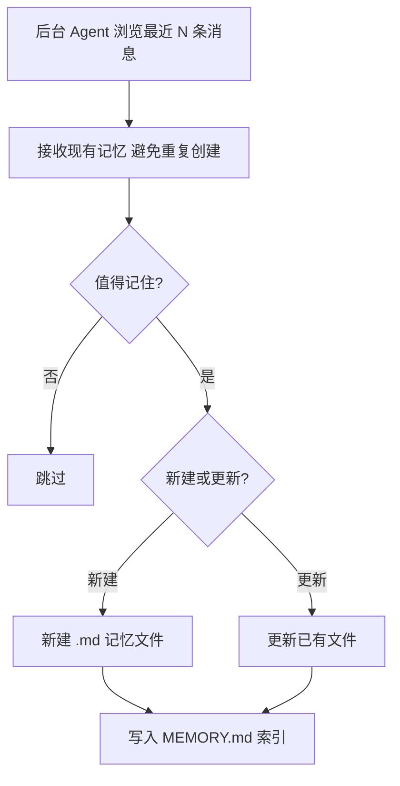
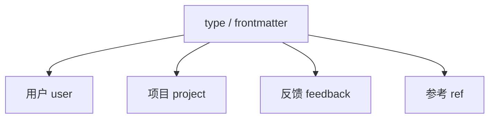
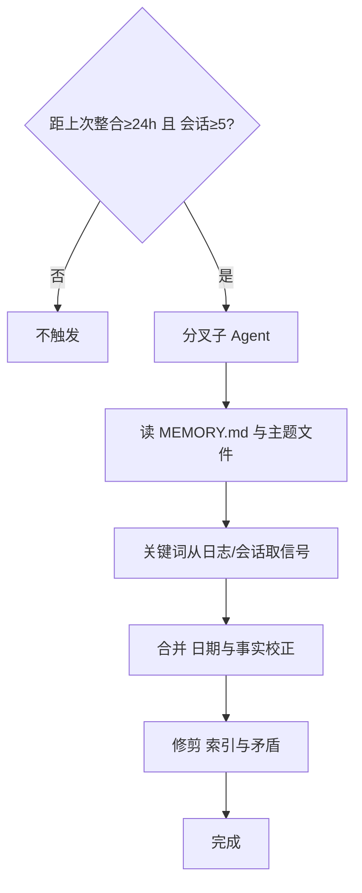
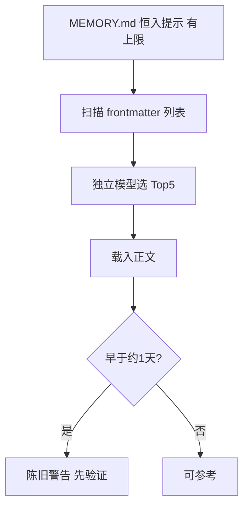

# Claude Code 类 Agent：长期 Memory 怎么写入、整合、检索才安全？

> **适合直接发知乎的导语**  
> 很多人把「记忆」理解成向量库 RAG；在 **Claude Code 这条 Harness 线**里，更常见的是 **Markdown 文件 + 索引 + YAML 元数据**，再配合 **分阶段写入、定期整合、独立模型筛上下文、沙箱写路径**。下面把这条链路用**流程图 + 人话**讲一遍，方便你对照自家工作流。  
> **网页版（含渲染好的 Mermaid）**：https://harzva.github.io/learn-likecc/topic-memory-harness.html  
> **仓库同源 MD**：`site/md/topic-memory-harness.md`

**声明**：本文根据公开架构讨论与示意图整理，**不保证与 Anthropic 某一版闭源实现逐行一致**；以官方文档与当前 CLI 为准。

---

## 一、记忆写入：阶段一「逐轮提取」

后台 Agent 会回看**最近 N 条消息**，并拿到**已有记忆**，先问一句：**值得记吗？**

- **不值得** → 跳过。  
- **值得** → **新建**或**更新**一个主题 `.md` 文件，并维护总索引 **`MEMORY.md`**（目录 + **单行摘要**，给人看也给后面检索用）。



### 四种 `type`：别让用户画像和项目截止混在一个桶里

用固定枚举（示例）：

| type | 记什么 |
|------|--------|
| **user** | 你是谁：角色、领域、偏好 |
| **project** | 代码和 Git 里看不到的：截止日、已拍板决策 |
| **feedback** | 你希望 CC 怎么做：纠错方式、风格红线 |
| **ref** | 仓库外指引：工单、合规、外部系统 |



### `MEMORY.md` 与单文件长什么样？

**索引**（每条链到独立文件 + 一句话）：

```markdown
- [用户档案](user_profile.md) — 后端背景，近期在学 React
- [测试规范](feedback_testing.md) — 集成测试禁止 mock 数据库
- [认证重构](project_auth_rewrite.md) — 合规驱动，截止 2026-04-15
```

**单文件**（frontmatter 给「未见正文」的筛选模型看）：

```markdown
---
name: 测试规范
description: 集成测试必须连真实库，禁止仅用 mock
type: feedback
---

正文：细则、讨论摘要、链接……
```

**划重点**：后面检索阶段，筛选模型往往**主要看 `description`**。这一行写糊了，召回就糊。

---

## 二、阶段二：定期整合（autoDream 类子 Agent）

满足类似 **「距上次整合 ≥ 24h」且「会话数 ≥ 5」** 的条件后，起一个**分叉子 Agent**专做整理（示意图里常有专用代号），避免和主会话抢窗口。

它干四件事：

1. 读 `MEMORY.md` + 各主题文件，建立全貌。  
2. 从**日志 / 会话记录**用**关键词**捞新信号（不是整本吞日志）。  
3. **合并**：相对日期改绝对日期；删掉**已与当前代码矛盾**的旧事实。  
4. **修剪**：失效索引、冗长段落、**文件间矛盾**——该删条目删条目，该合并合并。

并发上常用 **lock 文件**，防止多会话同时整合把磁盘写花。



---

## 三、记忆会「过期自动删」吗？

**一般不会按时间自动清空。** 删除多发生在**整合阶段**的主动判断：和代码现状冲突、或被更可靠的新记忆覆盖。

一句话：**记忆会越写越精，但不会在你不知情时悄悄蒸发**（除非你在整合策略里显式允许某种清理）。

---

## 四、检索：为什么永远先载 `MEMORY.md`，却不默认载入全部正文？

- **`MEMORY.md`**：轻量、**默认进系统提示**，但有**行数/体积上限**（示意：约 200 行或 25KB）。  
- **各主题文件**：**不会**无脑全进上下文。

做法是：扫一遍（例如最多 **200 个**）文件的 **YAML frontmatter**，按时间排序，拼成：

`[type] 文件名 (时间戳): description`

把这串列表 + **当前用户问题**丢给**相对便宜的独立模型**（示意图常用 **Sonnet**）做**相关性路由**：

- **最多选出 5 个文件**；**不确定就不选**。  
- 只把这 5 个正文读进来；**本会话已经展示过的**可以跳过，优先新相关。

对**较早写入**的记忆，加载时附带「可能过时，**先验证再行动**」——让 Agent 用 `grep` 或读文件对齐现状。

**金句**：记忆是**观察快照**，不是实时真相。



---

## 五、安全：三层防护，堵「借记忆写到别处」

1. **全局锁定**：存储根路径只在**全局配置**改，防恶意仓库改路径。  
2. **路径校验**：拦截 `..`、指到系统根目录等越权。  
3. **沙箱白名单**：每次写入落在允许集合里，否则拒绝。


---

## 六、总结：Harness 的四条纪律

- **写入**：YAML + 固定 `type`，格式不由模型随口定。  
- **检索**：独立模型筛文件，主模型不插手筛选。  
- **删除**：无静默定时删；整合时显式判断。  
- **过时**：用日期与警告倒逼「先验证再用」。

**一句话**：模型很强，但 **Harness 不信任它在无监督下自管记忆**——每一步都带约束。

---

## 分发备忘（发知乎可删）

- **标题备选**：  
  - 《Claude Code 的 Memory 不是 RAG：Markdown 索引 + Sonnet 路由》  
  - 《长期记忆怎么写入、整合、检索才安全？一张流程图讲清》  
- **标签建议**：Claude Code、AI 编程、Agent、上下文工程、安全。  
- **配图**：可用本站 `topic-memory-harness.html` 截图 Mermaid；或自绘信息图。

---

*仓库路径：`wemedia/zhihu/articles/13-Memory长期记忆-写入检索与安全.md`*
