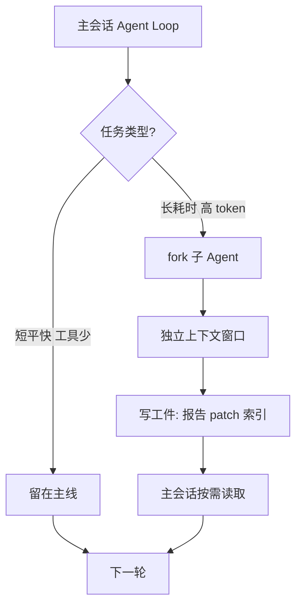
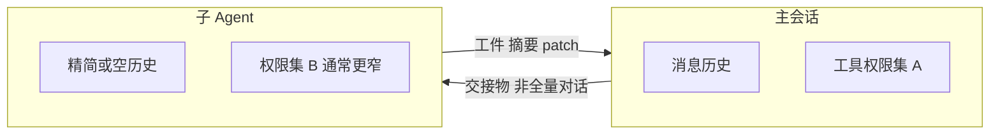
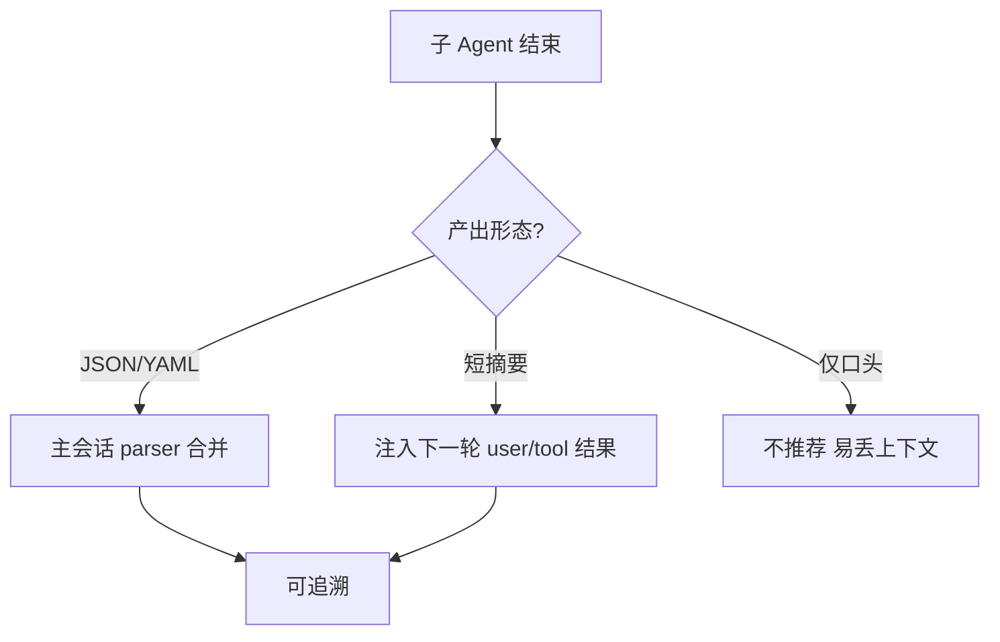

# 子 Agent 怎么编排？上下文隔离、交接与「别抢主会话窗口」

> **适合直接发知乎的导语**  
> 主会话里跑大任务，很容易把窗口吃满；**分叉子 Agent**（后台整理、专项检索、长耗时批处理）本质是**第二条（或多条）独立上下文**。本文从工程视角拆三件事：**何时 fork**、**隔离什么**、**如何把结果安全交回主线**——并配上流程图，方便你对照 Claude Code / 同类 Harness 的设计。

**声明**：以下为**架构级归纳**与业界常见模式，**不保证**与某一闭源版本实现逐行一致；以官方文档与当前 CLI 行为为准。

---

## 一、为什么要子 Agent：主循环的「机会成本」

主 Agent Loop 里，每一轮都要：

- 拼系统提示 + 项目规则 + 近期对话 + 工具结果；  
- 付 **token 税**（见稿 18）；  
- 承担 **串行延迟**（工具链一长，用户体感就拖）。

因此常见拆法：

| 形态 | 典型用途 | 和主会话关系 |
|------|----------|----------------|
| **后台整理** | 记忆整合、索引合并、日志摘要 | 异步，写完磁盘再被主会话读 |
| **专项子任务** | 大规模检索、批量改文件草案 | 同步或半同步，产出 patch/报告 |
| **沙箱执行** | 跑测试、构建、不可信脚本 | 强隔离，只回传 exit code + 日志摘要 |

**原则**：子 Agent **不是**「再开一个一样聪明的聊天」，而是**用独立预算**换 **主会话不被撑爆**。

---

## 二、隔离什么：状态、凭据、工作目录

**必须隔离的**：

1. **消息历史**：子任务不应默认继承主会话全部隐私与试错过程。  
2. **工具权限**：子 Agent 往往更窄（只读目录、禁止网络等）。  
3. **工作副本**：避免两个 Agent 同时 `write` 同一文件——常用 **lock 文件**或**队列**（与 Memory 整合思路同源）。

**可以共享的**：

- **只读**的项目快照（特定 commit、特定子树）。  
- **结构化交接物**：`SUMMARY.md`、`TASK_RESULT.json`、统一 schema 的 frontmatter。

---

## 三、交接协议：别让「子 Agent 说完了」变成黑盒

推荐把子任务输出压成三类之一：

1. **机器可读**：JSON/YAML（状态、文件列表、错误码）。  
2. **人可读短摘要**：≤ 20 行，含 **结论 / 风险 / 待确认项**。  
3. **可审计路径**：结果落在仓库内固定目录（例如 `artifacts/`），主会话只读路径不读全文。

**反模式**：子 Agent 在独立窗口里长篇解释，主会话只能靠复制粘贴——**不可 diff、不可回放**。

---

## 四、和 Memory / 压缩的关系（交叉引用）

- **Memory 定期整合**（稿 13）：非常适合用 **后台子 Agent** 做，避免打断用户当下编码心流。  
- **上下文压缩**（稿 08）：压缩的是**同一条**会话里的历史；子 Agent 是从**架构上**减少进入该历史的体积。

---

## 五、落地检查清单

- [ ] 子任务是否有 **明确输入边界**（路径、issue 号、命令）？  
- [ ] 子 Agent 的 **写权限**是否 ≤ 主会话？  
- [ ] 结果是否 **可机器合并**，而不是一段自由文本？  
- [ ] 并发写是否 **有锁或单写者**约定？

---

## 分发备忘（发知乎可删）

- **标题备选**：《AI 编程助手为什么要 fork 子 Agent？一张图讲清上下文隔离》  
- **标签**：Claude Code、Agent、上下文工程、多任务。  
- **相关稿**：`13-Memory…`、`05-AgentLoop…`、`08-上下文压缩…`

---

*仓库路径：`wemedia/zhihu/articles/14-子Agent编排与上下文隔离.md`*
