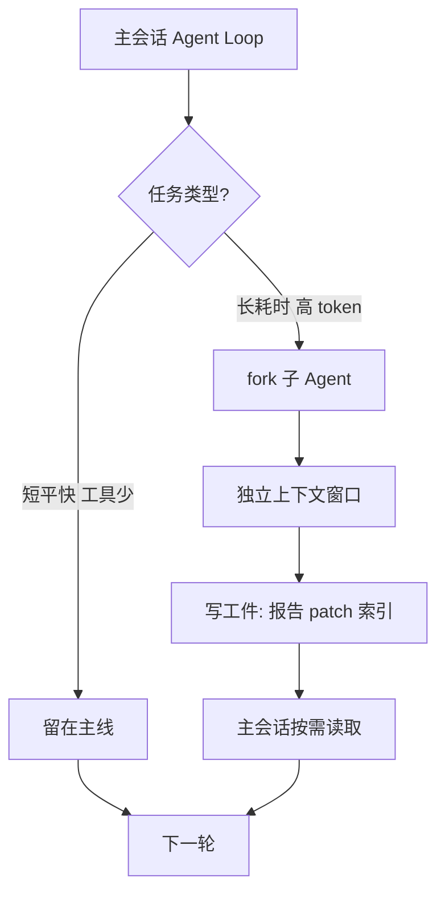
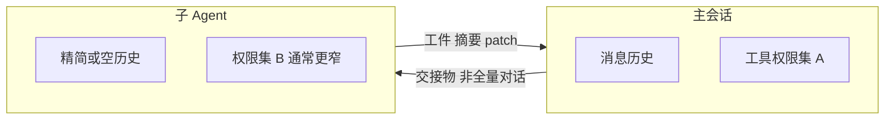
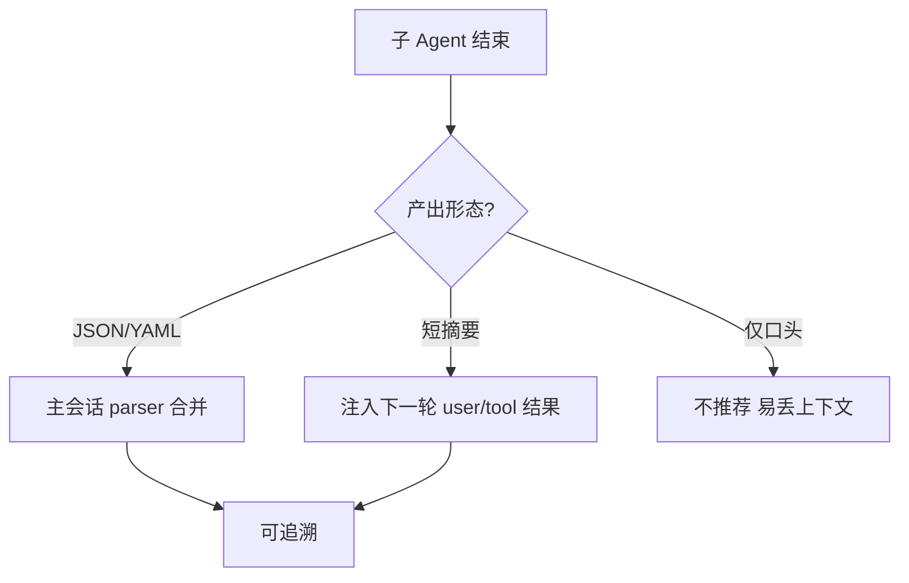

# 子 Agent 怎么编排？上下文隔离、交接与「别抢主会话窗口」

> **适合直接发知乎的导语**  
> 主会话里跑大任务，很容易把窗口吃满；**分叉子 Agent**（后台整理、专项检索、长耗时批处理）本质是**第二条（或多条）独立上下文**。本文从工程视角拆三件事：**何时 fork**、**隔离什么**、**如何把结果安全交回主线**——并配上流程图，方便你对照 Claude Code / 同类 Harness 的设计。

**声明**：以下为**架构级归纳**与业界常见模式，**不保证**与某一闭源版本实现逐行一致；以官方文档与当前 CLI 行为为准。

---

## 一、为什么要子 Agent：主循环的「机会成本」

主 Agent Loop 里，每一轮都要：

- 拼系统提示 + 项目规则 + 近期对话 + 工具结果；  
- 付 **token 税**（见稿 18）；  
- 承担 **串行延迟**（工具链一长，用户体感就拖）。

因此常见拆法：

| 形态 | 典型用途 | 和主会话关系 |
|------|----------|----------------|
| **后台整理** | 记忆整合、索引合并、日志摘要 | 异步，写完磁盘再被主会话读 |
| **专项子任务** | 大规模检索、批量改文件草案 | 同步或半同步，产出 patch/报告 |
| **沙箱执行** | 跑测试、构建、不可信脚本 | 强隔离，只回传 exit code + 日志摘要 |

**原则**：子 Agent **不是**「再开一个一样聪明的聊天」，而是**用独立预算**换 **主会话不被撑爆**。

---

## 二、隔离什么：状态、凭据、工作目录

**必须隔离的**：

1. **消息历史**：子任务不应默认继承主会话全部隐私与试错过程。  
2. **工具权限**：子 Agent 往往更窄（只读目录、禁止网络等）。  
3. **工作副本**：避免两个 Agent 同时 `write` 同一文件——常用 **lock 文件**或**队列**（与 Memory 整合思路同源）。

**可以共享的**：

- **只读**的项目快照（特定 commit、特定子树）。  
- **结构化交接物**：`SUMMARY.md`、`TASK_RESULT.json`、统一 schema 的 frontmatter。

---

## 三、交接协议：别让「子 Agent 说完了」变成黑盒

推荐把子任务输出压成三类之一：

1. **机器可读**：JSON/YAML（状态、文件列表、错误码）。  
2. **人可读短摘要**：≤ 20 行，含 **结论 / 风险 / 待确认项**。  
3. **可审计路径**：结果落在仓库内固定目录（例如 `artifacts/`），主会话只读路径不读全文。

**反模式**：子 Agent 在独立窗口里长篇解释，主会话只能靠复制粘贴——**不可 diff、不可回放**。

---

## 四、和 Memory / 压缩的关系（交叉引用）

- **Memory 定期整合**（稿 13）：非常适合用 **后台子 Agent** 做，避免打断用户当下编码心流。  
- **上下文压缩**（稿 08）：压缩的是**同一条**会话里的历史；子 Agent 是从**架构上**减少进入该历史的体积。

---

## 五、落地检查清单（含判定标准与示例）

下面四条对应 **子任务规格、权限模型、交接协议、并发写语义**；评审子 Agent 方案时，建议按条过一遍，缺哪条补哪条。

### 5.1 输入边界是否可审计（Input Contract）

**在问什么**：派工单是否包含 **可核对、可复现** 的输入集合，而不是「你看着优化一下」。

**为何重要**：边界模糊时，子 Agent 会自行扩大阅读/修改范围，与主会话 **目标分叉**，且事后无法论证「它该不该读那个目录」。

**合格标准**：至少具备一类 **硬锚点**——只读/只写路径列表、追踪系统 ID（issue / ticket）、或 **显式 shell 命令**（含参数）；主会话能对照锚点验收「有没有越界」。

| 偏弱（反例） | 偏强（正例） |
|--------------|--------------|
| 「帮我把项目整理干净」 | 「只读 `apps/web/src`，输出 `artifacts/audit.json`：列出未使用 import 的相对路径列表；**禁止** `write` 仓库内任何文件」 |
| 「修一下登录问题」 | 「范围：`packages/auth/` 与 `ISSUE-4412` 描述中的复现步骤；允许改动的路径白名单：`packages/auth/**/*.ts`」 |
| 「跑下测试看看」 | 「在仓库根执行 `pnpm test --filter @scope/pkg-a --run`；回传 **exit code** + **stderr 最后 80 行**」 |

**自检**：若换一个人类工程师接手同一张工单，能否在 **不猜** 的前提下开工？不能则边界仍不够。

---

### 5.2 写权限是否弱于或等于主会话（Privilege Non-Escalation）

**在问什么**：子 Agent 可用的 **工具集 / 文件系统写域 / 网络** 是否满足 **≤ 主会话**（不越权放大）。

**为何重要**：子任务往往上下文更短、提示面更大，是 **提示注入与误操作** 的高风险区；权限若比主线还宽，等于把「辅助进程」做成 **提权后门**。

**合格标准**：为子 Agent 单独声明 **allowlist**（可写目录、可调用的工具名）；危险能力（删库、发外网、改全局配置）默认关闭，除非主会话显式授权且可审计。

| 偏弱（反例） | 偏强（正例） |
|--------------|--------------|
| 子 Agent 与主会话共用同一「超级工具箱」 | 子 Agent 仅有 `read_file` / `grep` / `run_terminal_cmd(allowlist)`，**无**任意路径 `write` |
| 「和主会话一样能写盘就行」 | 主会话可写整个 workspace；子 Agent **仅**可写 `artifacts/subagent-run-<id>/` |
| 子任务跑在可访问生产密钥的环境里 | 子 Agent 在 **无 `DATABASE_URL`、无 deploy key** 的隔离环境中只产出 patch |

**自检**：若子 Agent 的提示被恶意仓库内容劫持，**最坏**能破坏到什么范围？该范围必须 ≤ 主会话在同样场景下被允许的范围。

---

### 5.3 交接物是否可机器合并（Machine-Mergeable Handoff）

**在问什么**：子 Agent 的产出是否带 **稳定 schema**，使主会话、CI 或脚本能 **解析、校验、合并**，而不是依赖自然语言二次理解。

**为何重要**：自由文本交接 = **不可测试、不可 diff、不可回滚**；主会话下一轮只能「再读一遍故事」，误差和 token 浪费都会上去。

**合格标准**：至少一种 **结构化载体**（JSON/YAML/统一模板的 Markdown 区块）+ **版本字段或 schema 名**；可选附带短摘要给人读，但 **真相应在结构体里**。

| 偏弱（反例） | 偏强（正例） |
|--------------|--------------|
| 长段「我检查了 A、B、C，建议改 D…」 | `result.json`：`{ "schema":"subagent/v1", "status":"ok", "changed_files":[], "findings":[...] }` |
| 「在第三个文件里改了登录」 | `{"patches":[{"path":"...","unified_diff":"..."}],"base_sha":"abc123"}` |
| 口头汇报「测试过了」 | `{"exit_code":0,"command":"pnpm test ...","log_tail":"..."}` |

**自检**：能否用 **十行脚本** 判断「子任务成功/失败」并决定主会话下一步？不能则交接仍偏聊天而非接口。

---

### 5.4 并发写是否有锁或单写者（Write Serialization）

**在问什么**：同一 **文件、同一索引、同一资源** 上，是否保证 **同一时刻最多一个写者**，或等价的有序队列。

**为何重要**：主会话与子 Agent（或多个子 Agent）并行时，若无约定，易出现 **交错写入、半提交状态、索引与正文不一致**——比单会话顺序写更难排查。

**合格标准**：以下任选其一即可：**文件锁 / 目录锁**、**单写者角色**（仅子 Agent 写某路径、主会话只读）、**串行队列**（任务进队列顺序执行）、或 **CRDT/版本号** 等可合并策略（成本高，少用）。

| 偏弱（反例） | 偏强（正例） |
|--------------|--------------|
| 主会话改 `MEMORY.md` 同时后台整合也在改 | 整合任务持 `memory/.consolidate.lock`，其它写入看到锁则 **延后或失败重试** |
| 两个子 Agent 同时 `write` 同一 `report.md` | 约定 `report.<runId>.md` 单写者，主会话最后 **人工或脚本合并** |
| 「应该不会同时写」 | 文档写明 **SPOF 写者** 与冲突时的 **优先级**（例如后台整理优先于会话内随手记） |

**自检**：画出 **谁写哪些路径**；若出现两条边指向同一文件且无锁/无队列，就是隐患。

---

### 5.5 四条速记（仍可作为勾选）

- [ ] **输入合同**：是否有路径 / issue / 命令等 **硬锚点**，他人无需猜即可执行？  
- [ ] **权限不抬升**：子 Agent 工具与写域是否 **≤ 主会话**，最坏 case 可接受？  
- [ ] **结构化交接**：产出是否带 **稳定 schema**，脚本可判成功失败？  
- [ ] **写序列化**：同一目标文件是否 **单写者或带锁**，避免交错写？

---

## 分发备忘（发知乎可删）

- **标题备选**：《AI 编程助手为什么要 fork 子 Agent？一张图讲清上下文隔离》  
- **标签**：Claude Code、Agent、上下文工程、多任务。  
- **相关稿**：`13-Memory…`、`05-AgentLoop…`、`08-上下文压缩…`

---

*仓库路径：`wemedia/zhihu/articles/14-子Agent编排与上下文隔离.md`*
