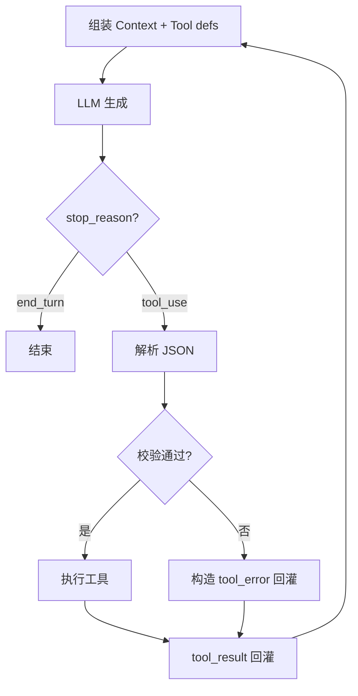
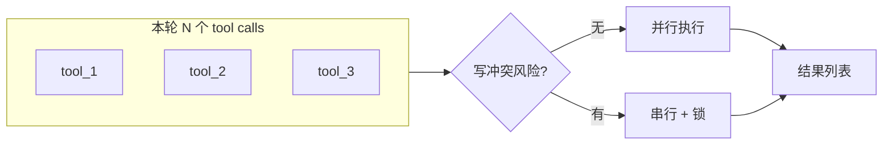

# 工具调用（Tool Use）全链路：从模型输出到执行器，再到「回灌上下文」

Agent 的「聪明」一半在模型，一半在 **工具闭环**：模型发出结构化调用 → 运行环境校验并执行 → 把结果**按固定格式塞回对话**。本文把这条链拆成可对照实现的阶段，并标出**失败语义**（超时、部分成功、权限拒绝）该怎么表达，避免 Loop 里「假绿真红」。

**声明**：不同产品 JSON schema、字段名可能不同；下文用**通用角色名**描述，请以你所用的 API 文档为准。

---

## 一、一回合里发生了什么

简化版（与稿 05 Agent Loop 呼应）：

1. **Context 组装**：系统提示 + 工具定义（name、description、parameters）+ 用户目标 + 历史。  
2. **模型生成**：`stop_reason = tool_use` 时附带 **一个或多个** tool call。  
3. **解析与校验**：JSON Schema / 自定义校验；非法调用 **不执行**，直接回错误给模型。  
4. **执行**：同步或异步；记录 **latency、exit code、截断策略**。  
5. **回灌**：以 **tool_result** 角色消息追加；进入下一轮模型调用。

---

## 二、工具定义三要素：模型只看得到这些

| 要素 | 作用 | 常见坑 |
|------|------|--------|
| **name** | 稳定路由键 | 改名=破坏性升级 |
| **description** | 模型选工具的「广告文案」 | 写太泛 → 乱选工具 |
| **parameters** | 约束输入形状 | 过宽 → 注入式参数；过严 → 反复试错 |

**建议**：对危险操作（删文件、发网络请求）在 description 里写明 **前置条件** 与 **需要用户确认**，与权限系统（稿 07）对齐。

---

## 三、执行器设计：超时、并行、幂等

- **超时**：必须；否则子进程挂死拖死整条 Loop。  
- **并行**：多 tool call 是否并行？若并行，**写同一资源**要禁止或加锁。  
- **幂等**：`write` 类工具理想情况是 **可重试**（或明确版本号），避免「再试一次多写一遍」。

---

## 四、回灌内容：给模型「可继续推理」的信号

好的 `tool_result` 通常包含：

- **status**：`ok` / `error` / `partial`（不要用含糊的「完成了」）。  
- **stdout / stderr 摘要**：长输出要 **截断 + 指明完整日志路径**（见稿 18 工具税）。  
- **结构化 payload**：例如 `{"matches": [...]}` 优于整页纯文本。

**坏味道**：把 50KB 原始 HTML 直接塞进消息——下一轮模型先读傻，再干活。

---

## 五、和 MCP 的关系（稿 06）

MCP 把 **工具提供方** 标准化成「另一进程 / 服务」；**本机执行器**仍要处理上面同样的 **校验、超时、回灌**。可以理解为：**协议层 MCP + 语义层仍是 Tool Loop**。

---

## 六、落地检查清单（含判定标准与示例）

对应 **错误面、输出边界、高危门禁、审计** 四条；评审 Tool Loop 时可逐条对照。

### 6.1 错误是否「机器可读 + 模型可续写」（Structured Tool Errors）

**在问什么**：执行失败时，回灌给模型的不是一句「出错了」，而是 **稳定字段**（错误类型、受影响的参数、建议动作）。

**为何重要**：模型靠 `tool_result` 决定下一轮；含糊错误会触发 **乱重试、换参数瞎试**，浪费轮次与配额。

**合格标准**：至少包含 `ok/error` 语义等价物 + **可枚举的 code**（如 `VALIDATION_FAILED`、`TIMEOUT`）+ **human+model 都能用的 hint**（缺哪个参数、路径不存在等）。

| 偏弱（反例） | 偏强（正例） |
|--------------|--------------|
| `tool_result`: 「执行失败」 | `{ "status":"error", "code":"PATH_NOT_FOUND", "detail":"...", "hint":"用 list_dir 确认父目录" }` |
| 抛原生栈给模型 | `{ "code":"TIMEOUT", "after_ms":30000, "partial_stdout":"..." }` |

**自检**：能否用单元测试断言「非法入参 → 固定 code」？不能则错误面仍不可依赖。

---

### 6.2 长输出是否默认有界（Bounded Tool Output）

**在问什么**：`grep`/`read`/`curl` 等工具的返回是否 **默认截断** 或 **分页**，并告知「全文在哪」。

**为何重要**：单轮工具税（稿 18）暴涨会挤掉用户目标与历史，甚至触发过早压缩。

**合格标准**：默认 `max_bytes` / `max_lines`；超限则 **截断 + `truncated:true` + 完整日志路径或 object key**。

| 偏弱（反例） | 偏强（正例） |
|--------------|--------------|
| 把 2MB 测试日志全塞进消息 | 返回前 120KB + `artifact_uri` 指向完整日志 |
| 静默丢弃尾部 | 明确 `truncated:true` 与 `total_lines` |

**自检**：任意工具在恶意/误用下，单轮能否被 **硬顶** 在约定上限内？

---

### 6.3 危险工具是否必经权限门（Gated Side Effects）

**在问什么**：删文件、写生产、对外 HTTP、包安装等是否具有 **显式授权层**（用户确认 / policy / allowlist）。

**为何重要**：工具调用是 **代码执行**；没有门就等于把 shell 交给模型草稿。

**合格标准**：危险工具在 schema 或执行器层标记 `risk:high`；首次调用或越界路径时 **阻断或降级**（仅 dry-run）。

| 偏弱（反例） | 偏强（正例） |
|--------------|--------------|
| `rm -rf` 类能力随叫随到 | 删除需 `confirm_token` 或交互式二次确认 |
| 任意 URL `fetch` | 仅允许域名 allowlist；否则 `POLICY_DENIED` |

**自检**：产品同学能否列出 **Top 10 不可恢复操作**，且每条都有对应门闩？

---

### 6.4 是否可追责审计（Audit Trail）

**在问什么**：每次工具执行是否留下 **会话 id、工具名、关键参数摘要、时间、结果状态**（脱敏后）。

**为何重要**：出安全事故或争议时，要回答「谁干的」；没有日志只能猜模型。

**合格标准**：结构化审计事件（可进 SIEM）；敏感参数 **哈希或截断** 存储，合规域另议。

| 偏弱（反例） | 偏强（正例） |
|--------------|--------------|
| 仅控制台 print | `audit.log`：`{session, tool, args_digest, outcome, ms}` |
| 日志含 API Key 明文 | 参数脱敏 / 仅记录 key 指纹 |

**自检**：能否从一条审计记录 **复现**「当时允许还是拒绝」及依据？

---

### 6.5 四条速记（勾选）

- [ ] **错误结构化**：失败是否有 **稳定 code + hint**，可测？  
- [ ] **输出有界**：重工具是否 **默认截断/分页** 并标明全文位置？  
- [ ] **高危有门**：删/写外/网络等是否 **policy 或确认**？  
- [ ] **审计可追责**：是否落 **结构化、脱敏** 的执行记录？

---

*仓库路径：`wemedia/zhihu/articles/15-工具调用全链路-解析执行与回灌.md`*
