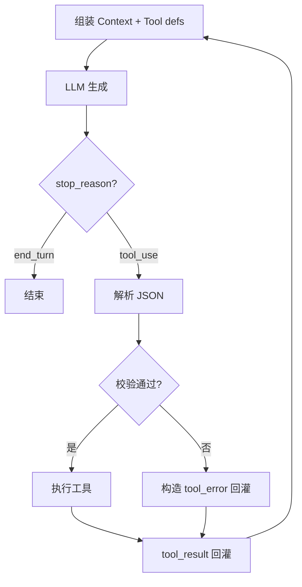
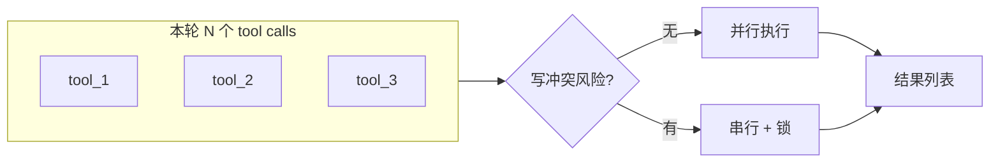

# 工具调用（Tool Use）全链路：从模型输出到执行器，再到「回灌上下文」

> **适合直接发知乎的导语**  
> Agent 的「聪明」一半在模型，一半在 **工具闭环**：模型发出结构化调用 → 运行环境校验并执行 → 把结果**按固定格式塞回对话**。本文把这条链拆成可对照实现的阶段，并标出**失败语义**（超时、部分成功、权限拒绝）该怎么表达，避免 Loop 里「假绿真红」。

**声明**：不同产品 JSON schema、字段名可能不同；下文用**通用角色名**描述，请以你所用的 API 文档为准。

---

## 一、一回合里发生了什么

简化版（与稿 05 Agent Loop 呼应）：

1. **Context 组装**：系统提示 + 工具定义（name、description、parameters）+ 用户目标 + 历史。  
2. **模型生成**：`stop_reason = tool_use` 时附带 **一个或多个** tool call。  
3. **解析与校验**：JSON Schema / 自定义校验；非法调用 **不执行**，直接回错误给模型。  
4. **执行**：同步或异步；记录 **latency、exit code、截断策略**。  
5. **回灌**：以 **tool_result** 角色消息追加；进入下一轮模型调用。

---

## 二、工具定义三要素：模型只看得到这些

| 要素 | 作用 | 常见坑 |
|------|------|--------|
| **name** | 稳定路由键 | 改名=破坏性升级 |
| **description** | 模型选工具的「广告文案」 | 写太泛 → 乱选工具 |
| **parameters** | 约束输入形状 | 过宽 → 注入式参数；过严 → 反复试错 |

**建议**：对危险操作（删文件、发网络请求）在 description 里写明 **前置条件** 与 **需要用户确认**，与权限系统（稿 07）对齐。

---

## 三、执行器设计：超时、并行、幂等

- **超时**：必须；否则子进程挂死拖死整条 Loop。  
- **并行**：多 tool call 是否并行？若并行，**写同一资源**要禁止或加锁。  
- **幂等**：`write` 类工具理想情况是 **可重试**（或明确版本号），避免「再试一次多写一遍」。

---

## 四、回灌内容：给模型「可继续推理」的信号

好的 `tool_result` 通常包含：

- **status**：`ok` / `error` / `partial`（不要用含糊的「完成了」）。  
- **stdout / stderr 摘要**：长输出要 **截断 + 指明完整日志路径**（见稿 18 工具税）。  
- **结构化 payload**：例如 `{"matches": [...]}` 优于整页纯文本。

**坏味道**：把 50KB 原始 HTML 直接塞进消息——下一轮模型先读傻，再干活。

---

## 五、和 MCP 的关系（稿 06）

MCP 把 **工具提供方** 标准化成「另一进程 / 服务」；**本机执行器**仍要处理上面同样的 **校验、超时、回灌**。可以理解为：**协议层 MCP + 语义层仍是 Tool Loop**。

---

## 六、落地检查清单

- [ ] 每个工具是否有 **明确错误码** 与模型可读的 **修复建议**？  
- [ ] 长输出是否 **默认截断**？  
- [ ] 危险工具是否 **二次确认** 或 **权限门**？  
- [ ] 是否记录 **审计日志**（谁、何时、对什么路径做了什么）？

---

## 分发备忘（发知乎可删）

- **标题备选**：《Agent 工具调用不是「跑个函数」：解析、执行、回灌三步缺一不可》  
- **标签**：Tool Use、Agent、MCP、Claude。  
- **相关稿**：`05-AgentLoop…`、`06-MCP…`、`07-权限…`

---

*仓库路径：`wemedia/zhihu/articles/15-工具调用全链路-解析执行与回灌.md`*
