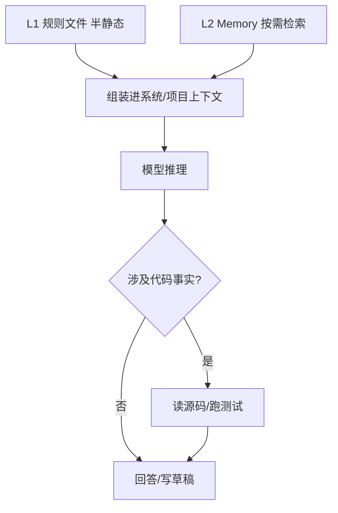
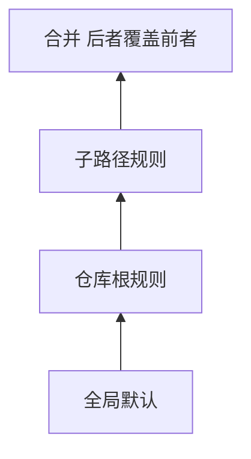

# CLAUDE.md / AGENTS.md：规则文件怎么工程化，才不和 Memory「抢戏」？

> **适合直接发知乎的导语**  
> 很多团队把「项目怎么写代码」全塞进一个巨长的系统提示，结果 **改一次全员重载、diff 难看、和长期记忆重复**。更稳的做法是：**规则文件分层**——仓库内**稳定公约**进 `CLAUDE.md`（或同类）；**因人而异、因事而变**的进 Memory（稿 13）；**实时真相**永远以代码与测试为准。下面给一套分层模型 + 流程图。

**声明**：文件名以各工具约定为准（Claude Code、Cursor、Codex 等可能不同）；思想通用。

---

## 一、三层蛋糕：规则 vs 记忆 vs 真相

| 层 | 放什么 | 更新频率 | 典型载体 |
|----|--------|----------|----------|
| **L1 规则** | 风格、目录约定、命令、禁止事项 | 低，走 PR | `CLAUDE.md`、`CONTRIBUTING`、lint 配置 |
| **L2 记忆** | 决策背景、截止日、个人偏好、外部工单 | 中，会话沉淀 | Memory 文件 + 索引 |
| **L3 真相** | 当前实现行为 | 高，随提交变 | 源码、测试、CI 日志 |

**铁律**：L1/L2 都是 **提示**，L3 才是 **裁判**。Agent 引用「某函数在某行」前必须 **再读文件**（稿 20 呼应）。

---

## 二、CLAUDE.md 写什么、不写什么

**适合写**：

- 一键构建/测试命令（可复制）。  
- 目录地图（「API 在 `src/api`，迁移别碰 `legacy/`」）。  
- **稳定**的安全红线（禁止提交密钥、禁止直连生产库）。

**不适合写**：

- 「上周我们决定……」——应进 Memory 并带日期。  
- 长篇会议记录——应外链 Wiki + Memory 里只存链接与一句摘要。  
- 易腐的 `file:line`——除非你愿意每次改代码都改规则文件。

---

## 三、多文件规则栈：优先级怎么定

常见模式（示例）：

1. **组织级**（可选）：全局默认。  
2. **仓库根**：`CLAUDE.md`。  
3. **子包**：`packages/foo/CLAUDE.md` 覆盖局部。

解析顺序应是 **确定性**的（从最具体到最泛），并把 **最终生效清单**打在调试日志里，否则排障会疯。

---

## 四、和 Memory 的边界（避免重复与矛盾）

- **索引 + description**（稿 13）负责「**召回哪条记忆**」；**CLAUDE.md** 负责「**在这个仓库怎么干活**」。  
- 同一条政策：**只在一个地方维护主文**，另一处 **链接引用**。  
- 定期整合时（Memory 侧）应检查：**是否已与 CLAUDE.md 重复**——重复则删记忆或删规则其一。

---

## 五、落地检查清单（含判定标准与示例）

对应 **L1 可执行性、合并顺序、事实分层、变更联动**；避免规则与 Memory 双写打架。

### 5.1 L1 是否短而可执行（Actionable Rules）

**在问什么**：`CLAUDE.md` 类文件是否以 **可复制命令、目录约定、禁止项** 为主，而不是长篇背景故事。

**为何重要**：L1 几乎每轮进固定层（稿 18）；冗长叙述 = 全员长期付 token，且更新时 diff 噪声大。

**合格标准**：新人按文档能在 **15 分钟内** 跑通 build/test；每条规则能对应到 **具体动作**（跑什么、别动哪）。

| 偏弱（反例） | 偏强（正例） |
|--------------|--------------|
| 粘贴整页会议纪要 | 「测试：`pnpm test`；禁止提交：`*.pem`、`.env.production`」 |
| 「代码要干净」 | 「格式化：`pnpm exec eslint --fix src`」 |

**自检**：随机删去一段，是否仍知道 **下一步手该敲什么**？若否，仍偏宣言而非规则。

---

### 5.2 合并顺序是否唯一且可实现（Deterministic Precedence）

**在问什么**：多文件规则栈（全局 / 根 / 子包）冲突时，**谁覆盖谁** 是否在文档与实现里一致。

**为何重要**：顺序模糊会导致「同一仓库两种说法」，模型与用户都无法预期。

**合格标准**：写明 **从具体到泛型** 或相反，但只能有一种；调试模式可打印 **最终生效片段列表**。

| 偏弱（反例） | 偏强（正例） |
|--------------|--------------|
| 「以团队约定为准」 | 「`packages/foo/CLAUDE.md` 覆盖根 `CLAUDE.md`；根覆盖 `~/.config/...`」 |
| 实现与文档各一套顺序 | CI 用 golden case 断言合并结果 |

**自检**：改子包规则后，能否 **预言** 某条全局句是否仍生效？

---

### 5.3 易腐事实是否禁止进 L1（No Rot in Static Layer）

**在问什么**：会随提交频繁变的 **file:line、接口细节、未合并的临时决策** 是否被挡在 L1 外，放进 Memory 或代码旁注释。

**为何重要**：L1 更新频率低，塞易腐内容会导致 **文档恒旧**，模型误信（稿 20）。

**合格标准**：L1 只保留 **稳定公约**；带日期的决策进 L2；**真相**以 repo 为准（稿 16 三层蛋糕）。

| 偏弱（反例） | 偏强（正例） |
|--------------|--------------|
| 「`utils.ts:120` 处理重试」 | 「重试逻辑见 `src/retry` 模块 README；细节以代码为准」 |
| 「下周上线新 auth」 | Memory：`project` 类型 + 截止日 + 链接 |

**自检**：若明天大重构移动文件，L1 是否需要大改？若 **是**，该项多半不该在 L1。

---

### 5.4 约定变更是否与 PR 联动（Rules in Code Review）

**在问什么**：改架构/命令/目录时，是否 **同一 PR** 或跟进 PR 更新规则文件，并有模板提醒。

**为何重要**：代码已迁、规则未迁 = **Harness 与真相分离**，Agent 按旧规则改新代码。

**合格标准**：PR 模板勾选「是否影响 `CLAUDE.md` / 构建命令」；breaking change 必伴规则更新或 issue。

| 偏弱（反例） | 偏强（正例） |
|--------------|--------------|
| 迁移目录后无人改规则 | PR body：`Updates CLAUDE.md paths for apps/web → apps/client` |
| 口头通知「以后用 bun」 | 合并时同步替换文档中的包管理器命令 |

**自检**：最近三次目录/命令变更，能否在 git log 里 **同时** 看到规则文件 diff？

---

### 5.5 四条速记（勾选）

- [ ] **L1 可执行**：是否 **命令级、短**，新人能直接照做？  
- [ ] **顺序确定**：多文件规则 **覆盖关系** 是否文档+实现一致？  
- [ ] **易腐外置**：file:line、临时决策是否 **不进 L1**？  
- [ ] **变更联动**：改结构/命令时是否 **同步改规则**（模板/评审）？

---

## 分发备忘（发知乎可删）

- **标题备选**：《别把所有项目知识塞进系统提示：CLAUDE.md 与 Memory 怎么分工》  
- **标签**：提示工程、Agent、工程化、Claude Code。  
- **相关稿**：`13-Memory…`、`08-上下文压缩…`

---

*仓库路径：`wemedia/zhihu/articles/16-规则文件工程化-CLAUDE与项目记忆分层.md`*
