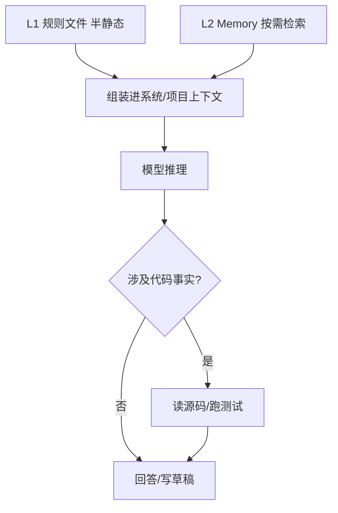
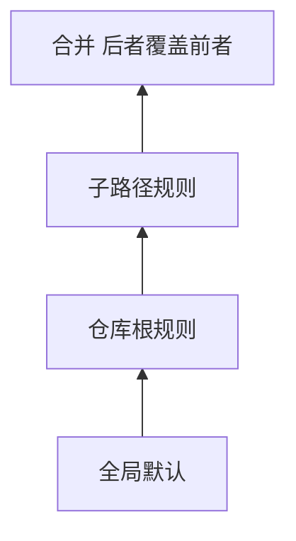

# CLAUDE.md / AGENTS.md：规则文件怎么工程化，才不和 Memory「抢戏」？

> **适合直接发知乎的导语**  
> 很多团队把「项目怎么写代码」全塞进一个巨长的系统提示，结果 **改一次全员重载、diff 难看、和长期记忆重复**。更稳的做法是：**规则文件分层**——仓库内**稳定公约**进 `CLAUDE.md`（或同类）；**因人而异、因事而变**的进 Memory（稿 13）；**实时真相**永远以代码与测试为准。下面给一套分层模型 + 流程图。

**声明**：文件名以各工具约定为准（Claude Code、Cursor、Codex 等可能不同）；思想通用。

---

## 一、三层蛋糕：规则 vs 记忆 vs 真相

| 层 | 放什么 | 更新频率 | 典型载体 |
|----|--------|----------|----------|
| **L1 规则** | 风格、目录约定、命令、禁止事项 | 低，走 PR | `CLAUDE.md`、`CONTRIBUTING`、lint 配置 |
| **L2 记忆** | 决策背景、截止日、个人偏好、外部工单 | 中，会话沉淀 | Memory 文件 + 索引 |
| **L3 真相** | 当前实现行为 | 高，随提交变 | 源码、测试、CI 日志 |

**铁律**：L1/L2 都是 **提示**，L3 才是 **裁判**。Agent 引用「某函数在某行」前必须 **再读文件**（稿 20 呼应）。

---

## 二、CLAUDE.md 写什么、不写什么

**适合写**：

- 一键构建/测试命令（可复制）。  
- 目录地图（「API 在 `src/api`，迁移别碰 `legacy/`」）。  
- **稳定**的安全红线（禁止提交密钥、禁止直连生产库）。

**不适合写**：

- 「上周我们决定……」——应进 Memory 并带日期。  
- 长篇会议记录——应外链 Wiki + Memory 里只存链接与一句摘要。  
- 易腐的 `file:line`——除非你愿意每次改代码都改规则文件。

---

## 三、多文件规则栈：优先级怎么定

常见模式（示例）：

1. **组织级**（可选）：全局默认。  
2. **仓库根**：`CLAUDE.md`。  
3. **子包**：`packages/foo/CLAUDE.md` 覆盖局部。

解析顺序应是 **确定性**的（从最具体到最泛），并把 **最终生效清单**打在调试日志里，否则排障会疯。

---

## 四、和 Memory 的边界（避免重复与矛盾）

- **索引 + description**（稿 13）负责「**召回哪条记忆**」；**CLAUDE.md** 负责「**在这个仓库怎么干活**」。  
- 同一条政策：**只在一个地方维护主文**，另一处 **链接引用**。  
- 定期整合时（Memory 侧）应检查：**是否已与 CLAUDE.md 重复**——重复则删记忆或删规则其一。

---

## 五、落地检查清单

- [ ] 规则文件是否 **短而可执行**（命令级）？  
- [ ] 是否有 **冲突解决顺序**（子路径 > 根 > 全局）？  
- [ ] 是否禁止把 **易腐事实**塞进半静态层？  
- [ ] PR 模板是否提醒 **改代码顺带改规则**（当约定变时）？

---

## 分发备忘（发知乎可删）

- **标题备选**：《别把所有项目知识塞进系统提示：CLAUDE.md 与 Memory 怎么分工》  
- **标签**：提示工程、Agent、工程化、Claude Code。  
- **相关稿**：`13-Memory…`、`08-上下文压缩…`

---

*仓库路径：`wemedia/zhihu/articles/16-规则文件工程化-CLAUDE与项目记忆分层.md`*
