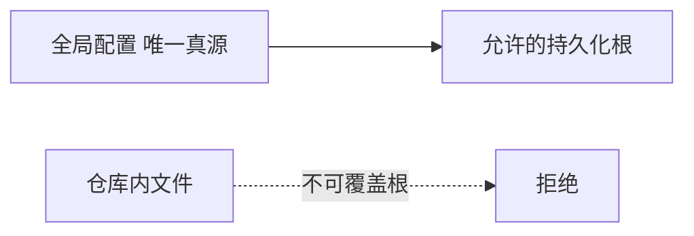
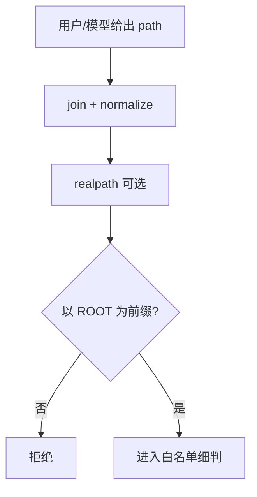

# Agent 写盘安全：路径规范化、`..` 与沙箱白名单怎么一起上？

> **适合直接发知乎的导语**  
> 模型本身不知道「磁盘边界」；**Harness** 必须在执行 `write` 前把路径变成**数学上可判定**的安全问题。本文从三层递进：**全局根目录锁定** → **规范化 +  traversal 拦截** → **白名单集合判定**，并解释为什么「只禁 `..`」远远不够。可与稿 13 Memory 安全、稿 07 权限哲学对照读。

**声明**：具体策略因产品与部署而异；企业环境还可能有 **SELinux / 容器挂载** 等更强约束，下文聚焦应用层常见模式。

---

## 一、威胁模型：不是「模型变坏」，而是「提示被劫持」

攻击面包括：

- 恶意仓库里的 **`.md` 指令**诱导写到 `~/.ssh`。  
- 工具参数里的 **`../../`** 或 **绝对路径逃逸**。  
- **符号链接** 把「看起来在项目内」的路径甩到项目外。

目标：**即使模型「想写错地方」，执行器也写不出去**。

---

## 二、第一层：全局存储根（防仓库改配置劫持）

Memory 类功能常见做法（稿 13）：**持久化根路径**只在用户/全局配置里改，**不信任**单个 repo 内的配置文件去改「记忆落盘根」。这样恶意项目无法把记忆目录指到敏感区再诱导覆盖。

---

## 三、第二层：规范化（canonicalize）再判断

推荐顺序：

1. **拒绝**裸的 `..` 片段（预检，防漏网）。  
2. **解析为绝对路径**：`base_dir + user_path`（注意先 `resolve`）。  
3. **realpath**（若平台支持）：解开 `symlink`，再比较前缀。  
4. 检查 **是否以允许根为前缀**（注意尾随 `/` 与大小写）。

**坑**：Windows 盘符、`\\?\` 长路径、大小写不敏感文件系统——跨平台要统一用库，不要手写字符串 `startsWith`。

---

## 四、第三层：白名单（最小写集合）

即使有统一根，仍可能 **写满整个 home**。进一步：

- 只允许 `workspace/`、`artifacts/`、`memory/` 等 **枚举前缀**。  
- **扩展名**限制（例如记忆只允许 `.md`）。  
- **单文件大小 / 总配额**。

这与 **沙箱**（稿 13、稿 07）是组合拳：**路径层** + **OS 层 cgroup** 各守一段。

---

## 五、审计与可观测

每次写盘记录：**谁（会话 id）、何工具、何路径、字节数、是否覆盖**。  
出问题时回答三个问题：**本该拒绝的为什么放行？本该放行的为什么误杀？**

---

## 六、落地检查清单（含判定标准与示例）

对应 **规范化次序、符号链接、白名单粒度、回归测试**；路径类 bug 往往一条漏网全线失守。

### 6.1 是否先规范化再判定（Canonicalize-Then-Check）

**在问什么**：是否对 **拼接后的绝对路径** 做 `normalize`/`resolve`（及平台的 `realpath`），再与允许根比较；而不是在原始字符串上 `includes("..")` 敷衍。

**为何重要**：`base + "../etc/passwd"`、混合分隔符、`.` 段等组合，**字符串预判**极易漏。

**合格标准**：统一 API：`safePath(base, userInput) -> { ok, absolutePath }`；**禁止**把未解析路径交给 OS 打开。

| 偏弱（反例） | 偏强（正例） |
|--------------|--------------|
| `if (path.includes("..")) reject` | `resolved = path.resolve(base, input); if (!resolved.startsWith(allowedRoot)) reject` |
| 先 `startsWith` 再 `join` | 先 `join`+`resolve`，再 **前缀比较**（注意尾随分隔符） |

**自检**：能否用 **10 个以内** 的绕过字符串让旧实现放行？能则仍不合格。

---

### 6.2 符号链接是否纳入威胁模型（Symlink & Final Path）

**在问什么**：在判断「在允许目录内」之后，实际写入前是否考虑 **`realpath` 跳出**（symlink 指到仓库外）。

**为何重要**：攻击面常见模式：**看起来在项目内的路径** → 实际写到敏感区。

**合格标准**：高安全模式：`realpath` 后再次校验前缀；或禁止跟随 symlink 写入；文档写明取舍。

| 偏弱（反例） | 偏强（正例） |
|--------------|--------------|
| 仅检查逻辑路径字符串 | `fs.realpathSync` 后再 `allowedRoot` 前缀校验 |
| 全盘允许跟随 symlink | `O_NOFOLLOW` 或显式策略 + 测试 |

**自检**：在 `workspace/sub -> ~/.ssh` 场景下，写 `workspace/sub/foo` 会被 **拦还是写出界**？

---

### 6.3 白名单是枚举还是「整棵子树任意写」（Whitelist Granularity）

**在问什么**：在已通过「在 workspace 根下」之后，是否进一步限制 **子目录 + 扩展名 + 配额**。

**为何重要**：单根过大时，恶意或误操作仍可 **填满磁盘或污染构建产物**。

**合格标准**：生产级至少 **枚举可写目录**；Memory 类可限制 `.md`；配合单文件大小上限。

| 偏弱（反例） | 偏强（正例） |
|--------------|--------------|
| 「只要在 repo 里都能写」 | 仅 `memory/`、`artifacts/`、`docs/drafts/` |
| 任意扩展名 | 「记忆文件仅 `*.md`」 |

**自检**：若模型想写 `node_modules/被投毒`，会不会 **默认成功**？若会，白名单过宽。

---

### 6.4 是否有路径安全回归集（Adversarial Fixture Suite）

**在问什么**：是否维护 **固定用例**（`..`、编码、`//`、Windows 盘符、symlink、大小写）在 CI 里跑。

**为何重要**：路径逻辑靠人眼 review 不可靠；**自动化负例**才能防回归。

**合格标准**：`tests/path_policy/` 或等价；每条用例 **期望 allow/deny**；合并前必绿。

| 偏弱（反例） | 偏强（正例） |
|--------------|--------------|
| 「我们代码里好像判断了」 | 12+ 条 fixture，`expect(deny)` / `expect(allow)` |
| 仅手动测一次 | PR 改路径逻辑必须更新 fixture |

**自检**：最近一次改路径校验的 PR，是否 **同时** 新增或修改了测试用例？

---

### 6.5 四条速记（勾选）

- [ ] **先解析后比**：是否 **resolve/realpath 后再** 与允许根比较？  
- [ ] **symlink**：跟链/不跟链策略是否 **明确且有测**？  
- [ ] **白名单细**：是否限制 **子路径/后缀**，而非「根下全开」？  
- [ ] **负例集**：是否有 **CI 级** 绕过用例防回归？

---

## 分发备忘（发知乎可删）

- **标题备选**：《AI 助手写文件前，路径要经过哪三道闸？》  
- **标签**：安全、沙箱、Agent、路径遍历。  
- **相关稿**：`07-权限…`、`13-Memory…`

---

*仓库路径：`wemedia/zhihu/articles/17-Agent写盘路径安全-白名单与规范化.md`*
