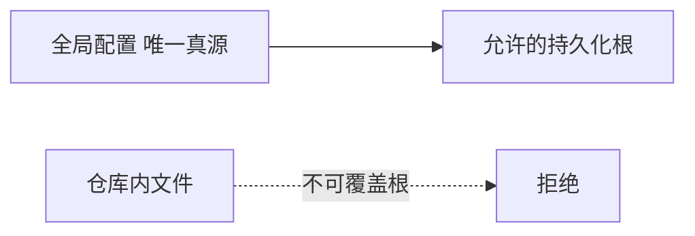
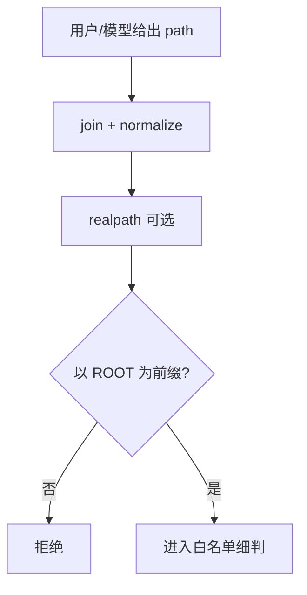
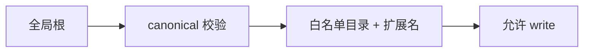

# Agent 写盘安全：路径规范化、`..` 与沙箱白名单怎么一起上？

> **适合直接发知乎的导语**  
> 模型本身不知道「磁盘边界」；**Harness** 必须在执行 `write` 前把路径变成**数学上可判定**的安全问题。本文从三层递进：**全局根目录锁定** → **规范化 +  traversal 拦截** → **白名单集合判定**，并解释为什么「只禁 `..`」远远不够。可与稿 13 Memory 安全、稿 07 权限哲学对照读。

**声明**：具体策略因产品与部署而异；企业环境还可能有 **SELinux / 容器挂载** 等更强约束，下文聚焦应用层常见模式。

---

## 一、威胁模型：不是「模型变坏」，而是「提示被劫持」

攻击面包括：

- 恶意仓库里的 **`.md` 指令**诱导写到 `~/.ssh`。  
- 工具参数里的 **`../../`** 或 **绝对路径逃逸**。  
- **符号链接** 把「看起来在项目内」的路径甩到项目外。

目标：**即使模型「想写错地方」，执行器也写不出去**。

---

## 二、第一层：全局存储根（防仓库改配置劫持）

Memory 类功能常见做法（稿 13）：**持久化根路径**只在用户/全局配置里改，**不信任**单个 repo 内的配置文件去改「记忆落盘根」。这样恶意项目无法把记忆目录指到敏感区再诱导覆盖。

---

## 三、第二层：规范化（canonicalize）再判断

推荐顺序：

1. **拒绝**裸的 `..` 片段（预检，防漏网）。  
2. **解析为绝对路径**：`base_dir + user_path`（注意先 `resolve`）。  
3. **realpath**（若平台支持）：解开 `symlink`，再比较前缀。  
4. 检查 **是否以允许根为前缀**（注意尾随 `/` 与大小写）。

**坑**：Windows 盘符、`\\?\` 长路径、大小写不敏感文件系统——跨平台要统一用库，不要手写字符串 `startsWith`。

---

## 四、第三层：白名单（最小写集合）

即使有统一根，仍可能 **写满整个 home**。进一步：

- 只允许 `workspace/`、`artifacts/`、`memory/` 等 **枚举前缀**。  
- **扩展名**限制（例如记忆只允许 `.md`）。  
- **单文件大小 / 总配额**。

这与 **沙箱**（稿 13、稿 07）是组合拳：**路径层** + **OS 层 cgroup** 各守一段。

---

## 五、审计与可观测

每次写盘记录：**谁（会话 id）、何工具、何路径、字节数、是否覆盖**。  
出问题时回答三个问题：**本该拒绝的为什么放行？本该放行的为什么误杀？**

---

## 六、落地检查清单

- [ ] 是否 **先 canonical 再判断**，而非先判断再拼接？  
- [ ] symlink 是否处理？  
- [ ] 白名单是 **显式枚举** 还是「根下任意」？  
- [ ] 是否有 **单路径测试集**（含绕过用例）？

---

## 分发备忘（发知乎可删）

- **标题备选**：《AI 助手写文件前，路径要经过哪三道闸？》  
- **标签**：安全、沙箱、Agent、路径遍历。  
- **相关稿**：`07-权限…`、`13-Memory…`

---

*仓库路径：`wemedia/zhihu/articles/17-Agent写盘路径安全-白名单与规范化.md`*
