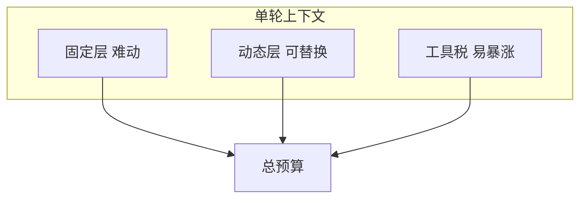
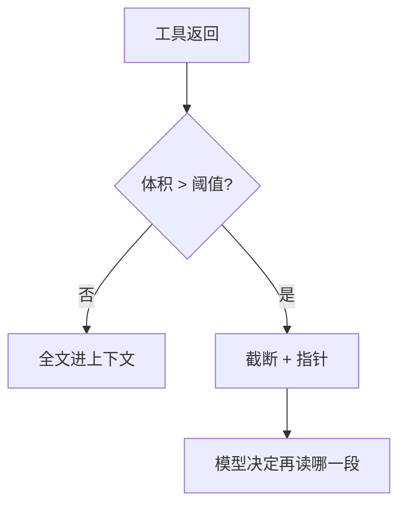

# 上下文预算：固定层、动态层与「工具税」——别等压缩才想起来

> **适合直接发知乎的导语**  
> 稿 08 讲的是 **压缩算法与 Compact 服务**；本文讲另一件事：**在进压缩之前**，你的窗口预算该怎么 **主动分配**。把上下文想成「固定房租 + 动态流水 + 工具过路费」，很多「莫名其妙截断」都能提前预防。

**声明**：具体 token 上限与计费以所用 API/产品为准；下图是 **比例思维** 不是精确数字。

---

## 一、三桶预算：谁占坑、谁该省

| 桶 | 内容 | 特点 |
|----|------|------|
| **固定层** | 系统提示、工具定义、CLAUDE.md、MEMORY.md 索引 | 几乎每轮都在；**增 1 字全员付税** |
| **动态层** | 当前任务相关文件、用户粘贴、近期对话 | 应可替换；靠摘要与裁剪管理 |
| **工具税** | `grep` 大结果、`read_file` 全文、测试输出 | **单轮暴涨** 的主因 |

**经验**：优化 Agent 体验，**先砍固定层冗余**（巨型 tool description），再谈压缩。

---

## 二、固定层瘦身：比「摘要历史」更划算

- **工具定义**：只暴露当前任务需要的子集（模式切换）。  
- **规则文件**：`CLAUDE.md` 保持可执行短条文，长文外链。  
- **MEMORY.md**：索引单行摘要（稿 13），不要把正文挤进索引。

---

## 三、工具税治理：默认截断 + 渐进披露

策略组合：

1. **硬上限**：单工具输出 > N KB 则截断，并提示「完整结果在 `path`」。  
2. **结构化优先**：能返回路径列表就不要返回全文。  
3. **两阶段读取**：先 `head`/符号索引，再按需读块。

这与 **检索路由**（稿 13 Sonnet 选 Top5）是同一哲学：**先便宜地筛选，再贵价地精读**。

---

## 四、动态层替换策略：LRU 不如「任务锚点」

纯 LRU 容易把 **任务目标句** 挤掉。更稳：

- 保留 **用户原始目标** 与 **验收标准** 为锚点。  
- 中间探索过程可摘要。  
- 多文件任务保留 **待办 checklist** 在动态层顶部。

---

## 五、和压缩的关系（稿 08）

- **预算分配**是 **日常策略**；**压缩**是 **阈值触发的事后救火**。  
- 两者一起用：**少交工具税** → 晚触发压缩 → 更少信息损失。

---

## 六、落地检查清单

- [ ] 固定层 token 是否可 **一键统计**（调试开关）？  
- [ ] 每个重工具是否有 **默认 limit**？  
- [ ] 是否禁止把 **二进制/base64** 大块塞进消息？  
- [ ] 任务锚点是否在压缩后仍可 **恢复或重注入**？

---

## 分发备忘（发知乎可删）

- **标题备选**：《200K 上下文为什么还是不够用？先算清「工具税」》  
- **标签**：上下文工程、Token、Agent、Claude。  
- **相关稿**：`08-上下文压缩…`、`13-Memory…`、`15-工具调用…`

---

*仓库路径：`wemedia/zhihu/articles/18-上下文预算分配-固定层动态层与工具税.md`*
