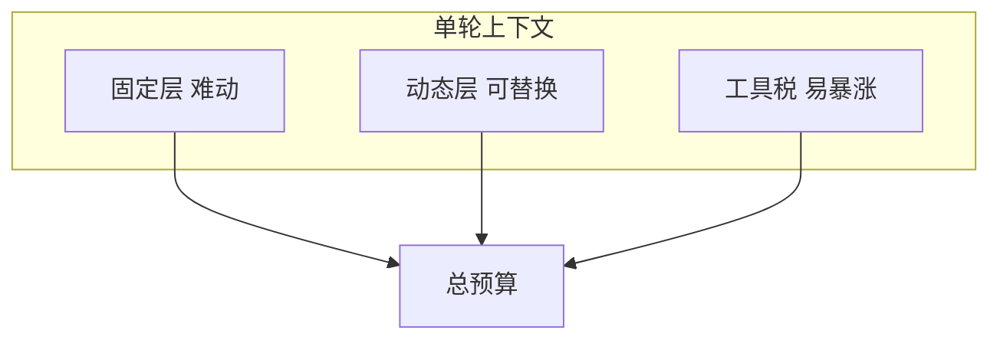
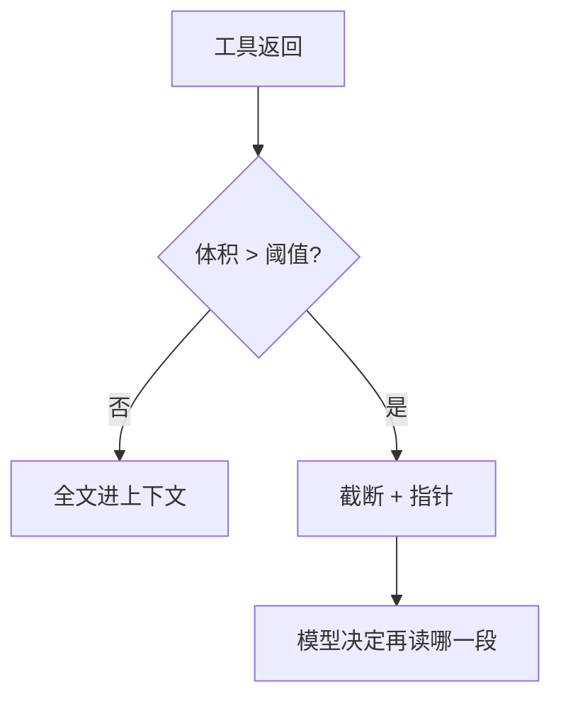

# 上下文预算：固定层、动态层与「工具税」——别等压缩才想起来

> **适合直接发知乎的导语**  
> 稿 08 讲的是 **压缩算法与 Compact 服务**；本文讲另一件事：**在进压缩之前**，你的窗口预算该怎么 **主动分配**。把上下文想成「固定房租 + 动态流水 + 工具过路费」，很多「莫名其妙截断」都能提前预防。

**声明**：具体 token 上限与计费以所用 API/产品为准；下图是 **比例思维** 不是精确数字。

---

## 一、三桶预算：谁占坑、谁该省

| 桶 | 内容 | 特点 |
|----|------|------|
| **固定层** | 系统提示、工具定义、CLAUDE.md、MEMORY.md 索引 | 几乎每轮都在；**增 1 字全员付税** |
| **动态层** | 当前任务相关文件、用户粘贴、近期对话 | 应可替换；靠摘要与裁剪管理 |
| **工具税** | `grep` 大结果、`read_file` 全文、测试输出 | **单轮暴涨** 的主因 |

**经验**：优化 Agent 体验，**先砍固定层冗余**（巨型 tool description），再谈压缩。

---

## 二、固定层瘦身：比「摘要历史」更划算

- **工具定义**：只暴露当前任务需要的子集（模式切换）。  
- **规则文件**：`CLAUDE.md` 保持可执行短条文，长文外链。  
- **MEMORY.md**：索引单行摘要（稿 13），不要把正文挤进索引。

---

## 三、工具税治理：默认截断 + 渐进披露

策略组合：

1. **硬上限**：单工具输出 > N KB 则截断，并提示「完整结果在 `path`」。  
2. **结构化优先**：能返回路径列表就不要返回全文。  
3. **两阶段读取**：先 `head`/符号索引，再按需读块。

这与 **检索路由**（稿 13 Sonnet 选 Top5）是同一哲学：**先便宜地筛选，再贵价地精读**。

---

## 四、动态层替换策略：LRU 不如「任务锚点」

纯 LRU 容易把 **任务目标句** 挤掉。更稳：

- 保留 **用户原始目标** 与 **验收标准** 为锚点。  
- 中间探索过程可摘要。  
- 多文件任务保留 **待办 checklist** 在动态层顶部。

---

## 五、和压缩的关系（稿 08）

- **预算分配**是 **日常策略**；**压缩**是 **阈值触发的事后救火**。  
- 两者一起用：**少交工具税** → 晚触发压缩 → 更少信息损失。

---

## 六、落地检查清单（含判定标准与示例）

对应 **可观测固定层、工具默认上限、二进制隔离、压缩后锚点**；把预算当 SLO 管，而不是出事再骂窗口小。

### 6.1 固定层是否可计量（Fixed-Layer Telemetry）

**在问什么**：系统提示 + 工具定义 + 规则 + 索引等 **每轮必带** 部分，能否 **一键打出 token 分解**（或字符近似）。

**为何重要**：不知道房租占多少，就无法决定砍 tool doc 还是砍 CLAUDE.md；优化靠猜必反弹。

**合格标准**：`debug=context_breakdown` 或日志里分桶：`system` / `tools` / `rules` / `memory_index`；有 **基线告警**（例如 tools > N 则 warn）。

| 偏弱（反例） | 偏强（正例） |
|--------------|--------------|
| 只知道「总用量 180k」 | 「tools 62k, rules 8k, history 90k」 |
| 仅线上偶发查一次 | 每次会话开头可选打印分解 |

**自检**：能否回答「**哪一段**最近一周涨了 20k」？答不出则观测不足。

---

### 6.2 重工具是否默认带 Limit（Tool Output Caps）

**在问什么**：`grep`/`glob`/`read_file`/测试输出等是否在 **schema 或执行器** 层带默认 `limit`，而不是靠模型自觉。

**为何重要**：模型倾向「多拿点总没错」；无硬顶则工具税（稿 15、本篇）**单轮打爆**。

**合格标准**：每个高扇出工具默认值 + 上限；返回里带 `truncated` 与续读指引（稿 15）。

| 偏弱（反例） | 偏强（正例） |
|--------------|--------------|
| `grep` 默认全仓库无上限 | 默认 `max_matches:200` + `head_limit` |
| `read_file` 一次读整文件 | 默认分块 + offset；大文件强制流式摘要 |

**自检**：对「搜索 `e`」这类恶意或愚蠢查询，系统是否仍 **有界**？

---

### 6.3 二进制与大块是否禁止直灌上下文（No Blob in Messages）

**在问什么**：图片、PDF、wasm、base64 附件是否走 **外链/artifact**，而不是塞进 assistant/user 消息正文。

**为何重要**：二进制 **token 折算离谱** 且模型难用；还拖慢整轮延迟。

**合格标准**：消息内仅 **指针**（路径、URI、hash）；需要时再调专用工具读 **摘要或元数据**。

| 偏弱（反例） | 偏强（正例） |
|--------------|--------------|
| 把 4MB base64 贴进对话 | 「已存 `artifacts/screenshot.png`，可用 vision 工具按需拉取」 |
| 日志全文进 thread | 摘要 + 对象存储链接 |

**自检**：能否配置 **单条 message 最大字节** 并在超限硬拒？

---

### 6.4 压缩后任务锚点是否不丢（Anchor Survival）

**在问什么**：Compact/摘要之后，**用户原始目标、验收标准、硬约束** 是否仍以 **短块** 重注入或结构化保留。

**为何重要**：压缩掉「当初要干啥」后，模型会 **自我连贯地跑偏**，看起来像幻觉（稿 20）。

**合格标准**：锚点区 **不参与压缩** 或 **压缩后强制 prepend**；或独立 `task_state` 键由 Harness 管理。

| 偏弱（反例） | 偏强（正例） |
|--------------|--------------|
| 摘要里「用户想改登录」一笔带过 | 固定块：`## Goal` / `## Acceptance` 每轮保留 |
| 压缩后只剩技术细节 | `must_keep: ["不破坏 API 兼容","覆盖 issue 4412"]` |

**自检**：随机抽一轮压缩后的 prompt，新人能否 **复述用户最初三条要求**？

---

### 6.5 四条速记（勾选）

- [ ] **固定层可观测**：能否 **分桶统计** 系统/工具/规则占用？  
- [ ] **工具有硬顶**：重工具是否有 **默认 limit + truncated**？  
- [ ] **大块外置**：二进制/base64 是否 **禁止直灌** 消息？  
- [ ] **锚点不死**：压缩后 **目标/验收** 是否仍显式存在？

---

## 分发备忘（发知乎可删）

- **标题备选**：《200K 上下文为什么还是不够用？先算清「工具税」》  
- **标签**：上下文工程、Token、Agent、Claude。  
- **相关稿**：`08-上下文压缩…`、`13-Memory…`、`15-工具调用…`

---

*仓库路径：`wemedia/zhihu/articles/18-上下文预算分配-固定层动态层与工具税.md`*
