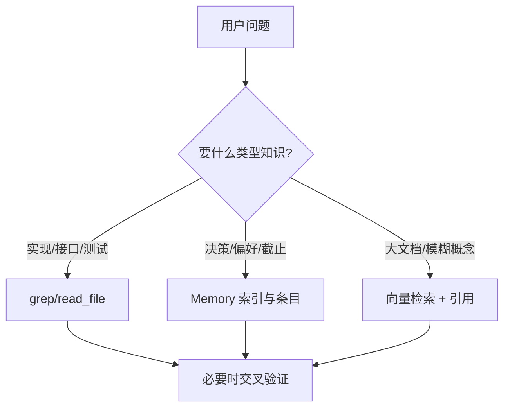
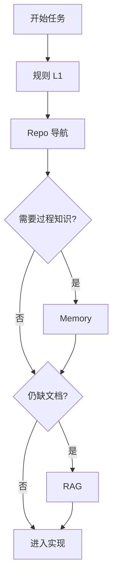

# RAG、Memory、还是直接读仓库？三轨上下文怎么取舍

> **适合直接发知乎的导语**  
> 很多人把「长记忆」和「RAG」混成一个框；在编码 Agent 里更实用的分法是 **三条轨道**：**向量/RAG 检索**、**结构化 Memory 文件**、**原生 repo 工具（读文件/grep）**。各自解决不同问题；混用顺序错了，就会又慢又贵还不准。下面给决策树 + 流程图。

**声明**：RAG 实现（分块、嵌入模型、重排）千变万化；本文讨论 **能力边界**，不绑定某一向量库。

---

## 一、三轨各自回答什么问题

| 轨道 | 最擅长 | 典型失效 |
|------|--------|----------|
| **Repo 原生** | 「这函数现在怎么实现」**精确**真相 | 仓库巨大时需要导航；不能记住「会外决策」 |
| **Memory** | **小而稳定**的决策、偏好、截止日、工单链接 | 与代码漂移不同步；要靠整合与验证（稿 13） |
| **RAG** | **非结构化**大文档、跨仓库知识、自然语言「大概在哪」 | 引错片段；需引用与二次打开文件校验 |

**金句**：**代码事实**优先走 repo；**组织过程**走 Memory；**文档海洋**才上 RAG。

---

## 二、为什么 Memory 不直接等于 RAG

Memory（稿 13）常见是 **带 YAML 的 Markdown + 索引 + 独立模型路由**：  
- **强类型**（user/project/feedback/ref）利于策略与安全；  
- **写入受控**（格式、路径、整合）；  
- **检索**可先 cheap model 筛文件，再精读。

RAG 往往是 **连续文本块**，**弱结构**，更适合手册与历史讨论。

二者可 **并存**：Memory 里存「去哪份文档找权威答案」的 **ref**，正文仍用 RAG 打开。

---

## 三、推荐组合顺序（编码任务）

1. **读 CLAUDE.md / 规则**（稿 16）定边界。  
2. **小步 repo**：从入口文件、`package.json`、路由表找锚点。  
3. **按需 Memory**：召回项目决策与用户红线。  
4. **RAG 兜底**：仅当 repo 内搜不到且确有外部知识库。

---

## 四、反模式

- **一上来全文嵌入整个 monorepo**：更新成本与漂移都高。  
- **用 RAG 回答「某行代码现在干嘛」**：应用 `read_file`。  
- **Memory 塞满实现细节**：应整合进代码注释或设计文档，Memory 只留指针。

---

## 五、落地检查清单

- [ ] 是否为三类知识 **各定 SLA**（延迟、成本、准确率期望）？  
- [ ] RAG 命中是否 **强制带回引用路径** 便于核验？  
- [ ] Memory 是否 **定期对齐**代码现状（整合任务）？

---

## 分发备忘（发知乎可删）

- **标题备选**：《编程 Agent 的「记忆」不止向量库：RAG / Memory / 读仓库怎么配》  
- **标签**：RAG、Agent、Memory、上下文工程。  
- **相关稿**：`13-Memory…`、`03-记忆系统…`（对比向）、`16-规则…`

---

*仓库路径：`wemedia/zhihu/articles/19-RAG-Memory-Repo三轨上下文取舍.md`*
