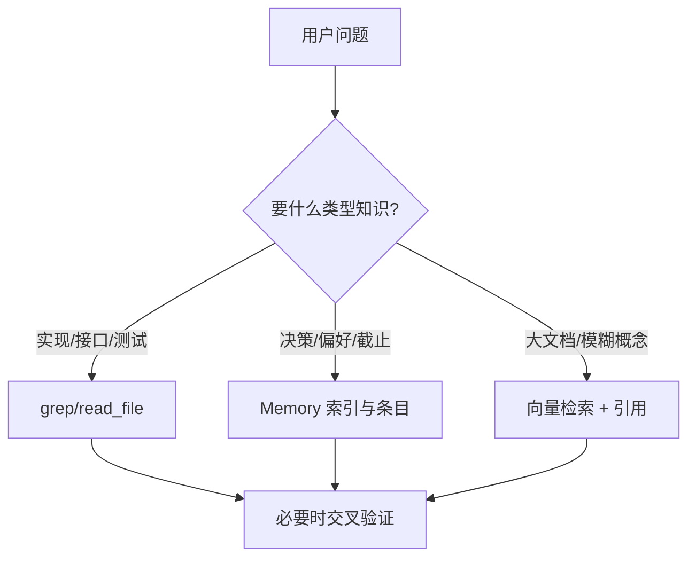
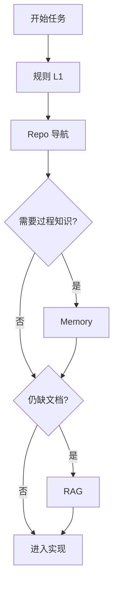

# RAG、Memory、还是直接读仓库？三轨上下文怎么取舍

> **适合直接发知乎的导语**  
> 很多人把「长记忆」和「RAG」混成一个框；在编码 Agent 里更实用的分法是 **三条轨道**：**向量/RAG 检索**、**结构化 Memory 文件**、**原生 repo 工具（读文件/grep）**。各自解决不同问题；混用顺序错了，就会又慢又贵还不准。下面给决策树 + 流程图。

**声明**：RAG 实现（分块、嵌入模型、重排）千变万化；本文讨论 **能力边界**，不绑定某一向量库。

---

## 一、三轨各自回答什么问题

| 轨道 | 最擅长 | 典型失效 |
|------|--------|----------|
| **Repo 原生** | 「这函数现在怎么实现」**精确**真相 | 仓库巨大时需要导航；不能记住「会外决策」 |
| **Memory** | **小而稳定**的决策、偏好、截止日、工单链接 | 与代码漂移不同步；要靠整合与验证（稿 13） |
| **RAG** | **非结构化**大文档、跨仓库知识、自然语言「大概在哪」 | 引错片段；需引用与二次打开文件校验 |

**金句**：**代码事实**优先走 repo；**组织过程**走 Memory；**文档海洋**才上 RAG。

---

## 二、为什么 Memory 不直接等于 RAG

Memory（稿 13）常见是 **带 YAML 的 Markdown + 索引 + 独立模型路由**：  
- **强类型**（user/project/feedback/ref）利于策略与安全；  
- **写入受控**（格式、路径、整合）；  
- **检索**可先 cheap model 筛文件，再精读。

RAG 往往是 **连续文本块**，**弱结构**，更适合手册与历史讨论。

二者可 **并存**：Memory 里存「去哪份文档找权威答案」的 **ref**，正文仍用 RAG 打开。

---

## 三、推荐组合顺序（编码任务）

1. **读 CLAUDE.md / 规则**（稿 16）定边界。  
2. **小步 repo**：从入口文件、`package.json`、路由表找锚点。  
3. **按需 Memory**：召回项目决策与用户红线。  
4. **RAG 兜底**：仅当 repo 内搜不到且确有外部知识库。

---

## 四、反模式

- **一上来全文嵌入整个 monorepo**：更新成本与漂移都高。  
- **用 RAG 回答「某行代码现在干嘛」**：应用 `read_file`。  
- **Memory 塞满实现细节**：应整合进代码注释或设计文档，Memory 只留指针。

---

## 五、落地检查清单（含判定标准与示例）

对应 **三轨 SLA、RAG 可核验、Memory 对齐、决策可执行**；避免「全上 RAG」或「全靠记忆」两种极端。

### 5.1 三轨是否各有 SLA（Per-Track Service Levels）

**在问什么**：Repo / Memory / RAG 是否各自写明 **可接受延迟、单次成本、容错**（例如「代码事实必须 100% 可复核」）。

**为何重要**：没有 SLA 就无法做路由与降级；出事时也不知道该怪 **召回** 还是 **模型**。

**合格标准**：表格或内规：`repo: P0 必须准；rag: P2 允许误召但必须带引用；memory: 陈旧须警告`（稿 13）。

| 偏弱（反例） | 偏强（正例） |
|--------------|--------------|
| 「三个都开着就行」 | 「接口签名类问题 **禁止**仅用 RAG 回答」 |
| 无预算上限 | 「RAG 每轮最多 2 次、top_k≤8」 |

**自检**：产品若问「最在乎延迟还是最在乎引用准确」，能否 **对轨回答**？

---

### 5.2 RAG 命中是否强制可核验（Citation Required）

**在问什么**：向量检索返回是否 **必须带** 文档 id、路径、段落锚点，便于 `read_file` 二次打开。

**为何重要**：RAG 片段是 **概率召回**；无引用则无法执行稿 20 的「证」。

**合格标准**：UI/协议层无引用则 **拒答或降级**；日志里可审计 `chunk_id`。

| 偏弱（反例） | 偏强（正例） |
|--------------|--------------|
| 「根据内部文档，应该……」 | 「`docs/auth.md#L120-L135` 写道……请打开核对」 |
| 仅页码无路径 | `source_uri` + `start_char` 或章节标题 |

**自检**：能否在 **不信任模型** 的前提下，只用引用 **人工打开原文**？

---

### 5.3 Memory 是否与代码现状对齐（Consolidation & Drift）

**在问什么**：是否有 **定期整合** 或触发式整理，删掉与 repo 矛盾的记忆，并更新 description（稿 13）。

**为何重要**：Memory 是 **观察快照**；不对齐则越用越像「官方谣言库」。

**合格标准**：整合任务 + 陈旧警告；大重构后 **人工或脚本** 触发 memory review。

| 偏弱（反例） | 偏强（正例） |
|--------------|--------------|
| 写了永不读 | 每 N 会话或每周 merge 记忆与索引 |
| 记忆写「模块在 A 目录」已迁走 | 整合时 diff 仓库结构 → 删或改条目 |

**自检**：打开最老一条 memory，能否在 **5 分钟内** 判断仍真仍假？若不能，缺整合或缺日期。

---

### 5.4 路由策略是否文档化且可执行（Decision Playbook）

**在问什么**：团队是否有一张 **短决策表**：何种问题 **先 grep**、何种 **先 Memory**、何种 **才 RAG**（见第三节流程图）。

**为何重要**：个人习惯不可复制；新同事与 Agent 需要 **同一 playbook**。

**合格标准**：`docs/agent-routing.md` 或 CLAUDE.md 一节；与 CI/评审可选挂钩（例如「设计评审必须指明知识源」）。

| 偏弱（反例） | 偏强（正例） |
|--------------|--------------|
| 口口相传 | 「实现细节 → repo；截止日与决策 → memory；外部门手册 → rag」 |
| 与实现相反 | 文档与 Harness 默认工具顺序一致 |

**自检**：随机抽三个真实 issue，团队能否 **一致说出** 第一步走哪轨？

---

### 5.5 四条速记（勾选）

- [ ] **分轨 SLA**：Repo / Memory / RAG 是否各有 **延迟/成本/准确** 期望？  
- [ ] **RAG 带引用**：命中是否 **强制路径/锚点** 以便核验？  
- [ ] **Memory 整合**：是否有 **去矛盾/去陈旧** 机制？  
- [ ] **Playbook**：路由顺序是否 **成文** 且与工具默认一致？

---

## 分发备忘（发知乎可删）

- **标题备选**：《编程 Agent 的「记忆」不止向量库：RAG / Memory / 读仓库怎么配》  
- **标签**：RAG、Agent、Memory、上下文工程。  
- **相关稿**：`13-Memory…`、`03-记忆系统…`（对比向）、`16-规则…`

---

*仓库路径：`wemedia/zhihu/articles/19-RAG-Memory-Repo三轨上下文取舍.md`*
