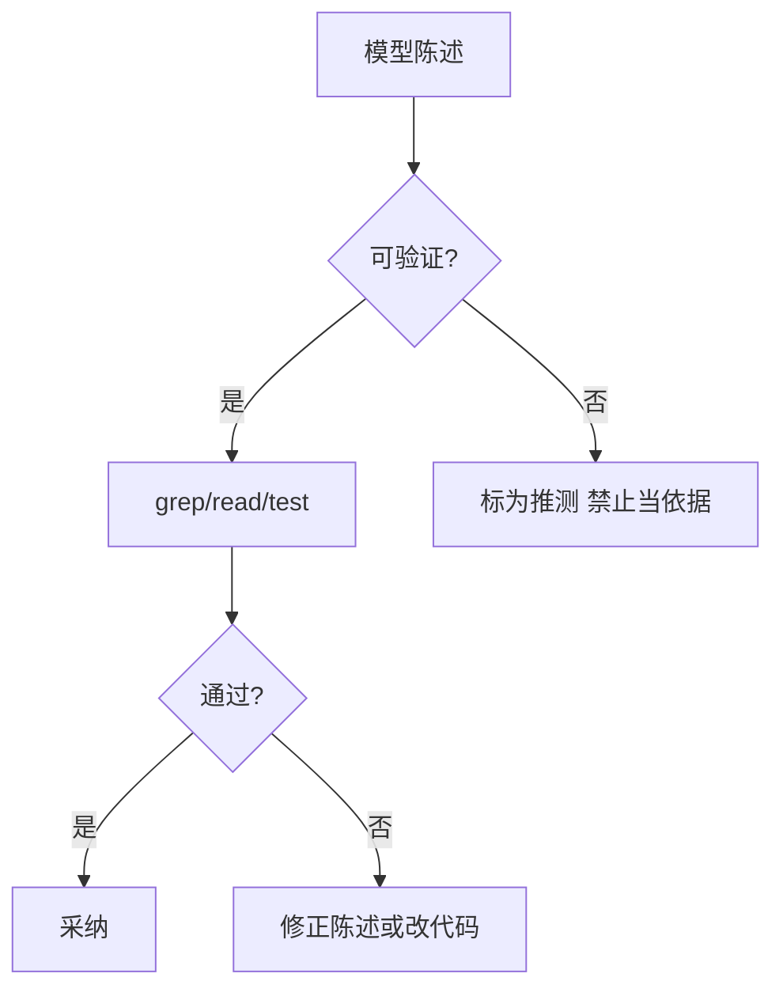
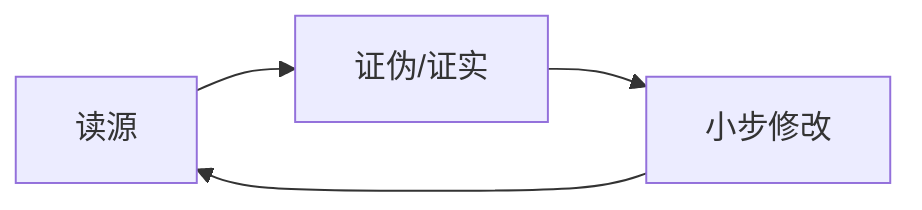

# Agent「幻觉」怎么治？读—证—改闭环与可观测轨迹

模型会 **流畅地错**：编造 API、记错文件路径、把旧记忆当现状。工程上不靠「提醒它别瞎说」这种软约束，而靠 **Harness 流程**：关键断言前 **强制读源**、**可重复验证**、**把证据链留痕**。本文给一套闭环 + 流程图，和稿 13「陈旧记忆先验证」、稿 16「L3 真相」直接衔接。

**声明**：没有银弹；目标是 **降低事故率与排障成本**，不是追求 100% 不说错。

---

## 一、三类幻觉，对症不一样

| 类型 | 表现 | 首选对策 |
|------|------|----------|
| **事实型** | API/签名/路径不存在 | 工具读源码、跑类型检查/测试 |
| **过程型** | 省略步骤、跳过分支 | checklist / 状态机提示 + 强制输出计划再执行 |
| **叙事型** | 解释听起来对但不可证 | 要求 **引用路径+行号** 或「未找到则明说」 |

---

## 二、读—证—改：最小闭环

1. **读**：对「将改动的模块」至少一次 **primary source**（源文件或官方 doc 片段）。  
2. **证**：能跑测试则跑；不能则 **类型检查 / lint / 最小复现脚本**。  
3. **改**：补丁小步；每步可回滚。  
4. **记**：在 PR 或会话摘要里留 **依据**（路径、命令、结果），不是只有自然语言故事。

Memory 里 **陈旧警告**（稿 13）是Harness 帮你记得「先证」；**不能替代证**。

---

## 三、可观测性：没有轨迹就无法复盘

建议在工具层记录：

- **打开了哪些路径**、**grep 模式**、**测试命令与 exit code**。  
- **模型是否跳过了读文件**（可设门禁：改某目录必须先 list/read）。

出问题时问：**模型是根据哪条证据得出该结论的？** 答不上来＝流程缺口。

---

## 四、提示层「软约束」仍有用，但是第二层

例如：

- 「不确定就说不知道」  
- 「引用文件须带行号」

这些减少 **过度自信语气**，但 **不能代替** 硬工具验证——否则遇到对抗性提示仍会翻车。

---

## 五、落地检查清单（含判定标准与示例）

对应 **验证门禁、引用纪律、证据链日志、记忆陈旧提示**；把「别瞎编」从口号变成 **可审计流程**。

### 5.1 关键路径是否有可重复验证（Verify Before Merge）

**在问什么**：改动共享模块、鉴权、支付、数据迁移等，是否 **必须有** 自动化测试或书面最小复现步骤（可交给 CI 或人工按表打勾）。

**为何重要**：没有验证，模型叙述再流畅也不能 **升格为事实**；幻觉在复盘时无法区分「模型错」还是「流程没要求证」。

**合格标准**：分支保护 + 必测清单；Agent 会话里 **显式记录** 跑的命令与结果（稿 15 回灌可引用）。

| 偏弱（反例） | 偏强（正例） |
|--------------|--------------|
| 「我看过代码了」无命令 | `pnpm test` exit 0 截图或日志片段进 PR |
| 仅手点 UI 一次 | 录屏或 checklist：`步骤1…期望…实际…` |

**自检**：若删掉对话记录，仅凭 **PR 附件** 能否复现「为何认为正确」？

---

### 5.2 是否禁止「裸 file:line」进合入叙事（Citation Discipline）

**在问什么**：合并说明、设计文档、CR 评论中的 **路径:行号** 是否要求 **附带** 引用片段或链接到具体 commit；禁止纯口述坐标。

**为何重要**：行号 **随重构漂移**；无片段的坐标是 **幻觉高发区**。

**合格标准**：模板要求「结论 + 证据（代码引用块或 permalink）」；无证据则标为 **推测**。

| 偏弱（反例） | 偏强（正例） |
|--------------|--------------|
| 「见 foo.ts:42」 | permalink 到 `abc123` 的 `foo.ts` 或贴 5 行上下文 |
| 「API 支持批量」无链接 | 链到 OpenAPI 或 handler 测试用例 |

**自检**：随机抽三条 CR 评论，能否 **30 秒内** 打开对应代码？不能则引用纪律未落地。

---

### 5.3 证据链是否落到命令级（Command-Level Observability）

**在问什么**：CI 与 Agent 会话是否保留 **实际执行的命令、参数摘要、退出码、关键环境版本**（脱敏后）。

**为何重要**：复盘「当时到底跑没跑测试」需要 **物证**，不是聊天记录复述。

**合格标准**：结构化日志或 artifact；敏感信息脱敏；与 `session_id` 可关联。

| 偏弱（反例） | 偏强（正例） |
|--------------|--------------|
| 「测过了」 | `TEST_LOG.md`：`npm test` + sha + node 版本 |
| 仅终态 green | 保留 junit / 失败时 stderr |

**自检**：能否回答「**哪一次提交** 在什么环境下绿的」？

---

### 5.4 Memory 是否带时间与过时提示（Temporal Hygiene）

**在问什么**：长期记忆是否 **有写入/更新时间**，加载时是否 **注入**「可能过时、先验证」（稿 13），避免把记忆当源码。

**为何重要**：记忆与代码 **天然不同步**；无时间戳则无「保质期」心理模型。

**合格标准**：frontmatter `updated`；>1 天或团队阈值则警告；整合任务清矛盾。

| 偏弱（反例） | 偏强（正例） |
|--------------|--------------|
| 正文无日期 | `updated: 2026-03-01` + 加载提示 |
| 永不删改 | 整合时删与 repo 冲突条目 |

**自检**：最旧一条仍显示的 memory，是否 **带日期** 且 Agent 被提示先证？

---

### 5.5 四条速记（勾选）

- [ ] **可重复验证**：关键改动是否有 **测试或最小复现** 进 PR/会话？  
- [ ] **引用有物证**：file:line 是否配 **permalink 或代码块**？  
- [ ] **命令级留痕**：CI/Agent 是否存 **命令+exit+版本**？  
- [ ] **记忆带时标**：是否 **日期 + 过时警告 + 整合**？

---

*仓库路径：`wemedia/zhihu/articles/20-Agent幻觉治理-读证改与可观测性.md`*
