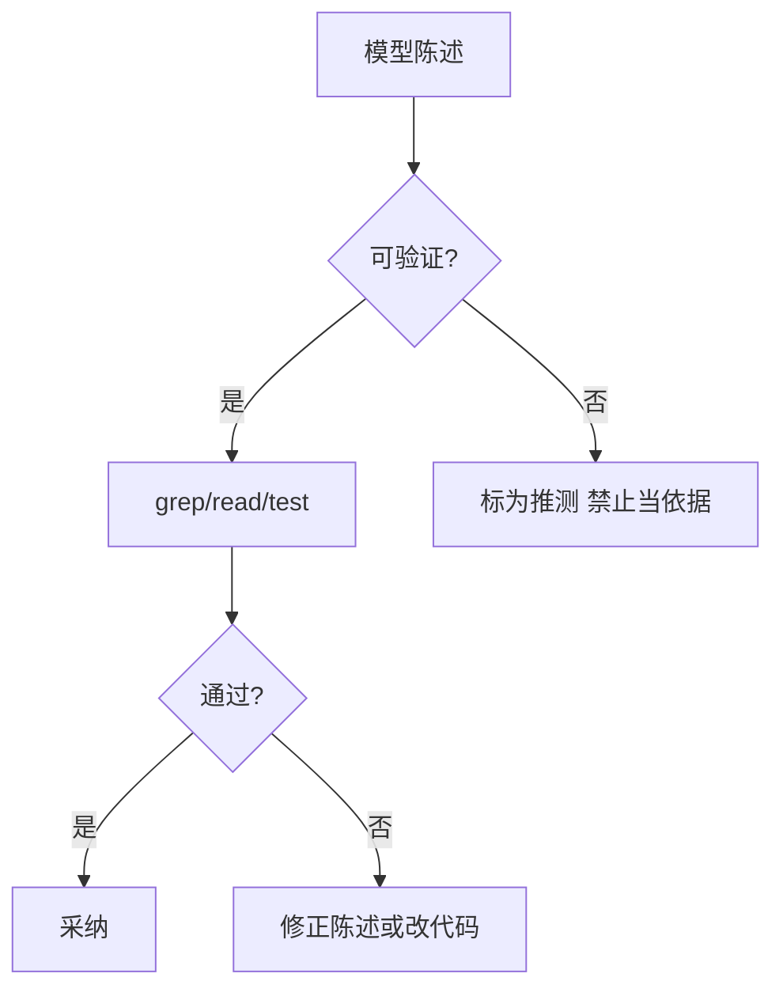
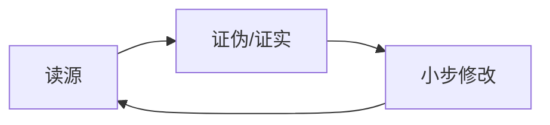

# Agent「幻觉」怎么治？读—证—改闭环与可观测轨迹

> **适合直接发知乎的导语**  
> 模型会 **流畅地错**：编造 API、记错文件路径、把旧记忆当现状。工程上不靠「提醒它别瞎说」这种软约束，而靠 **Harness 流程**：关键断言前 **强制读源**、**可重复验证**、**把证据链留痕**。本文给一套闭环 + 流程图，和稿 13「陈旧记忆先验证」、稿 16「L3 真相」直接衔接。

**声明**：没有银弹；目标是 **降低事故率与排障成本**，不是追求 100% 不说错。

---

## 一、三类幻觉，对症不一样

| 类型 | 表现 | 首选对策 |
|------|------|----------|
| **事实型** | API/签名/路径不存在 | 工具读源码、跑类型检查/测试 |
| **过程型** | 省略步骤、跳过分支 | checklist / 状态机提示 + 强制输出计划再执行 |
| **叙事型** | 解释听起来对但不可证 | 要求 **引用路径+行号** 或「未找到则明说」 |

---

## 二、读—证—改：最小闭环

1. **读**：对「将改动的模块」至少一次 **primary source**（源文件或官方 doc 片段）。  
2. **证**：能跑测试则跑；不能则 **类型检查 / lint / 最小复现脚本**。  
3. **改**：补丁小步；每步可回滚。  
4. **记**：在 PR 或会话摘要里留 **依据**（路径、命令、结果），不是只有自然语言故事。

Memory 里 **陈旧警告**（稿 13）是Harness 帮你记得「先证」；**不能替代证**。

---

## 三、可观测性：没有轨迹就无法复盘

建议在工具层记录：

- **打开了哪些路径**、**grep 模式**、**测试命令与 exit code**。  
- **模型是否跳过了读文件**（可设门禁：改某目录必须先 list/read）。

出问题时问：**模型是根据哪条证据得出该结论的？** 答不上来＝流程缺口。

---

## 四、提示层「软约束」仍有用，但是第二层

例如：

- 「不确定就说不知道」  
- 「引用文件须带行号」

这些减少 **过度自信语气**，但 **不能代替** 硬工具验证——否则遇到对抗性提示仍会翻车。

---

## 五、落地检查清单

- [ ] 修改关键路径是否有 **自动测试** 或 **最小手动步骤**？  
- [ ] 是否禁止 **无依据的 file:line** 进合并说明？  
- [ ] 会话/CI 是否保留 **命令级日志**？  
- [ ] Memory 是否启用 **日期 + 过时提醒**（稿 13）？

---

## 分发备忘（发知乎可删）

- **标题备选**：《别只骂 AI 爱瞎编：用「读—证—改」把幻觉关进流程里》  
- **标签**：Agent、可靠性、软件工程、Claude Code。  
- **相关稿**：`13-Memory…`、`16-规则…`、`15-工具调用…`

---

*仓库路径：`wemedia/zhihu/articles/20-Agent幻觉治理-读证改与可观测性.md`*
