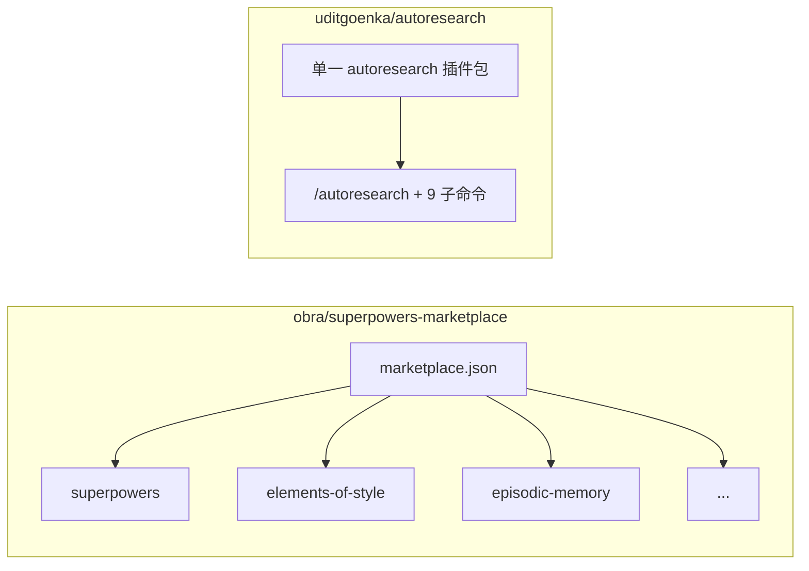
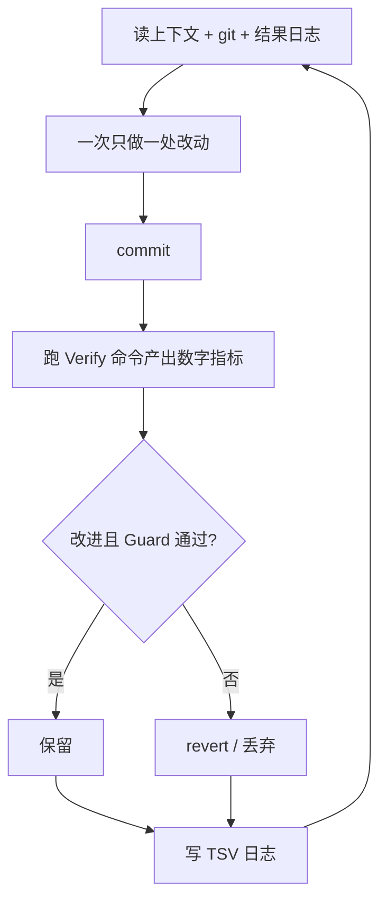

# Superpowers 市场 / 核心插件 与 Autoresearch：差别是什么？

> **适合直接发知乎的导语**  
> 两个名字都常出现在 Claude Code 插件讨论里，但**不是同一类东西**：**[superpowers-marketplace](https://github.com/obra/superpowers-marketplace)** 是 Jesse Vincent（obra）维护的 **插件市场目录**（一个 `marketplace.json` 里挂多款插件）；**[autoresearch](https://github.com/uditgoenka/autoresearch)** 是 Udit Goenka 的 **单一插件包**，把 Karpathy 式「指标 + 约束 + 自主迭代」推广成 **10 条斜杠命令 + 一大套 SKILL 协议**。下文对照**本仓库已 vend 的克隆**（见 `reference/reference_agent/`），避免空口对比。

**声明**：版本号、插件条目以各仓库当前文件为准；Claude Code 行为以 Anthropic 文档为准。

---

## 一、先把三个名词分开

| 名词 | 是什么 | 本仓库证据路径 |
|------|--------|------------------|
| **Superpowers Marketplace** | Claude Code 的 **marketplace 元数据仓库**：列出可安装的插件名、git URL、版本、描述 | `reference/reference_agent/superpowers-marketplace/.claude-plugin/marketplace.json` |
| **Superpowers（核心插件）** | 市场中的 **一款**插件，远程指向 `https://github.com/obra/superpowers.git`；README 称其含大量 skill、`/brainstorm` 等命令 | 同上 `marketplace.json` 中 `name: "superpowers"` 条目；`superpowers-marketplace/README.md` |
| **Autoresearch** | **独立插件**：`claude-plugin/` 下 **一个** `plugin.json` + **一个**主 skill + **多条**子命令（`/autoresearch:plan` 等） | `reference/reference_agent/autoresearch/claude-plugin/.claude-plugin/plugin.json`、`claude-plugin/skills/autoresearch/SKILL.md` |

日常说「装 Superpowers」通常指 **从该市场安装 obra 的 superpowers 插件**；**不等于**「Superpowers Marketplace 本身是一个插件功能」——市场是给 `/plugin marketplace add` 用的**目录**。



---

## 二、Superpowers Marketplace 里实际有什么（读 `marketplace.json`）

当前快照中，除 **superpowers** 外，同文件还登记例如（节选意译，以 JSON 为准）：

- **superpowers-chrome**：Chrome DevTools 协议 / `browsing` skill（标注 BETA）。  
- **elements-of-style**：写作规范类插件。  
- **episodic-memory**：跨会话语义检索对话。  
- **superpowers-lab**、**superpowers-developing-for-claude-code**、**claude-session-driver**、**double-shot-latte** 等。

**结论**：这是 **多产品货架**；用户按需 `plugin install …@superpowers-marketplace` 选其中一款或多款。

---

## 三、Autoresearch 是什么（读 `plugin.json` + `SKILL.md`）

- **定位**（`plugin.json` 的 `description`）：面向 Claude Code 的 **自主改进引擎**：对**任意可机械度量的指标**做 **无界或 `Iterations: N` 有界** 的「改 → 验证 → 保留/回滚」循环；并带 **plan / debug / fix / security / ship / scenario / predict / learn / reason** 等子命令。  
- **协议载体**：长文写在 `claude-plugin/skills/autoresearch/SKILL.md` 与 `references/*.md`（如 `autonomous-loop-protocol.md`），由 Claude Code **按 Skill 机制加载**。  
- **与 Karpathy 关系**：README / COMPARISON 明确继承 [karpathy/autoresearch](https://github.com/karpathy/autoresearch) 的哲学，但泛化到非 ML 领域；**对比文**见上游 `COMPARISON.md`（本仓库克隆内同路径）。



---

## 四、核心差异一览（不是「谁更强」）

| 维度 | Superpowers **生态**（市场 + 其中核心插件） | Autoresearch |
|------|---------------------------------------------|--------------|
| **单元** | 市场 = **多插件目录**；核心 Superpowers = **技能库 + 若干工作流命令**（README 描述） | **单插件**内嵌 **10 条命令面** + 统一循环协议 |
| **主隐喻** | 精选 **skills / workflows / 生产力工具** 合集；可再装 episodic-memory、Chrome 等 **正交**能力 | **目标 + 指标 + 机械验证 + Git 记忆** 的 **自主循环** 与衍生工作流（安全、发货、场景、辩论等） |
| **是否自带「整夜跑指标」闭环** | 核心插件强调 TDD、调试、协作等 **模式**；**不等于** Autoresearch 那套完整 TSV + `experiment:` 提交规范（除非你在别处自行接） | **显式**定义循环、Guard、`Iterations: N`、崩溃恢复等 |
| **安装方式** | `/plugin marketplace add obra/superpowers-marketplace` 再选插件 | `/plugin marketplace add uditgoenka/autoresearch`（见上游 README） |

**互补性**：二者可同时装——例如用 Superpowers 的技能做日常开发习惯，用 `/autoresearch` 做 **有数值目标的持续优化** 或 `/autoresearch:security` 专链。

---

## 五、本仓库如何复现对照

```bash
# 已 vend 于（无嵌套 .git，便于随主仓库浏览）
reference/reference_agent/superpowers-marketplace/
reference/reference_agent/autoresearch/
```

更新上游内容时，可删目录后重新 `git clone --depth 1 <url>`，或按 `reference/reference_agent/README.md` 说明操作。

---

## 六、延伸阅读（上游）

- Superpowers 核心实现本体（不在本快照内，仅 market 指向）：`https://github.com/obra/superpowers`  
- Autoresearch 与 Karpathy 原版深度对比：`autoresearch/COMPARISON.md`  

---

## 分发备忘（发知乎可删）

- **标题备选**：《Claude Code：Superpowers 市场 ≠ Autoresearch，一张表分清》  
- **标签**：Claude Code、插件、Superpowers、Autoresearch、Agent。  
- **网页版**：https://harzva.github.io/learn-likecc/topic-superpowers-autoresearch.html  

---

*仓库路径：`wemedia/zhihu/articles/21-Superpowers市场与Autoresearch-Claude插件对比.md`*
