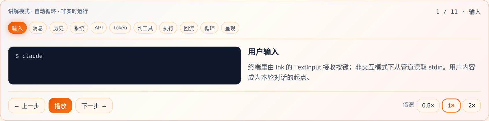
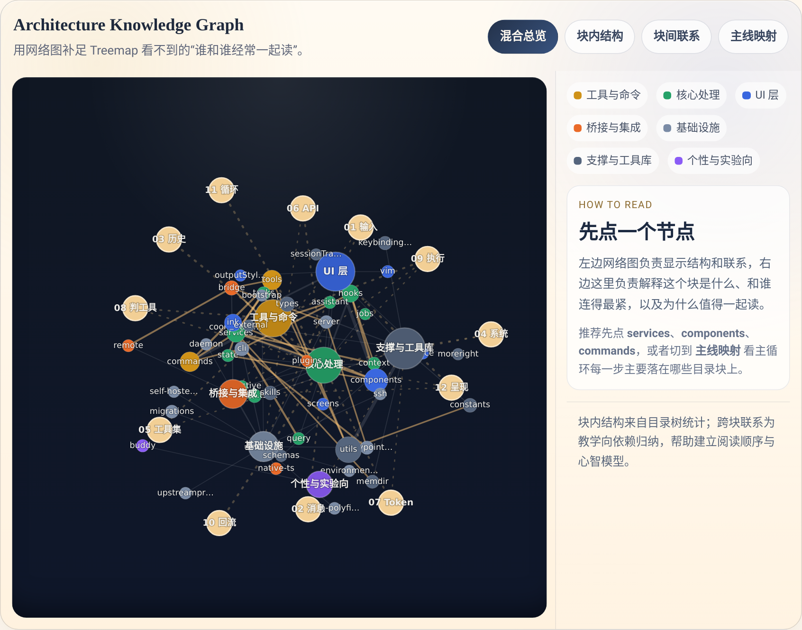
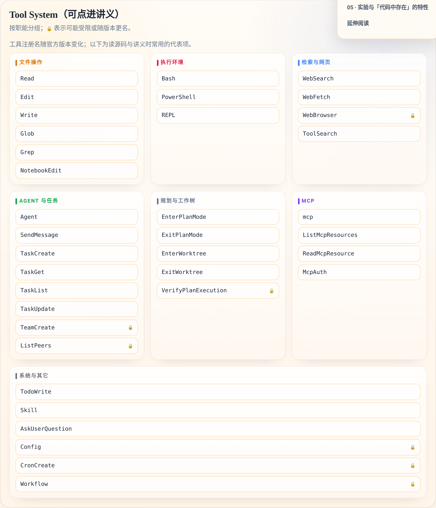
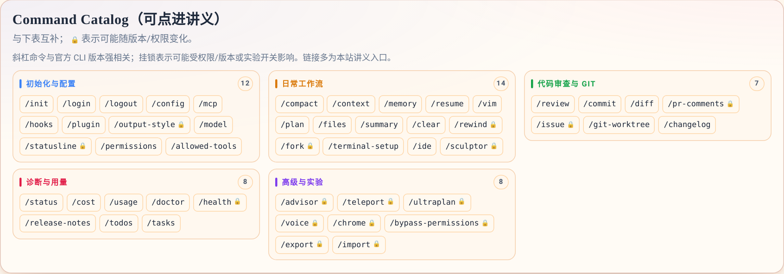

# 我做了一页「Claude Code 庖丁解牛」：把主循环、目录、工具和斜杠命令拆成一张中文地图

很多人第一次打开 Claude Code 相关源码仓库，都会有同一种感受：

不是看不懂某个函数，而是**不知道应该从哪里开始看**。

目录很多，工具很多，斜杠命令也很多。你知道它们都重要，但如果没有一张“结构地图”，阅读顺序就会变成随机游走。于是我专门做了一个中文专题页，想解决的不是“把所有实现细节全讲完”，而是先回答三个更关键的问题：

1. Claude Code 一轮到底是怎么跑起来的？
2. 仓库里这些目录块，彼此是什么关系？
3. 工具、斜杠命令、实验特性，应该各从哪里入手？

专题页在这里：

- https://harzva.github.io/learn-likecc/topic-cc-unpacked-zh.html

---

## 一、这页不是“文档翻译”，而是一张阅读地图

这页我给它起名叫 **“庖丁解牛”**。意思不是把源码神秘化，而是尽量把它拆成几块可以被普通读者消化的结构：

- **01 主循环**：先理解一次请求如何进入系统、什么时候触发工具、结果如何回灌上下文。
- **02 架构导览 + 02B 知识图谱**：先看“规模”，再看“关系”。
- **03 工具系统**：把内置工具按职能分组，而不是把名字平铺给你。
- **04 斜杠命令目录**：把 `/init`、`/memory`、`/review`、`/doctor` 这些命令按使用场景重新组织。
- **05 实验特性**：提醒你哪些东西是代码里“存在过”，但不一定已经是稳定契约。

如果说很多源码文章是在回答“这个模块怎么实现”，这页更像是在回答：

**“我下一步应该读哪一块，为什么是它，而不是别的地方？”**

---

## 二、首页第一屏，就先把阅读目标讲清楚

我希望用户一进来不是先被目录吓住，而是先获得一个“这页能帮我什么”的判断，所以首屏做得比较直接：用一句话把主循环、目录、工具和命令串起来，再给出量级信息和入口。

这里的重点不是数字本身，而是建立一个预期：

- 这不是一篇只讲某个点的小文。
- 这是一个把 Claude Code **整体阅读路径**压缩进一页的入口页。
- 你可以从这里继续跳转到本站的 S/D 讲义和源码专题，而不是孤立地看一张漂亮图。

---

## 三、主循环那一段，我特意做成了“讲解型播放器”

只写“用户输入 → 模型 → 工具 → tool_result → 下一轮”当然可以，但阅读体验很差，因为这是一条**动态链路**。所以这一节我做成了一个步进式的讲解播放器，让读者按顺序看到每一步发生了什么。

这块适合几类读者：

- 想快速理解 Agent Loop 的人。
- 已经听过 Tool Use，但对“结果如何重新回到上下文”没有形成画面的人。
- 想从页面跳转去看 S01、D01、OH01 对照讲义的人。

它的价值不在于“模拟真实遥测”，而在于**把一个抽象闭环讲成人脑能跟住的顺序**。

---

## 四、知识图谱是这页里我最想做的部分

Treemap 很适合回答“哪里大、哪里小”，但它不回答“哪些目录最好一起读”。而阅读源码时，真正决定理解效率的，往往不是文件数，而是**关系**。

所以我单独做了一个 **Architecture Knowledge Graph**。

这块我想解决的是几个很实际的问题：

- 为什么 `services` 往往不能孤立看？
- `tools`、`commands`、`components`、`bridge` 之间，哪些联系最值得先建立？
- 如果你是按主循环去读代码，那么每一步会主要落在哪些目录块上？

因此它不是静态 import 图，而是**教学向的关系图**。你点一个节点，右边就会解释：

- 这个块是什么
- 它和谁连得最紧
- 为什么值得一起看
- 建议先从哪里进入

我最近还把这块的字体整体放大了，因为这里的信息密度本来就高，太小会严重影响可读性。

---

## 五、工具系统和斜杠命令，不该再用“长名单”去记

很多人对 Claude Code 的第一印象，是“工具好多，命令也好多”。但如果只是把它们按字母顺序或原始清单堆出来，用户其实不会更容易理解。

所以我在 03 和 04 两节里做的事情，是把它们重新按**心智模型**组织。

先看工具系统：

这里不是简单列工具名，而是拆成：

- 文件操作
- 执行环境
- 检索与网页
- Agent 与任务
- 规划与工作树
- MCP

也就是说，读者拿到的不是“有哪些工具”，而是“这些工具分别在解决什么类型的问题”。

再看斜杠命令目录：

我把命令重新组织成：

- 初始化与配置
- 日常工作流
- 代码审查与 Git
- 诊断与用量
- 高级与实验

这样 `/compact`、`/memory`、`/review`、`/doctor` 这些命令就不再是散点，而是能回到使用场景里去记。

这一轮我还专门调整了布局：工具系统减少了横向空白，命令目录在桌面端改成更自然的 3 列排布，读起来会更紧凑。

---

## 六、这页真正想服务的，不只是“看热闹的人”

我做这页时，脑子里想的是三种读者：

### 1. 想快速建立全局心智模型的人

你不一定马上要啃源码，但你想知道 Claude Code 这套东西大致怎么搭起来。这页能让你先形成一张地图，再决定去哪个讲义深挖。

### 2. 已经开始读源码，但总在迷路的人

你可能已经进了 `tools/`、`services/`、`commands/`，但总感觉“单点能看懂，整体串不起来”。这种情况下，图谱和分组地图往往比继续硬啃函数更有效。

### 3. 想给团队做分享或内部培训的人

很多时候最缺的不是源码资料，而是**能给别人讲明白的中文入口页**。这页正好适合作为内部导读材料，再往下分发到具体课程或代码目录。

---

## 七、如果你只打算点开一次，我建议这么看

一个最省时间的阅读顺序是：

1. 先看 **01 主循环**，弄清“回合怎么转起来”。
2. 再看 **02 架构导览**，建立目录分区印象。
3. 然后重点看 **02B 知识图谱**，补上“哪些块应该一起读”。
4. 再去看 **03 工具系统** 和 **04 斜杠命令目录**，把能力面拼完整。
5. 最后再看 **05 实验特性**，避免把代码里出现过的东西误当成稳定功能。

如果你是“马上要继续点源码”的人，我会建议你直接从 **知识图谱** 和 **工具系统** 两块开始。

---

## 八、专题页地址

- 在线页：https://harzva.github.io/learn-likecc/topic-cc-unpacked-zh.html
- 仓库：`learn-likecc`
- 页面定位：Claude Code 的中文结构导览页，不替代官方文档，也不替代源码本身，而是尽量把阅读路径先铺平

后面我还会继续补这页和关联讲义，把它做成一个更稳定的“中文源码入口层”。

如果你也在看 Claude Code、Agent 工具链、MCP 或相关源码，欢迎直接把这页当作你的第一站。

---

*仓库路径：`wemedia/zhihu/articles/22-庖丁解牛专题页-把Claude-Code拆成一张能读懂的中文地图.md`*
