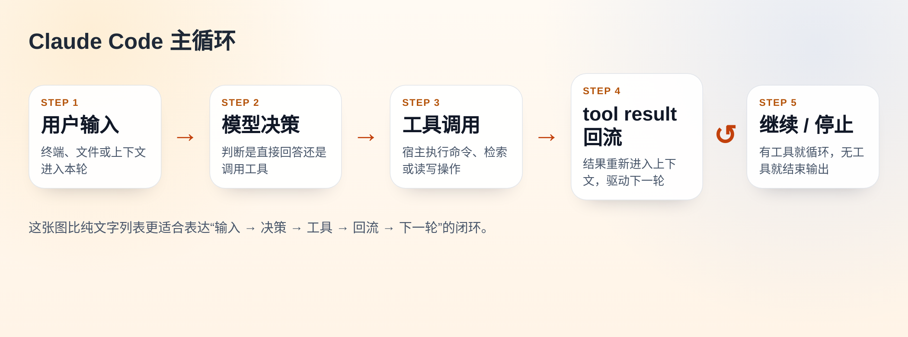

# 找到一个不错的 Claude Code 中文教程页：主循环、目录、工具、命令基本都串起来了

最近看到一个做得比较完整的中文教程页，适合用来快速建立 Claude Code 的整体认知：
https://harzva.github.io/learn-likecc/topic-cc-unpacked-zh.html

它不是官方文档，也不是单篇源码分析，而是把几个常见的学习入口放到了一页里：主循环、目录架构、工具系统、斜杠命令、实验特性。

如果你刚开始看 Claude Code 相关资料，或者已经看过一些零散文章，但还没有形成完整心智模型，这页很值得先过一遍。

一、先看整体入口

这页最有价值的一点，是它不是从某一个细节切进去，而是先给出一张总地图。

首屏就把几个核心问题摆出来了：一次请求怎么进入系统、工具调用怎么回流、仓库结构该怎么看、工具和命令应该怎么分组理解。

这种“先给地图，再深挖”的方式，比直接扎进源码目录里效率高很多。

二、主循环部分适合入门

如果之前只知道 Agent 会调用工具，但对“调用之后发生了什么”没有特别清晰的画面，可以先看这一段。

这块把一轮主循环拆成了可顺序理解的过程：

它不算运行时监控，但作为教学演示足够清楚，也方便再跳去看对应讲义。

三、知识图谱这块做得比较好

很多资料能告诉你“目录有哪些”，但不太会告诉你“哪些目录应该一起看”。这一页里我比较推荐的是知识图谱部分。

它更像是一种阅读导航：哪些块联系紧、哪些块适合配套阅读、按主循环去读时主要会落在哪些目录上。

对准备读源码的人来说，这一块比单纯看目录树更有帮助。

四、工具系统不是简单列名字

工具系统这块也整理得比较适合学习。

它不是把工具名平铺出来，而是按用途拆成几组，例如文件操作、执行环境、检索与网页、Agent 与任务、规划与工作树、MCP。

这样看会更容易理解“各类工具分别负责什么”。

五、斜杠命令目录也很实用

斜杠命令这部分适合拿来快速查阅。

它把命令按场景重新整理了，例如初始化与配置、日常工作流、代码审查与 Git、诊断与用量、高级与实验。

所以像 `/compact`、`/memory`、`/review`、`/doctor` 这些命令，不再是散的，而是能放回具体场景里理解。

六、适合什么人看

我觉得这页最适合三类人：刚开始接触 Claude Code、想先建立整体印象的人；已经在看源码，但还没把目录、工具和主循环串起来的人；想给团队做内部分享，想找一页中文导读材料的人。

七、推荐阅读顺序

如果时间不多，可以按这个顺序看：
1. 先看主循环。
2. 再看架构导览和知识图谱。
3. 然后看工具系统和斜杠命令目录。
4. 最后再看实验特性部分。

这样能先把“整体结构”搭起来，再决定要不要继续深入具体模块。

八、链接放这里

在线页：
https://harzva.github.io/learn-likecc/topic-cc-unpacked-zh.html

如果最近正准备系统看 Claude Code，这页可以作为一个不错的中文起点。
